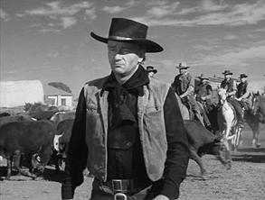
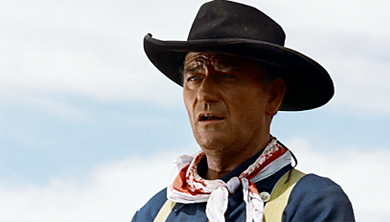

>>"*If it's got horses in it, it's a western.*" Lester Siegel (Aaron Arkin) dans *Argo* (Ben Affleck,  2012).

#1. Introduction : d'un héros à l'autre

Si partir des *westerners*[^36] pour définir les héros relève d'un choix, le fait que ces hommes de l'Ouest sont bien des héros semble en revanche relever de l'évidence. Héroïques sont, en effet, la conquête de la Frontière, d'un nouvel espace et d'un territoire à soi, puis la préservation dudit espace[^37]. Mieux, dès les années 40, Robert Warshow pointe cette famille de personnages comme représentant les "*derniers gentlemen*"[^38], c'est-à-dire les derniers survivants d'une lignée supérieure, en voix d'extinction. Le *westerner* cristalliserait l'identité même du héros, lorsque les autres ont renoncé. Cependant, nous avons tenu à nous concentrer sur les héros, les héros héroïques, les héros "à cent pour cent". Le western, surtout à partir des années 50, est souvent perçu comme étant davantage le domaine des anti-héros. Le terme ici embarrasse : anti-héros, c'est le contraire de ce que nous cherchons ; en même temps, la domination garde l'héroïsme pour le retourner, l'intègre apparemment à un système de valeurs renouvelées. Un Clint Eastwood, dans *The Good, the Bad and the Ugly* (Sergio Leone, 1966), sera qualifié d'anti-héros : quand le héros ne se bat plus pour la veuve et l'orphelin, mais pour lui-même, il mérite apparemment ce nouveau statut. Ce parcours du héros au anti-héros définirait en partie le genre, selon Christian Viviani : 
>>Le cheminement du western l'a conduit du justicier pur et brave au mercenaire méprisant et calculateur. Après avoir pris comme héros des surhommes, puis des hommes simples et nobles, comme les shériffs et les militaires, le western voit son reflet déformé en la personne du mercenaire, bon et mauvais à la fois, porteur de toutes les contradictions de l'Ouest américain réel[^39]. 
>>

Cette évolution, relativement linéaire (que Viviani ne fait cependant que suggérer), peut être contestée. En effet, avant d'être des personnages de cinéma, les westerners se sont illustrés dans les *dime novels* de la fin du XIXe siècle, et constituent déjà des figures complexes, loin de l'idéal de pureté supposé par un schéma cyclique (d'une figure "classique" à son retournement[^40]). Cet aspect est commenté par Rita Parks dans son étude du westerner dans la littérature, le cinéma et la télévision :  
>>Les aspects les moins civilisés du héros - son aspect sauvage confinant à la sauvagerie, et sa position souvent marginale de hors-la-loi repenti - étaient particulièrement excitants pour le public populaire. La possibilité d'être bon et mauvais à la fois constituait une perspective fascinante, même à une époque pré-freudienne ; ceci satisfaisant le besoin éternel de goûter  par procuration au fruit défendu[^41].
>>

Parks parle ainsi, suite à cette observation, de "*tireurs à la Jekyll et Hyde*" ("*Jekyll-Hyde gunfighters*"[^42]), et pointe de ce fait la nature profondément biface de tout héros, quelque soit son contexte historique d'émergence. Cet aspect est particulièrement important pour nous, et nous verrons, au fil de cette étude, que la définition du héros rejoint souvent ce schéma bipartite opposant une nature fondamentalement bonne et un inconscient sauvage, ou dangereux, qu'il faudra domestiquer pour devenir ou rester héroïque.

La pureté du héros, tout comme généralement la pureté originelle d'un genre, est également mise en doute par Tag Gallagher. Sa critique porte à l'origine sur le modèle cyclique élaboré par Philip French, qui reprend les notions d'âge d'or et de déclin (elles-mêmes empruntées à l'histoire de l'Art[^43]). Gallagher avance que nous avons tendance à juger plus sévèrement des œuvres à mesure qu'elles sont historiquement éloignées de nous. Il réfute également l'idée selon laquelle la réflexivité suit une période classique, et identifie des exemples de westerns, qui, dès 1912, jouent avec leurs propres conventions. Les "héros" semblent à peine mériter ce titre : la fin de *Straight Shooting* (John Ford, 1917), voit son personnage de tueur professionnel s'éloigner vers l'horizon, ayant renoncé à s'établir avec une femme[^44]. Il serait pourtant confortable de séparer héros et anti-héros de western, qui plus est en utilisant un marqueur historique. Celui-ci se situerait dans les années 60, même si Christian Viviani repère dès les années 40 un fléchissement, un passage à des "*héros vulnérables, incertains, ou troubles, diamétralement opposés aux héros tout d'une pièce qui, jusqu'alors avaient constitué l'essentiel du genre*"[^45].  Ici l'essence du héros change radicalement ; chez Gallagher, il est ironiquement suggéré qu'en fait de changement, il ne s'agit peut-être que d'un simple remous, en surface : 
>> La question de savoir si les héros changent dans les années 60 n'est pas aussi simple que certains critiques voudraient nous le faire croire. C'est peut-être que les héros disparaissent tout simplement, et, comme dans les décennies antérieures, permettent aux personnages qui tenaient les seconds rôles de prendre la première place. Ou peut-être que les héros ont tout simplement arrêté de se raser[^46].
>> 

Faut-il donc postuler l'existence d'une figure du *westerner* qui évolue intrinsèquement, de façon cyclique, pour se complexifier à mesure qu'elle se fait plus impure, ou mettre cette variation sur le compte de la nécessité d'un renouvellement visuel et narratif ? Dans cette dernière hypothèse, la barbe donne l'impression d'un changement, mais le héros n'a pas changé, du moins pas en profondeur. Warshow voit justement dans cette "évolution" la nécessité de la variation inhérente aux films de genre, mais pas une révolution fondamentale du sens des films ("*ce genre de variation est absolument nécessaire pour empêcher la formule de devenir stérile ; nous ne voulons pas voir le même film encore et encore, seulement la même forme*"[^47]).
La nature du *westerner* permet potentiellement de saisir celle, hybride, du héros d'action. Bien entendu, le *westerner* lui-même est frappé d'hybridité, et semble une figure instable : certains le présentent comme évoluant avec son genre d'une période classique où il se tient droit dans ses bottes, au réexamen auto-référentiel de ses conventions dès les années 60-70 (*Midnight Cowboy*, *Butch Cassidy and the Sundance Kid*). Cette difficulté propre au *westerner* nous permet d'anticiper : il faudra pour saisir le héros le replacer dans son contexte historique, sans le déclarer plus critique parce qu'il est plus récent - et dépasser la tentation de saisir le héros d'action selon un schéma chronologique. Il faut par ailleurs noter que la notion de chronologie elle-même est plus complexe qu'il n'y paraît, et l'historicité des westerns fonctionne selon un maillage d'époques de références, comme le note William Bourton dans son étude historique du western : 
>> Un western - un film historique aussi bien - est porté par trois dates. D'abord sa date de réalisation, ensuite l'époque qu'il évoque, enfin la date où il est vu[^48]. 
>> 

Cette nécessité de garder à l'esprit la contextualisation multiple des films de notre corpus est d'autant plus vive que les films d'action, en raison d'une nature souvent référentielle, et même ironique vis-à-vis de leur référent, induisent une lecture de l'Histoire décalée. Cet aspect est synthétisé par Laurent Jullier qui affirme : "*Quand le film post-moderne prétend parler du passé, il parle des images du passé*"[^49]. Ceci peut sembler relever de l'évidence : un film ne décrit pas la réalité, mais la reformule, jouant ainsi avec les conceptions liées à une figure, plutôt qu'avec la réalité historique de celle-ci. Néanmoins, cette observation doit nous inviter à une certaine vigilance : ce n'est pas de l'histoire de l'Ouest que nous parlerons, mais bien du mythe construit autour de cette notion par les différents films appartenant au genre western.

Nous avons ici opposé deux thèses, l'une saisissant une variation historique révélant un changement qualitatif du héros ; l'autre refusant la généralité des modèles évolutionnistes, penchant vers l'empirisme appliqué cas par cas aux films. Une troisième position consiste à avancer que le *westerner* est resté globalement le même, au point qu'il s'agit presque d'une anomalie. Thomas Schatz explique ainsi : 
>> De manière assez curieuse, au fur et à mesure que le genre Western a évolué et que sa formule s'est affinée et embellie au moyen de la répétition, le héros de Western a maintenu son statut ambivalent, alors que dans le même temps, la communauté de la Frontière et ses représentants étaient dépeints en des termes de plus en plus négatifs. En réalité, un des aspects les plus complexes et les plus fascinants de l'évolution constante du western, en tant que forme filmique, est la stabilité -  sinon le statisme ou la nature réactionnaire - du héros de western, alors même que la communauté a évolué vers un statut plus "progressiste" et discipliné, mais aussi plus malveillant[^50].
>> 

Cette dernière position nous guidera, d'autant plus qu'elle explique la permanence de la figure du *westerner* dans des genres qui ne sont pas le sien. Si le personnage surgit avec autant d'aisance, se passant de son décor, voire même de ses contours physiques (lorsqu'il devient une référence, au passage dans un dialogue) c'est qu'il a une extraordinaire capacité à se figer, et à charrier avec lui un ensemble de thèmes et valeurs absolument identifiables. Sans doute change-t-il dans les années 60, sans doute ce changement avait été préparé par de précédents personnages déjà impurs, dès les années 10. Avant tout, il nous faut retenir que le western ne nous intéresse pas dans son évolution ou ses particularismes, mais pour l'idée du *westerner* telle qu'elle va irriguer le film d'action. Ici le héros croise à nouveau le genre, dans la mesure où le genre est "*ce que nous croyons collectivement qu'il est*" ("*Genre is what we collectively believe it to be*"[^51]). De la même façon, il y a bien, à défaut d'un dénominateur commun aux héros (la définition que nous cherchions à l'origine), une idée de ce que le héros peut être, infléchie elle-même par une idée du *westerner*.
À chercher les liens qui attachent un type d'héroïsme à sa reformulation, nous ne pouvons donc contourner la figure du *westerner*, même si le héros de péplum possède un référent historique plus ancien : paradoxalement, nous verrons que ce replacement inattendu de l'origine (de l'Antiquité, voire des récits de Homère à l'Ouest américain) vaut de par l'archaïsme inhérent au personnage héroïque de western. Il s'agit également de réconcilier deux attitudes opposées, l'une parlant d'une permanence du *westerner* dans le film américain (réincarné en héros reaganien dans le film d'action), l'autre posant au contraire le héros de l'Ouest comme figure "*traditionnelle*"[^52] vouée à être remplacée. Plutôt que la question de la contemporanéité potentielle ou réelle du western, c'est l'idée de "place" qui nous semble essentielle : si le *westerner* est toujours d'actualité, comment les nouveaux héros, ou héros de genres nouveaux se positionnent-ils par rapport à lui ? De même, si d'autres héros apparaissent et remplacent le *westerner*, prennent-ils sa place, ou inventent-ils des lieux alternatifs pour l'héroïsme ?

Si le héros héritait sa nature héroïque du *westerner*[^53], nous pourrions retenir le dépassement, l'exploit (ici topographiquement inscrit, dans un mouvement d'expansion) et la préservation de la morale (concernant les récits privilégiant un espace qui ne s'étend plus, mais qu'il faut "purifier" de ses mauvais éléments : *High Noon*, *Rio Bravo*, et tant d'autres) comme qualités notoires. Le western est souvent décrit comme un genre facilement identifiable[^54] ; à celui-ci correspondrait, de façon tentante, un genre ou un type parallèle de héros. La définition du genre, et plus particulièrement du western, est comme nous l'avons vu largement problématique. Évoquons seulement deux des nombreux problèmes que génère ce recouvrement partiel entre la problématique héroïque et la question du genre ; certains westerns, bien que parfaitement intégrés à leur genre (si l'on considère la définition le ramenant à la colonisation de l'Ouest) n'intègrent pas de héros *héroïques*. Par exemple, *The Big Sky* (Howard Hawks, 1952), malgré la présence de Kirk Douglas, qui a déjà interprété des héros de l'Ouest, ne présente pas le trajet héroïque d'un héros à proprement parler. Si héroïsme il y a, il se rapporte à l'action collective de l'équipage le long du fleuve Missouri, métonymique en un sens de l'action collective du peuple américain découvrant le territoire[^55]. Dans ce cas, le western recouvre imparfaitement la notion d'héroïsme, l'évoque mais n'en fait pas un thème central. De plus, la notion même de western peut renvoyer à plusieurs éléments caractéristiques, mais de nature différente[^56]. Ainsi *First Blood* (Ted Kotcheff, 1982), plutôt un film d'action, renverra à un aspect narratif du western, en reprenant l'éviction canonique du *drifter* de la petite ville par le shérif, tandis que la présence iconique de Clint Eastwood suffit à justifier, en un sens, le titre de *Space Cowboys* (qui raconte l'histoire d'astronautes, sans rapport direct avec l'Ouest) : dans les deux cas, on se situe en dehors du genre, mais dans une proximité avec le *westerner*, tantôt narrative, tantôt sémantique. À ce titre, *Dirty Harry* doit alors être vu comme une citation croisée d'éléments narratifs et visuels, brodés avec le cadre d'insertion de l'action qui n'est pas directement lié avec le western, puisqu'il s'agit de la ville de San Francisco dans les années 70. En somme, si les westerns moins directement centrés sur les héros seront écartés de notre corpus, des films ne relevant pas du genre "western" pourront être examinés s'il révèlent une parenté du héros avec la figure du *westerner*.

Le western possède des formes multiples, dans lesquelles il faut repérer des récurrences qui justifient l'identification d'un groupe de films au genre. L'étude générique présente deux tendances, syntactique et sémantique, repérées et critiquées par Rick Altman. Alors que la première, en saisissant les schémas narratifs, semble condamnée à diviser les genres en sous-genres, l'autre prend le risque de figer la définition des genres du côté de leurs images emblématiques. Altman propose ainsi une méthode sémantico-syntactique, qui permettrait d'utiliser les deux filtres d'analyse de manière croisée[^57]. L'utilisation d'un corpus dans le cadre d'une étude générique présente ses difficultés. Une fois une liste de films établie, la sélection de critères identifiant cet ensemble comme genre présente un autre problème de taille. La méthode syntactique, dans une optique aristotélicienne choisira des éléments narratifs, traitant le film dans ses aspects les plus structurels. Ces éléments formant le langage du western pourront constituer des formules (chez John Cawelti, par exemple), ou des fonctions (Will Wright). Même si Cawelti dit s'opposer à la méthode de Wright, nous pouvons noter des convergences manifestes. La méthode de Wright est plus exclusive, et s'appuie sur un corpus volontairement très fermé (limité aux plus grands succès du box office) pour détacher des éléments narratifs précis, sans faire le jeu des exceptions. L'approche de Cawelti est plus floue et autorise davantage de combinaisons, et s'oriente ainsi davantage vers une définition typique des caractéristiques narratives du genre entier, là où Wright découpait l'ensemble en cinq catégories distinctes de récits ("*classique*", "*de vengeance*", "*de transition*", "*professionnel*", "*classique/professionnel*"[^58]). Toutefois, malgré ces différences, nous noterons que les deux auteurs partagent une certaine volonté de saisir le fonctionnement d'un genre en détachant des structures narratives, lesquelles se distinguent par l'articulation de différents groupes de personnages. Le western se définirait ainsi par l'interaction entre trois groupes : les "*villageois*" ("*townspeople*"), les Indiens et les hors-la-loi (réunis en une catégorie chez Cawelti, séparés chez Wright) et enfin le héros[^59]. D'un autre côté, si ces outils nous seront précieux en ce qui concerne l'étude des vigilantes, il nous faut préciser que chez Wright, par exemple, *héros personnage principal* et *héros héroïque* sont des notions qui se recouvrent imparfaitement. Autrement dit, personnage principal et personnage héroïque sont indifféremment désignés par le terme "*hero*", ce qui peut prêter à confusion. Les schémas narratifs qu'il dégage conviennent souvent à un parcours proprement héroïque (par exemple, dans le cas de *The Man from Laramie* (Anthony Mann, 1955) et du récit "*de vengeance*"), mais s'appliquent aussi à des personnages qui, tout en respectant certains points d'un "programme", ne sont pas héroïques (Ethan Edwards, à un détail près, suit ce parcours vengeur).
Face à ces méthodes qui invoquent la syntaxe des films, nous allons également nous intéresser aux éléments visuels - c'est le pan sémantique de l'analyse générique. Là, la figure du *westerner* peut surgir de façon plus inattendue, et même autrement qu'en venant habiter le corps d'un autre héros. Ainsi Forrest Gump (dans le film du même nom, Robert Zemeckis, 1994) ne ressemble jamais - loin s'en faut - à un héros de l'Ouest, mais après deux années de course à pied ininterrompue, illustrée par des vues canoniques de l'Amérique, c'est devant un décor digne de Monument Valley qu'il décide d'achever sa course. Hirsute, la barbe longue et les tennis salies, Gump semble comme contaminé par les connotations du paysage, et ce clin d'œil suffit à donner au personnage un supplément d'aura[^60]. Il nous faut donc interroger le cow-boy comme matrice possible de l'héroïsme, à tous les niveaux, du personnage au paysage, dans leurs dimensions narratives comme visuelles. Quelle leçon le *westerner* et son genre d'appartenance, sous toutes leurs formes, ont-ils donnée aux héros ?

Une telle approche, centrée sur l'héritage du *westerner* du côté de l'image, implique qu'une attention particulière soit portée sur les acteurs. Ce sont leurs noms qui souvent se substituent à la catégorie de *westerner*, leurs noms qui réunissent plusieurs personnages. Ceci tient notamment à l'essence de la star, dont le corps, familier, dépasse ses incarnations individuelles de film en film ; c'est en ce sens que Marc Vernet parle de Fred Astaire comme d'une "*figure transdiégiétique*"[^61]. Plusieurs noms, aptes à résumer leur genre à partir de leur seule iconicité, viennent à l'esprit et illustrent cette construction du héros grâce à la star : Gary Cooper, Glenn Ford, James Stewart, Kirk Douglas, Clint Eastwood, John Wayne. Ce dernier, tout particulièrement, se détache comme le stéréotype le plus emblématique du westerner. Il est souvent, quoique un peu vite, associé à une morale dite reaganienne, les deux acteurs constituant dès lors l'incarnation du héros rigide (*self-righteous*). Lorsqu'il s'agit de définir le prototype du "*héros idéalisé*", Thibault Isabel cite Errol Flynn, Gregory Peck, Tyrone Power, Stewart Granger, Robert Taylor ou encore Kirk Douglas - mais c'est John Wayne qui arrive en tête de cette liste[^62]. L'acteur possède une aura mythique, tutélaire, que Christian Viviani évoque lorsqu'il dit de sa carrière qu'elle est "*la plus prestigieuse du genre entier*"[^63]. Richard de Cordova parle d'association entre l'acteur et le genre, tandis que Richard Dyer va plus loin et parle de figure "*quintessencielle*" du genre[^64], "*[du] westerner par excellence, [de] l'homme de l'Ouest porté à son logique point final*"[^65] - un rôle dont Clint Eastwood serait ensuite l'héritier[^66]. En somme, quand nous tentons de déployer le lien qui existe entre *westerner* et héros d'action, nous devons prendre en compte la dimension actorale de l'héroïsme et de sa construction, sans oublier que la persona d'un acteur, à mesure qu'elle se solidifie, se rend également disponible au détournement. 
L'exemple de John Wayne illustre justement ce lien. Emblème parmi les emblèmes, il constitue une image très prégnante dans l'imaginaire collectif, au point de faire retour dans la critique comme curseur historique : Cawelti remarque à ce titre que sa mort a constitué la fin d'une époque pour le genre tout entier. Il est aussi l'acteur le plus cité, le raccourci le plus efficace qui accompagne les allusions au *westerner*[^67]. John Wayne incarnerait donc le westerner par excellence, dans la mesure où il en embrasse toutes les particularités au long de sa carrière, que celles-ci relèvent de la fonction (membre de la garde nationale, *marshall*, *drifter*, etc.) ou des qualités. Malgré cette série de rôles variés (ou grâce à eux), la persona de l'acteur l'emporte sur l'ensemble fictionnel des personnages interprétés, pour former une sorte de personnage moyen, croisement des rôles les plus marquants. On pourra lire ainsi chez Ruth Amossy une description de ce héros résultant d'un lissage des particularités des différents personnages : "*John Wayne, dans sa présence massive, est le dur dont la rudesse recouvre un bon cœur et une nature de justicier*"[^68]. Aucun film n'est cité, mais tous le sont, par le biais de la seule présence de l'acteur, invoquée par le nom. Nous aurons l'occasion de traiter en détail cette question des rapports de l'acteur au héros, nous retiendrons donc ici que cette caractérisation engendre une simplification, c'est-à-dire que le cliché de l'Ouest est une catégorisation que nous avons aujourd'hui tendance à rapporter aux films eux-mêmes (sans doute parce que nous sommes familiers de la parodie), en oubliant que la prétendue uniformité des héros peut également être fonction de la réception elle-même. Sur ce dernier point en effet - et nous rentrons là dans une complexité qui nous est familière - les personnages incarnés par John Wayne ne sont pas toujours aussi clairement héroïques que John T. Chance (*Rio Bravo*) ou que The Ringo Kid (*Stage Coach*) : pensons au très ambigu Ethan Edwards, violent et rarement bienveillant (dans *Red River*), ou au bourru Tom Doniphon (*The Man Who Shot Liberty Valance*), qui se sert de ses qualités pour humilier son rival. 

######fig. 1 : John Wayne a incarné des personnages plus sombres, à l'héroïsme contestable, ou variable au sein du récit (respectivement dans *Red River* en 1948 et *The Searchers* en 1956).

Une autre figure mythique doit nous retenir : Clint Eastwood. Le cas de l'acteur est un peu spécifique car ce ne sont finalement pas ses incarnations de *westerner* que nous retiendrons, mais plutôt son rôle charnière de l'inspecteur Harry dans les années 70. Eastwood a en effet imposé sa marque sur le genre western en trois temps : d'abord dans la série télévisée *Rawhide*[^69], dans laquelle il a tenu le rôle de Rowdy Yates pendant sept années ; dans la seconde période, il s'illustre de nouveau en tant qu'acteur dans une série de films réalisés par Sergio Leone (la Trilogie du Dollar, principalement, de 1964 à 1966), avant de passer derrière la caméra en 1971 (avec *Play Misty for Me*) et de proposer, en tant qu'auteur et acteur une relecture du genre mais aussi du stéréotype du westerner qu'il a contribué à remodeler (deux ans plus tard, avec *High Plains Drifter*). Nous excluons volontairement les films de la seconde phase, ainsi que l'ensemble des westerns dits "spaghetti" (les films de Leone, principalement mais aussi de Sergio Corbucci, Duccio Tessari, entre autres). Ces films nous semblent en effet mériter une étude distincte, pour plusieurs raisons. La première relève de l'ancrage culturel : bien que l'intrigue de ces westerns soit bien contextualisée dans les espaces américains de la Frontière, les films eux-mêmes ont été produits en Italie, avec des équipes italiennes (Sergio Leone étant par exemple entouré d'Ennio Morricone pour la musique et de Luciano Vincenzoni pour le scénario[^70]). Même si les capitaux qui alimentaient ces productions venaient des États-Unis[^71], il s'agissait bel et bien de productions italiennes, certes très inspirées des modèles américains. Au-delà de ces faits contextuels, il existe bien, au visionnage des films, le sentiment d'une "*italianisation du western*", selon les termes du romancier Alberto Moravia[^72]. Il nous semble alors complexe de parler de "héros américain", même si Clint Eastwood, qui incarne dans plusieurs films l'Homme sans Nom, était bien, lui, de nationalité américaine. Nous écartons donc le sous-genre que constitue le spaghetti western, en pleine conscience et avec la certitude de le retrouver. En effet, cet Homme sans Nom, parti d'Italie, déjà inspiré par l'admiration de Leone pour les cinéastes américains associés au genre, a en retour nourri de nouvelles figures américaines, notamment chez Peckinpah, qui a reconnu sa dette envers Leone (elle est criante dans *The Wild Bunch*[^73]). Clint Eastwood a également tenté d'exorciser le fantôme de l'Homme sans Nom en le reformulant dans *High Plains Drifter* tandis que Don Siegel, qui a lancé le cycle des *Dirty Harry*, a cité dans *Coogan's Bluff* une scène de *Et pour quelques dollars de plus*[^74]. Si nous voulons faire de l'hybridité générique un thème connexe de la variété des héros américains, nous choisissons donc ici de réduire le spectre de l'étude.

Notre intention n'est pas, rappelons-le, d'étudier le genre western dans son intégralité, mais de sélectionner des occurrences significatives, et intrinsèquement critiques, qui pourraient irriguer les définitions de l'héroïsme de personnages d'action. La notion de genre constituera ici un emprunt théorique, qui se déploiera de plusieurs façons. Saisir le héros participera en effet pour nous d'un "*geste générique*"[^75]. Plutôt que d'utiliser un référent mythologique unique pour donner une origine au héros, nous accepterons l'éclatement de cette origine, entre genres, personnages, et incarnations successives par différents acteurs. Même si le choix de la figure du westerner peut paraître relever de la recherche d'une origine unique, il n'en est rien. Nous allons, par un travail de généalogie[^76] identifier des correspondances, des héritages et filiations du héros de western à son prétendu double, le héros de film d'action - dans cette tentative émergeront parfois des lignes brisées, des chaînons manquants. Il est aussi essentiel de noter que ce concept d'héritage se replie en quelque sorte sur notre sujet, puisque l'héritage est intégré aux récits de western, en constitue une orientation thématique aussi forte que la fin de la Frontière, ou l'opposition entre nature et culture[^77]. Les premiers liens abordés seront parmi les plus anecdotiques : il pourra s'agir du surgissement d'une image, d'un fragment visuel de l'Ouest qui vient s'insérer dans un récit a priori éloigné du genre western. Nous nous attacherons ensuite à identifier des ponts plus développés d'un genre à l'autre, et la référence au western sera dans nos exemples plus substantielle, souvent injectée dans le fil narratif. Partie d'un héritage externe au western, nous reviendrons ensuite un temps au genre lui-même, pour saisir cette notion de transmission sur un plan interne. Suivant une ligne générationnelle dans *Ride the High Country* (Sam Peckinpah, 1962), l'héritage se fait plutôt symbolique dans *The Man Who Shot Liberty Valance* (John Ford, 1962). Alors que ces deux films proposent des lectures critiques du genre et de ses conventions, les films de vigilantes que nous isolerons par la suite semblent relever d'un positionnement conservateur, beaucoup distancié par rapport à la référence de l'Ouest. Ce sous-genre, de *Dirty Harry* (Don Siegel, 1971) à *Death Wish* (Michael Winner, 1974), reformule la figure du *westerner*, qui devient une sorte de dernier homme, seul en charge des valeurs historiques de l'Ouest dans une ville viciée qui n'a rien à envier à l'urbanité du film noir. Nous terminerons ce chapitre en nous intéressant à *The Big Lebowski*, qui a le mérite, de manière éclectique, de rassembler, questionner et moquer les figures du *westerner* et de l'homme d'action. L'articulation des signes associés à ces deux personnages stéréotypés nous permettra de lier le *westerner* à son successeur, et d'amorcer notre analyse du héros d'action en ayant conscience des continuités et ruptures d'une figure héroïque à l'autre, d'un héroïsme à l'autre.

___

[^36]: Nous emploierons de préférence ce terme plutôt que celui d'homme de l'Ouest, dans la mesure où cette terminologie renvoie directement au découpage générique que nous pratiquons dans notre corpus.

[^37]: Nous partons en effet de la définition de Jean Mitry, qui décrit le western comme "*un film dont l'action, située dans l'Ouest américain, est conséquente du milieu, des mœurs et des conditions d'existence au Far West entre 1840 et 1900*", in MITRY Jean. *Dictionnaire du cinéma*. 1963, p. 276.

[^38]: "*The* *Westerner is the last gentleman*" ("*le westerner est le dernier gentleman*"), in WARSHOW Robert. *The Immediate Experience, Movies, Comics, Theatre and Other Aspects of Popular Culture*. 2001, p. 111.

[^39]: VIVIANI Christian. *Le Western*. 1982, p. 44.

[^40]: Tag Gallagher la conteste d'ailleurs de manière entendue, en refusant de considérer que les héros ambigus et les récits auto-référentiels soient apparus dans les années 60 ; cf. GALLAGHER Tag. "Shoot-Out at the Genre Corral: Problems in the 'Evolution' of the Western". 1995, p. 247-248. 

[^41]: "*The* *less civilized aspects of the hero – his wildness bordering on savagery and his often marginal position as a reformed outlaw – were particularly thrilling for the popular audience. The possibility of being good and bad at the same time was a fascinating prospect even in pre-Freudian times; it met the eternal need for a vicarious taste of the forbidden fruit*" in PARKS Rita. *The Western Hero in Film and Television. Mass Media Mythology*. 1982, p. 41.

[^42]: "*Jekyll-Hyde* *gunfighers*", ibid., p. 51-52.

[^43]: GALLAGHER Tag. op. cit., p. 246.

[^44]: Tag Gallagher est à l'origine de l'exemple ; il indique cependant que le même film sort une deuxième fois en 1925, sous le titre de *Straight Shootin'* : cette fois, le héros finit marié ; ibid., p. 251.

[^45]: VIVIANI Christian. *Le Western*. op. cit., p. 153.
 
[^46]: "**The* *question, then, of whether heroes change in the 1960s is not as simple as some critics would have us believe. Perhaps heroes merely disappear, allowing, as they did at times during earlier decades, the fellows who play supporting roles to step to center stage. Perhaps heroes merely stop shaving*", in GALLAGHER Tad. op. cit., p. 254.
 
[^47]: "*that* *kind of variation is absolutely necessary to keep the type from becoming sterile; we do not want to see the same movie over and over again, only the same form*", in WARSHOW Robert. op. cit., p. 117. 

[^48]: BOURTON William. *Le Western : une histoire parallèle des États-Unis*. 2008, p. 11.

[^49]: JULLIER Laurent. *L'écran post-moderne, un cinéma de l'allusion et de l'artifice*. 1997, p. 22.

[^50]: "*Curiously* *enough, as the western genre evolved and the formula was further refined and embellished through repetition, the western hero maintained his ambivalent status while the frontier community and its denizens were depicted in increasingly negative terms. In fact, one of the most fascinating and complex aspects of the western's steady evolution as a cinematic form is how stable – if not downright static or reactionnary – the western hero has been while the community has taken on a more 'progressive' and orderly and at the same time a more malevolent status*", in SCHATZ Thomas. "The Western". 1988, p. 31.

[^51]: TUDOR Andrew. op. cit., p. 7.

[^52]: "*the* *traditional Westerner*", in CAWELTI John G. *The Six-Gun Mystique*. 1984, p. 13.

[^53]: Pour certains commentateurs, la définition est la plus économique possible, comme chez Philip French : "*Dans cette série d'archétypes et d'attendus que j'appelle le Western type, le héros est l'incarnation du Bien*" ("*In that set of archetypes and expectations I have called the Model Western, the hero is the embodiment of good*") in FRENCH Philip. *Westerns*. 1977, p. 48.

[^54]: Ou, à tout le moins, plus identifiable que d'autres : il reste bien entendu des ambiguïtés, notamment sur l'introduction de films se déroulant à l'Est du pays, ou ne décrivant pas le mouvement d'expansion de la frontière.

[^55]: BOURGET Jean-Loup. *Hollywood, la norme et la marge*. 2005, p. 40.

[^56]: Cf. MOINE Raphaëlle. *Les genres du cinéma*. 2005, p. 20.

[^57]: ALTMAN Rick. op. cit., p. 630-631.

[^58]: Ou : "*classical*", "*vengeance*", "*transition*", "*professional*", "*classical/professional*", in WRIGHT Will. *Six Guns and Society, A Structural Study of the Western*. 1975, p. 15.

[^59]: Cf. CAWELTI John G. op. cit., p. 78-93, et WRIGHT Will, op. cit., p. 33.

[^60]: Nous reviendrons sur le film dans son ensemble comme caractéristique d'un certain rapport à l'héroïsme dans les années 90 : quel que soit l'héroïsme réel de Forrest Gump, le paysage semble ici signaler que l'intention, tant au niveau de l'auteur que du personnage, est toujours là.

[^61]: VERNET Marc. *De l'invisible au cinéma. Figures de l'absence*. 1988, p. 14.

[^62]: ISABEL Thibaut. *La fin de siècle du cinéma américain (1981-2000), Une évaluation psychologique et morale des mentalités psychologiques*. 2006, p. 107.

[^63]: VIVIANI Christian. *Le Western*. op. cit., p. 34.

[^64]: DE CORDOVA Richard. "Genre and Performance". 1995, p. 133.  

[^65]: "*the* *Westerner par excellence, the man of the West taken to his logical conclusion*", in DYER Richard. *Stars*. 1998, p. 33.

[^66]: Ibid.

[^67]: Pensons à *Die Hard* (que nous analyserons de manière détaillée), ou encore à *Full Metal Jacket*, qui fait mention de l'acteur sur un registre plus grinçant (dans la scène d'ouverture, un soldat moque son supérieur en lançant : "*Est-ce que c'est toi John Wayne, ou est-ce que c'est moi ?*" ("*Is that you, John Wayne? Is this me?*"). L'image de l'acteur a également été utilisée dans *The Simpsons* (épisode "Threehouse of Horror XIX", Saison 20, épisode 4, diffusé le 1er novembre 2008).

[^68]: AMOSSY Ruth. *Les idées reçues : Sémiologie du stéréotype*. 1991, p. 144.

[^69]: *Rawhide*, création : Charles Marquis Warren, États-Unis, 1959-1966 (CBS). 

[^70]: FRAYLING Christopher. *Il était une fois en Italie. Les westerns de Sergio Leone*. 2005, p. 17.
 
[^71]: Ibid., p. 16.

[^72]: Ibid., p. 19.
 
[^73]: Ibid., p. 181.

[^74]: Ibid., p. 182.

[^75]: MOINE Raphaëlle. *Les genres du cinéma*. op. cit., p. 7.

[^76]: Dans le sens où Pierre-Olivier Toulza parle de "*situations de transmission*", qui recoupent un versant communicationnel (la transmission d'un message) et une approche psychanalytique (le lien générationnel). Si nous ne souscrivons pas à l'entièreté de l'analyse, nous retenons, d'un point de vue global, un aspect observé par l'auteur chez Clint Eastwood qui relève de "*la conscience de venir après*" ; in TOULZA Pierre-Olivier. *La question de la transmission dans les films de Clint Eastwood*, p. 142.

[^77]: Selon Christian Viviani, "*Le relais d'une génération à l'autre est essentiel puisque le western raconte l'établissement d'une civilisation*", in VIVIANI Christian. *Le Western*. op. cit., p. 111.