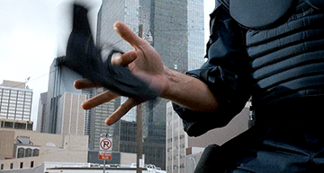

#2. Un héritage héroïque transgenre

##2.1 L'image citée : l'évocation par la vignette

Chapeau de cow-boy, étoile de shérif, profil à contre-jour d'une figure sur un cheval hennissant constituent autant d'apparitions codées, plastiquement évocatrices (la texture d'un contre-jour), qui portent de façon iconique le genre (tout un catalogue de formes reconnaissables entre toutes). La vignette, c'est-à-dire le surgissement d'une image qui ne semble pas continue par rapport à son contexte d'apparition, pourra constituer un des lieux de croisement entre le *westerner* et d'autres genres, et par extension entre le *westerner* et d'autres héros. Dans une hypothèse basse, la vignette est la solidification d'éléments originaux, qui, lors du processus, perdent leur force originale ; c'est l'hypothèse de Vincent Amiel, selon laquelle le procédé est facilité par son appartenance générique : "*Un archétype se constitue par la récurrence d'une figure dans un genre cinématographique, qui perd son contenu au fil des films, pour devenir une simple forme immédiatement identifiable par le spectateur*"[^78]. C'est également la vision de Serge Daney, chez qui le cliché est cette image "*qui ne bouge pas*"[^79], hors des catégories de vrai et de faux. Malgré un figement certain, comme dans le cas de Monument Valley cité par *Forrest Gump*, la répétition d'un cliché crée suffisamment d'écarts pour produire une variété de sens. Il faut ainsi ramener cette force du cliché à une vision sinon positive, à tout le moins non dépréciative. Ruth Amossy nous rappelle ainsi que la caractéristique du cliché qui le différencie du stéréotype est sa capacité à être extrait tel quel de son contexte d'apparition[^80]. Ce contexte est plus ou moins identifiable : par exemple, le "*showdown*" est très clairement une forme d'opposition issue du western ; en revanche, d'autres formes relèveront davantage du thème, comme le rappelle Robin Wood qui voit dans l'opposition entre l'errance et le foyer une problématique transgenre du cinéma américain[^81]. Quoi qu'il en soit, les situations ou des images ne se répètent pas *ex nihilo*, elles sont souvent le résultat d'une intention d'imitation, de citation ou d'hommage. Richard Dyer nous rappelle ainsi qu'il n'existe pas d'imitation qui ne soit médiatisée, à l'exception de la reproduction exacte d'un original[^82]. Plutôt que de trancher entre les deux postures, nous saisirons nos différents exemples de cliché, à la fois comme des formes figées, tirées telles quelles d'un contexte (le western), et comme le résultat de la rencontre entre une image originale et un contexte, qui vont mutuellement altérer leurs sens respectifs. Le cliché, de par sa pauvreté supposée, pourra également nous permettre d'identifier le lieu d'un manque. Dans cette optique, la référence au western viendra panser un héroïsme qui ne parvient plus à se renouveler.

À cause du grand codage du genre "western", ces apparitions en forme de citation vont permettre de jeter des ponts transgenre d'un film à un autre. Le héros, figure centrale, sera le point nodal par lequel les films joueront leur filiation. L'appellation de "vignette" semble tout à fait adaptée ici, dans le sens où ces éléments iconiques, auxquels nous soustrayons leur genre contextuel d'apparition, font figure d'images fixes, insérées telles quelles dans le mouvement continu du film[^83]. L'apparition peut être très courte, et le lien se fait alors ténu. Dans *Judge Dredd* (Danny Cannon, 1995), qui appartient globalement au genre science-fiction (et si l'on veut au sous-genre "comic book adapté au cinéma"), l'enfermement du héros Dredd (Sylvester Stallone) dans une prison située sur une planète désertique est l'occasion d'une vue rassemblant le sable orangé, la ligne d'horizon découpant un coteau venteux, et le premier plan, opaque, masse minérale d'où émergent deux silhouettes[^84] (*fig. 1.3*). 

######fig. 1.3 : Résurgences du western dans *Judge Dredd* (1995).

L'insert est court, et la narration mêlant l'univers du comic book et de la science-fiction reprend bien vite le dessus : pendant un court instant, cependant, le western a fait irruption, comme pour signaler une communauté de buts entre Dredd qui cherche à regagner ses galons, et le *westerner* dédié à sa quête (un espace à conquérir, une jeune blanche kidnappée, etc.). De la même façon, dans *Armageddon* (Michael Bay, 1998), des séquences sous forme de petits portraits présentent les co-équipiers que Harry Stamper (Bruce Willis) s'est choisis pour sauver le monde. On se retrouve ainsi dans l'officine d'un tatoueur, sur les routes avec un motard en Harley Davidson, et dans un contre-jour flamboyant, face à la silhouette noire d'un cow-boy. Un instant, cette image semble vide de rapport avec la narration (le rassemblement d'une équipe de professionnels du forage pour détruire un astéroïde menaçant de s'écraser sur Terre), jusqu'à ce que deux hélicoptères, saisis également à contre-jour, apparaissent derrière le cow-boy et intègrent la citation au continuum du récit (*fig. 2*). 

######fig. 2 : Pendant un court instant, le film d'action *Armageddon* (1998) semble visité par un autre genre, le western.

Ces vignettes, narrativement accessoires, plastiquement fidèles à leur modèle, jouent le rôle de "vues" tombant au cœur du montage à la façon d'une diapositive mal rangée au cours d'une projection. Dans le dernier exemple, la vignette est un instant isolée, presque sans rapport : puis l'arrivée des hélicoptères, surgissant derrière l'horizon permet de recoudre le tout, en faisant surgir nettement le western comme tableau, au moment où l'improbable équipe s'apprête à réitérer un exploit primitif (sauver le monde, plus seulement le Nouveau, mais la planète entière). Ainsi donc, ces hélicoptères bouclent la boucle, réintroduisent un rapport narratif là où la généalogie avait tendu une ligne thématique (des héros de l'Ouest aux héros foreurs d'astéroïdes). 

Enfin, *RoboCop* (Paul Verhoeven, 1987) offre un cas plus élaboré de "vignette", et justement dépasse l'anecdote : le rapport au western se joue dans l'image mais produit ici du discours, en remédiatisant (pour paraphraser Dyer) un geste issu d'un genre. Dans ce film, le policier Murphy va connaître une mort tragique, avant que son corps ne soit recyclé pour servir de base à un programme scientifique. Le cadavre du policier est ainsi couplé à une armure, pour façonner "RoboCop", une machine destinée à faire respecter l'ordre dans les rues de Detroit. Avant de connaître ce destin, Murphy, encore humain, s'entraîne à faire tourner son revolver avec sa main (*fig. 3*). 

######fig. 3 : Murphy fait tournoyer son pistolet, en imitant le geste vu dans une série télévisée.

Il souhaite ainsi faire plaisir à son fils qui a vu son héros de série télévisée préférée exécuter le geste, en s'extasiant : "*Est-ce que tu peux faire pareil, papa ?*"[^85]. À l'intérieur du film, ce geste est référencé trois fois : c'est le geste du héros de la série imaginaire *JT Lazer*, le geste que Murphy pratique alors qu'il vient d'entrer dans la police de Detroit, et le geste résiduel que le droïde RoboCop reproduira mécaniquement. Autrement dit, la référence au western ne fonctionne plus dans ce cas sur le mode d'une ligne tracée d'un film à un autre (le *westerner* des temps modernes appelant le *westerner* de l'Ouest originel) : signe pourtant reconnaissable du genre, ce petit tour de passe-passe n'est que la reproduction d'une reproduction. *JT Lazer* en est le premier niveau, mais il est déjà le bégaiement d'un geste dont la référentialité ne fonctionne plus, copie d'une série imaginaire qui est une copie de toutes les séries télévisées stéréotypées, elles-mêmes dérivées des stéréotypes cinématographiques. C'est donc à la déclinaison d'une mythologie en pièces que le spectateur assiste. Dans le western classique, il est clair que le tourbillonnement du colt, à la manière des franges dans les péplums[^86], avait encore un statut de signe "*obstiné*" se voulant "*naturel*"[^87]. Ici, la reprise, si elle trace un lien, vise plus encore à manifester une rupture. Le signe est intact, mais sa première occurrence manifeste déjà une usure, une distance vis-à-vis de ses habituels signifiés (l'habileté, et l'aisance du héros un peu cabot) : l'héritage se manifeste alors en creux, lorsque l'Ouest est convoqué pour mieux marquer l'absence cruelle de cow-boy. Déjà dans *The Searchers* (John Ford, 1956), pourtant un western, le geste iconique apparaissait "*deux fois, et jamais pour tirer*"[^88]. Jean-Louis Leutrat et Suzanne Liandrat-Guigues notent ainsi que "*la citation est donnée comme telle, agrémentée d'une variation*"[^89]. Pour les deux auteurs cependant, ces éléments extraits d'un "*catalogue de stéréotypes*"[^90] contribuent à donner corps à l'œuvre ainsi qu'au genre. Si, au niveau du film, l'usage de tels signes trace en effet des lignes de correspondances qui contribuent à la cohérence de l'ensemble, au niveau du personnage, les signes en question tendent à convoquer une généalogie éclectique. Décliner les signes et icônes représentatifs de l'Ouest n'est jamais, de façon univoque, un moyen de rappeler une tradition héroïque, puisqu'au sein même du genre (dans le cas, entre autres, de *The Searchers*) celui-ci connaît déjà des détournements ou des usages stéréotypiques redondants, dont la sérialité amoindrit parfois la signification. Citer le western dans le temps même où les personnages tentent d'accéder à l'héroïsme revient aussi à souligner un déficit de ladite qualité, que seul le héros peut justement compenser. 

##2.2 Le récit cité : l'action de western comme modèle héroïque

Parfois, la vignette se fait scène, le film appelle un lien au-delà de la seule citation ponctuelle. Ce type de référence, davantage axé sur l'hommage, convoque un peu plus longuement et de façon plus complexe les codes propres au genre. Le rappel dépasse alors dans ce cas le clin d'œil anecdotique, et trace une ligne d'héritage plus substantielle, d'un héros cow-boy à un homologue qui se pose en héritier. On peut analyser de cette façon une des scènes capitales de *The Untouchables* de Brian De Palma (1987). Le film appartient globalement au genre du film de gangsters, mais la période de réalisation (les années 80) nous engage à le situer dans le sous-genre du film criminel dans sa formulation historique[^91]. Enfin, le récit intègre une forte composante mythique, à la fois par le choix des personnages (Al Capone et Eliot Ness), et celui des acteurs. En effet, le choix de Robert de Niro dans le rôle d'Al Capone, alors que celui-ci s'est déjà illustré dans de nombreux rôles de gangsters (chez Scorsese, Coppola, dans des œuvres considérées comme "cultes" par la grand public), redouble l'aspect mythique du film. Le spectateur retrouve alors un personnage connu, et pour l'interpréter, un acteur attendu dans ce type de rôle, puisqu'il s'en est quasiment rendu propriétaire. Le film est donc parfaitement identifiable, grâce au contexte historique de la prohibition, associé au film de gangsters classique et à un groupe d'acteurs reconnus (même si Kevin Costner n'est véritablement connu que depuis le western *Silverado*, en 1985) dont certains sont proches du genre. Notons cependant qu'il est fait usage de référentialité de façon beaucoup plus ostentatoire dans le film, comme en témoigne la scène de l'embuscade dans la gare, double revendiqué de la scène des marches dans *Le Cuirassé Potemkine* (Sergueï Eisenstein, 1925).

Notre analyse porte particulièrement sur le moment où le groupe des incorruptibles, menés par Eliot Ness, décide de frapper un grand coup contre Al Capone en saisissant une livraison de whisky canadien. Ici, le western semble s'inviter dans le cadre, le temps d'une scène. Celle-ci commence par un travelling sur les lieux de l'opération : un décor de montagne apparaît, ainsi que le pont sur lequel aura lieu le trafic des malfrats. Progressivement, la caméra balaye le paysage, et le pont sort du champ, laissant alors le paysage devenir cet horizon, cette découpe entre la terre et le ciel auquel le western, dès ses origines, nous a habitués, et par lequel il ne cesse depuis d'être identifié. Puis, un hennissement se fait entendre ; cette impression de déjà-vu se matérialise pleinement lorsque qu'apparaît au loin une rangée de cavaliers postés sur la crête. L'image est cette fois-ci très claire, la référence est ouverte : mais nous sommes encore ici dans le domaine de la vignette (*fig. 4*). 

######fig. 4 : Le western s'invite dans le film de gangsters, dans *The Untouchables* (1987).

C'est le déroulement de l'action qui va tisser des liens plus profonds d'un genre à l'autre : le plan suivant présente les quatre incorruptibles (Sean Connery, Kevin Costner, Andy Garcia et Charles Martin Smith) en rang, leurs silhouettes alignées et parfaitement découpées, selon une ligne décroissante de pouvoir (de Sean Connery, policier autoritaire et intègre, à Charlie Martin Smith[^92], le plus *nerd*[^93] de tous). Le plan d'Eliot Ness est apparemment bien préparé : ils chargeront les gangsters à son signal, et seront assistés par la police canadienne[^94]. Alors que les hommes de Capone déchargent leurs tonneaux de whisky, la police canadienne se lance de son propre chef dans la bataille. Jim Malone (Sean Connery) ne se laisse pas abattre et incite ses trois partenaires à se jeter dans la bataille. La suite de la scène se joue comme la visite d'un genre à un autre : de nombreux plans présentent la cavalcade des incorruptibles, en alternance avec des vues frontales de la police canadienne. Lorsque les gangsters sont débordés par leurs poursuivants, c'est littéralement, au niveau visuel, un genre qui en déborde un autre. De nombreux plans construisent notre impression de déjà-vu : George Stone (Andy Garcia) allongé dans l'herbe après avoir été touché, rappelle l'image du westerner blessé, ou du cadavre dissimulé ; Eliot Ness, couché sur le sol pour éviter d'être écrasé par une voiture, évoque le westerner allongé dans le foin d'une grange où il s'est caché ; enfin, lorsque Ness poursuit un malfrat dans la petite cabane où la police surveillait les lieux, le spectateur voit se dessiner une scène de traque connue, entre le cow-boy à l'extérieur, et sa proie visible depuis les fenêtres. 
Ces scènes peuvent certes correspondre individuellement à une forme de cliché : mais saisies ensemble, elles forment un tableau à double sens. Dans la continuité de la narration, c'est ce "coup" qui va intensifier la guerre ouverte entre les incorruptibles et Al Capone, et fédérer les membres du groupe autour de leur mission. Du côté du dialogue entre western et film criminel, c'est le passage par la figure du *westerner* qui entérine le passage de ce groupe de têtes brûlées à un statut véritablement héroïque : c'est par exemple lors de cette chevauchée que Oscar Wallace (Charles Martin Smith), un comptable qui n'a pas le physique de l'emploi, se montre capable de véritables exploits, en tuant de nombreux gangsters lors d'une action quelque peu suicidaire. Le western est donc certes convoqué pour l'impact visuel de son décor (comme dans le cas d'*Armageddon*), mais celui-ci semble charrier avec lui des schémas narratifs, des modes d'action susceptibles de poser une identité héroïque. Ainsi, de la vignette à l'articulation de la référence au cœur de la scène, l'héritage n'est jamais univoque : tantôt l'image porte en elle la posture héroïque du *westerner*, que les personnages viennent enfiler comme un costume taillé sur mesure (*The Untouchables*) ; d'autres fois, le signe (geste, image...) tourne à vide, et convoque l'imagerie western (*RoboCop*) pour mieux marquer l'appartenance d'un personnage à une classe de héros inachevés, bons imitateurs mais héritiers imparfaits.

___

[^77]: Selon Christian Viviani, "*Le relais d'une génération à l'autre est essentiel puisque le western raconte l'établissement d'une civilisation*", in VIVIANI Christian. *Le Western*. op. cit., p. 111.

[^78]: AMIEL Vincent, COUTÉ Pascal. *Formes et obsessions du cinéma américain contemporain*. 2003, p. 93-94.

[^79]: DANEY Serge. *Ciné Journal, Volume I*. 1981-1982. 1998, p. 32.

[^80]: AMOSSY Ruth. op.cit., p. 33.

[^81]: "*Les* *motifs cinématographiques se croisent de manière répétée d'un genre à l'autre [...] L'opposition entre le foyer et l'errance que Peter Wollen repère comme étant centrale dans le cinéma de John Ford, n'est pas seulement centrale chez Ford ou même dans le western ; ce thème structure un large nombre de film américains, tous genres confondus*" ("*In the classical Hollywood cinema motifs cross repeatedly from genre to genre [...] The home/wandering opposition that Peter Wollen rightly sees as central to Ford is not central only to Ford or even to the Western; it structures a remarkably large number of American films covering all genres*") ; in WOOD Robin. "Ideology, Genre, Auteur". 1999, p. 671.

[^82]: "*L'imitation* *n'équivaut pas à une reproduction directe" ("imitation is not the same as unmediated reproduction*") in DYER Richard. *Pastiche*. op. cit., p. 23.

[^83]: Nous nous trouvons donc dans le cadre du stéréotype, qui à défaut d'être fixe répond d'un "*processus de schématisation à l'extrême*", in AMOSSY Ruth. op. cit., p. 98.

[^84]: Il existe en effet une alternative au "*lonesome cowboy*", qui s'exprime souvent au travers du binôme à demi-héroïque composé du héros fort et d'un *sidekick*. Ce dernier peut prendre plusieurs formes. Nous pensons par exemple à la figure de l'idiot sympathique, proche parfois d'un *Shakespearian fool*, dont l'idiotie (relative) révèle quelque chose de l'absurdité du monde (cf. WISSE Ruth R. *The Schlemiel as Modern Hero*. 1971, p. 39). Ce dernier cas se rapprocherait du personnage de Mose Harper dans *The Searchers*. Nous pourrions penser à bien d'autres exemples encore, tel l'alcoolique repenti (Dude dans *Rio Bravo*) ou l'embarrassant "Kid" (*Rio Bravo*, *The Magnificent Seven*, *Unforgiven*) voulant faire ses preuves, mais dans tous les cas ce personnage représente un faire-valoir, uni au héros par ce que les *gender studies* rassemblent généralement sous le nom de "*male camaraderie*".

[^85]: "*Can* *you do that, Dad?*".

[^86]: BARTHES Roland. "Les Romains au cinéma". 1957, p. 27-29.
 
[^87]: Ibid.

[^88]: LEUTRAT Jean-Louis, LIANDRAT-GUIGUES Suzanne. *Splendeur du Western*. 2007, p. 134.
 
[^89]: Ibid.
 
[^90]: Ibid.

[^91]: Nous reprenons ici le classement établi par BOURGET Jean-Loup. *Hollywood, la norme et la marge*. op. cit., p. 74.

[^92]: Celui-ci n'est cependant pas étranger au Western, puisqu'il a joué dans *The Culpepper Cattle Company* et *Pat Garrett and Billy the Kid*, cf. FRENCH Philip. op. cit., p. 182. 

[^93]: Le nerd, dont nous parlerons de façon approfondie dans un prochain chapitre, correspond au stéréotype américain de l'adolescent mal dans sa peau, privé de compétences physiques réelles mais doté d'une intelligence certaine, et parfois hors du commun.

[^94]: Notons ici que cette police montée canadienne ressemble visuellement à la garde nationale, ce qui ajoute à cette impression de déjà-vu. Cependant, elle a également fait l'objet d'un western consacré avec Gary Cooper (*North West Mounted Police*, Cecil B. DeMille, 1940).  Tout comme il existe des "westerns" se situant à l'est des États-Unis, le Canada constitue le paysage de quelques films au statut d'exception.

