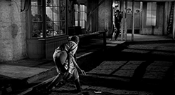

#3. La figure de l'héritage dans les westerns

Nous avons parlé d'héritage, dans la mesure où un film semble répondre d'une tradition en citant un genre dans son entier.  Ainsi le film criminel peut faire un détour par le western, pour mieux affirmer l'héroïsme de ses héros. La question de l'héritage doit cependant être saisie comme la ligne interne d'un film. Ce thème est en effet récurrent dans les films narrant la conquête de l'Ouest. Par exemple, dans *The Searchers*, le jeune Martin Pawley semble offrir une morale d'action plus acceptable, plus actuelle que celle de son partenaire Ethan Edwards - même si ce dernier se range au dernier moment au choix le plus humain, celui de ne pas tuer Debbie, capturée par les Indiens. La question de l'héritage se double logiquement du motif du conflit de génération : qui, du petit jeune ou du "vieux briscard", est plus à même de porter l'action héroïque ? Un *westerner* viellissant peut avoir conscience de ses limites, mais se trouver seul devant la nécessité d'agir (*Ride the High Country*, Sam Peckinpah, 1962), ou, au contraire, être sûr de son bon droit et refuser de passer le flambeau (*Red River*, Howard Hawks ; Arthur Rosson, 1948). Une scission dans la figure du cow-boy est ainsi instaurée, entre ceux qu'on interpelle d'un "*sonny boy*", et les autres qui ne peuvent pas être et avoir été, les "*old timers*". Cette opposition entre deux personnages nous offre non seulement une lecture alternative de la notion d'héritage dans le genre western, mais montre également une qualité double du héros que nous serons amenée à retrouver dans les chapitres à venir.

##3.1. La transmission générationnelle et le héros vieillissant

Dans les westerns dits classiques, une passation moins conflictuelle est généralement mise en place. *West of the Divide* (Robert N. Bradbury, 1934), par exemple, introduit un *westerner* et son jeune acolyte (John Wayne), mais au fur et à mesure que les actions s'enchaînent, John Wayne réalise ses exploits seul, accomplit sa vengeance personnelle et devient logiquement le centre du film. Cette passation est progressive, car non conflictuelle : un héros émerge, et devient, au lieu de l'enfant sauvé d'une mort certaine par son vieux compagnon, un homme mûr et autonome. Comme Christian Viviani l'explique, le westerner était présent, mais se trouvait rarement au centre de l'histoire : "*Chaque grand héros était, en général, flanqué d'un old timer haut en couleur destiné à donner corps à l'idée d'apprentissage, ou simplement à donner une note de pittoresque comique*"[^95]. Le héros vieillissant cesse dans nos exemples d'être accessoire, en marge du héros, puisqu'il est censé incarner le héros que nous avons connu, plusieurs années plus tard. Il existe toujours un personnage jeune, mais c'est lui cette fois qui se trouve dans l'orbite du héros vieillissant. Dans ce type de récit, l'alliance entre les deux personnages est beaucoup moins évidente que dans *West of the Divide*. En effet, même si nous avons été prudente avec les schémas cycliques, force est de constater que dès la fin des années 40, les passages de relais se font beaucoup plus douloureux.

Cette tendance est illustrée par *Ride the High Country* (1962), qui met crûment en relief le manque d'un héros qui viendrait remplir son rôle.  Dans ce film, Sam Peckinpah joue à démonter les attentes du spectateur en s'appuyant sur la familiarité de ce dernier avec le genre. Cela est manifeste dans une des premières scènes du film, qui illustre une course à laquelle Heck Longtree participe à dos de chameau (*fig. 5*) : l'Ouest dont il est question ici est finissant, son univers et ses valeurs cédant face aux assauts de la modernité. 

######fig. 5 : Signe des temps, le chameau bat le cheval dans *Ride the High Country* (1962).

Au niveau du casting, comme le note Christian Viviani[^96], ce ne sont pas des stars qui viennent s'illustrer, mais deux acteurs plus confidentiels, Joel McCrea et Randolph Scott - du moins si nous les comparons à John Wayne ou Henry Fonda. Si le schéma d'opposition entre le bien et le mal est bien présent, il n'en faut pas moins observer l'évidement progressif de la figure du héros tout au long du récit. Dans *Ride the High Country*, Steve Judd (Joel McCrea), ancien shérif, accepte de transporter un chargement d'or sur une route réputée dangereuse. Il s'associe pour ce faire à un ancien ami, Gil Westrum (Randolph Scott), et au jeune associé de ce dernier, Heck Longtree (Ron Starr). Westrum et Longtree comptent bien détourner le magot : si Longtree ne voit pas d'inconvénient à se débarrasser de Judd, son ancien comparse préférerait le convaincre de s'associer à eux. En chemin, les trois associés sauvent la jeune Elsa d'un dangereux mariage avec Billy Hammond, qui comptait la prostituer à ses frères. Elsa tombe sous le charme de Heck Longtree et suit le convoi, désormais en possession de l'or. Face à l'intégrité inébranlable de Judd, Westrum et Longtree décident de fuir avec le butin. Judd les surprend, et promet de les livrer à la justice lorsqu'ils auront atteint leur destination. Le groupe est cependant rattrapé par les frères Hammond. Heck tente de se battre, mais il est vite blessé, et se replie avec Elsa. Westrum et Judd unissent leurs forces dans la bataille, mais Judd est mortellement touché. Westrum lui assure qu'il assurera la livraison comme cela était prévu, et Judd répond dans un dernier souffle : "*Je le sais bien. Je l'ai toujours su. Tu as juste oublié un temps, voilà tout*"[^97].

Dans ce récit, les "méchants" que sont les frères Hammond sont de facture plutôt classique (ils sont vulgaires, vénaux et maltraitent les femmes), et face à eux, du côté des "gentils", trois personnages se disputent donc la place - la figure du héros s'en trouve alors d'autant plus évidée. Steve Judd a une bonne réputation, mais il est trop vieux[^98], et condamné à risquer sa vie pour un maigre salaire. Son ancien ami Gil Westrum est également âgé, et qui plus est, appelé à le trahir (pour revenir, enfin, sur cette trahison). Peckinpah utilise ainsi Randolph Scott à contre-emploi, puisque l'acteur était plutôt habitué aux rôles de personnages bons et intègres[^99]. Enfin, le jeune Heck Longtree, progresse, il est vrai, du statut de blanc-bec à un personnage plus héroïque. Néanmoins, il trahit lui aussi Steve, et participe de la suite d'événements qui aboutiront à la mort de ce dernier. Ce destin de traître est par ailleurs inscrit dès le début du film. Le personnage est introduit par une course à laquelle il participe à dos de chameau, ce qui constitue déjà une transgression vis-à-vis de l'éthique de l'Ouest, qui veut que le héros monte à cheval[^100]. 

Le jeune Heck se rachète dans la bataille finale qui oppose les trois personnages aux frères Hammond, mais Peckinpah ne donne jamais d'indices qui indiqueraient, ou traduiraient cette passation de pouvoir. Au contraire, le dernier plan du film montre Steve Judd, criblé de balles, assis sur le sol, qui s'effondre hors du plan (fig. 6). La caméra reste fixe, et ne montre alors plus que le paysage (le *High Country* du titre), et un fragment du corps de Judd. La place du héros lui revient, puisqu'il est le seul à avoir conservé une morale d'action claire, du côté de la loi et de ses principes : il accepte de transporter l'or, et malgré sa faible rémunération, ne pense jamais à le voler ; il intervient pour sauver la jeune Elsa d'un mariage douteux (et contrairement à Heck, sans espérer quoi que ce soit en retour) ; enfin, il est prêt, au nom de la Loi, à livrer son ancien ami au shérif après qu'il l'a trahi. Lorsque Judd quitte le plan, donc, la lignée héroïque reste brisée, la place du héros, désaffectée. Heck, seul candidat probable au poste, se rapproche en effet de Steve à la fin du récit : il refuse de le trahir une seconde fois, et avoue même que les derniers événements ont forcé son admiration envers lui. 

######fig. 6 : Steve Judd s'écroule hors du champ à la fin de *Ride the High Country*.

Néanmoins, avant que Steve ne s'écroule, un plan nous révèle Heck, tenant Elsa par l'épaule. Gil, sur l'ordre de Steve, tient le jeune couple à distance. Il nous semble ainsi clairement suggéré que Heck épousera Elsa, dès lors qu'il est tenu à part du combat et de ses conséquences macabres. Plutôt que d'être le héros héritier de Steve Judd, il deviendra sans doute fermier (*rancher*) dans la propriété d'Elsa (la mort du père de celle-ci va également dans le sens de cette interprétation). Enfin, l'absence de paroles échangées entre Heck et Steve dans ses derniers moments achève de dessiner cette ligne brisée : les derniers mots de Steve sont pour Gil, traître repenti. Steve Judd pardonne à son partenaire, et transforme ainsi la trahison en un moment d'égarement. Si transmission il y a, c'est d'un *old timer* à un autre : néanmoins, la conversion de Gil est un peu tardive pour que l'on puisse considérer ce personnage comme un héros à part entière. Il se rachète dans une ultime action courageuse : ce n'est pas assez pour être complètement le héros de l'histoire, mais trop pour ne pas prétendre à ce titre.

*Ride the High Country* questionne également l'héroïsme et sa temporalité en montrant directement le vieillissement des héros : c'est une façon de traiter le temps qui passe dans le récit (les voitures, remplaçantes des chevaux, apparaissent dans le film) et le temps, effectif celui-là, qui a affecté le genre western[^101]. Les westerns crépusculaires mettent ainsi en avant de "vieux" *westerners*[^102], et interrogent parallèlement la validité de la figure du héros : un héros, peut-il tirer de sa maturité un héroïsme renforcé ? La figure du vieil homme, de l'*old timer*[^103], souvent encore vert, croise celle du "never were" (celui qui n'a jamais été), parfois encore dans la force de l'âge, mais déjà dépassé. En ce qui concerne la prolifération de la version "âgée" du *westerner*, il existe une "*aura de vieillissement*"[^104] qui semble baigner les westerns modernes, des westerns révisionnistes aux survivances plus isolées du genre dans les années 1980-2000 (malgré ce qu'on pourrait appeler un retour de flamme, relativement, des œuvres de Clint Eastwood au récent *The Assassination of Jesse James by the Coward Robert Ford*, en 2007[^105]). Le cow-boy semble nécessairement vieux, ou plus exactement *vieilli* : l'usage, à ce titre, d'acteurs s'étant illustrés dans le genre pendant leur jeunesse témoigne de cette intention. Le corps de l'acteur reste malgré l'âge identifiable, mais ce qui est perdu en force semble être compensé par la fascination suscitée. En effet, le vieillissement peut être un moyen de contourner une "*norme ressentie comme  insupportablement banale*"[^106] : cette norme, ce peut être celle du cow-boy droit dans ses bottes ("*self-righteous*"), téméraire, jamais décoiffé, d'âge mûr et fringant, etc. Autrement dit, vieillir, et donc ne pas mourir, c'est encore une façon de ne pas, de ne rien transmettre. Les raisons peuvent être multiples, mais à chaque fois, devenir un old timer revient à rejeter le dernier acte qui pourrait consacrer la carrière du héros. Si Thomas Dunson (ou Ethan Edwards) refuse de laisser Matt Garth (ou respectivement Martin Pawley) prendre la relève, Steve Judd préfère pardonner la trahison de son ami que de parler à celui qui incarne une "descendance" possible. 

Dans tous les cas présents, nous observons que le genre western traite souvent, et de façon réflexive, de la difficulté à faire émerger une lignée de nouveaux héros *westerners*[^107] - ou peut-être cette difficulté exprime-t-elle autant la mort de l'Ouest, qu'une absence de désir de la part des personnages (qui ne veulent ni continuer, ni transmettre). Le spectateur voit, en effet, ces *old timers* refusant de céder leur place, ou des jeunes personnages qui ne sont tout simplement pas aptes à prendre le relais. Si on ne peut que supposer l'installation du jeune Heck dans un confortable foyer dans *Ride the High Country*, dans *The Magnificent Seven* (John Sturges, 1960), l'adolescent du groupe, Chico, décide sans aucune ambiguïté de se marier avec une villageoise, et de renoncer à une vie d'aventures. L'impossibilité de définir un cow-boy qui soit véritablement moderne suit donc deux lignes : dans un cas, celle du cow-boy de l'Ouest, doublement historique (au sens du genre, et au sens de l'historicité propre aux films) qui devient une figure usée au lieu de passer le relais, ou, à l'opposé, le chemin de héros toujours verts par nécessité, ne trouvant pas la relève nécessaire[^108]. 

##3.2. La transmission symbolique, d'Est en Ouest

Le thème de l'obsolescence est donc récurrent dans le genre western, en tant que problème des héros, de leur idéal (la Frontière) mais aussi du genre cinématographique qui les illustre. L'émergence d'un héros central, se plaçant comme le responsable d'une situation, est recadré pour devenir polarité entre deux modèles possibles. Le magnétisme entre les deux figures, les oppositions, font de l'héroïsme non plus une donnée acquise, mais une question (quel est le personnage le plus adéquat à une situation, et plus profondément, à toute une époque ?) à laquelle le film se chargera de répondre. "Vieux", dans ce cas, n'est plus tant une question d'âge, que de modernité : un personnage peut être déjà laissé pour compte avant même d'avoir servi la cause héroïque. Tom Doniphon (*The Man Who Shot Liberty Valance*, John Ford, 1962) est représentatif de cette forme binaire opposant deux candidats à la position du héros, dans la mesure où il tisse également un jeu complexe entre héros contemporain et héros anachronique, entre héros véritable et héros fictif. Ce dernier aspect indique bien entendu un autre point d'ancrage possible pour problématiser l'héroïsme, mais il forme également un thème de prédilection de John Ford : dans nombre de ses films, entre le récit des actions réelles et le récit qui en assure la mémoire, il se situe en effet un écart (*Fort Apache* en constitue un exemple).

Dans *The Man Who Shot Liberty Valance*, Ransom Stoddard (James Stewart) et Tom Doniphon (John Wayne) présentent deux masculinités opposées, donc deux tendances possibles de l'héroïsme, et possèdent chacun, à l'inverse, des défauts qui leur interdisent d'endosser seul la place de héros (*fig. 7*). Tom Doniphon est un *rancher* qui présente tous les attributs iconiques de l'homme de l'Ouest, le chapeau, les éperons, une arme qu'il sait rapidement dégainer[^109], un aide fidèle (Pompey), et un comportement courageux que laisse supposer la réunion de ces signes. Il est le seul dans la petite communauté de Shinbone à s'opposer à Liberty Valance, hors-la-loi cruel qui terrorise la population, y compris le shérif. De l'autre côté, Ransom Stoddard constitue un élément extérieur ; venu de l'Est pour tenter l'aventure, de son propre aveu ("*J'avais pris la maxime d'Horace Greeley littéralement : va à l'Ouest, jeune homme, va à l'Ouest et cherche la célébrité, la fortune et l'aventure*"[^110]), il porte des costumes noirs, parle un langage châtié, et, étant jeune juriste, ne jure que par ses livres de droit. 

######fig. 7 : L'homme de l'Ouest (John Wayne) face à l'homme de l'Est (James Stewart).

Le récit travaille à déterminer qui, du local bourru ou du jeune homme de Loi, est le plus apte à protéger la communauté de Shinbone des assauts de Liberty Valance. La faiblesse semble dans un premier temps du côté de Stoddard : il arrive à Shinbone par accident, car sa diligence a été arrêtée par la bande de Valance, qui l'a lui-même roué de coups. Pour Tom, il est donc un "*pied-tendre*" ("*tenderfoot*"), l'opposé du héros fort et courageux dont la ville a besoin. Néanmoins, si Tom possède la force de s'opposer à Liberty Valance, il n'utilise pas cette force pour l'empêcher de nuire une bonne fois pour toutes. C'est ainsi que peu à peu, Stoddard compense par la volonté et la rigueur morale la force et la compréhension de l'éthique de l'Ouest qui lui manque (faute, pense Tom, de savoir manier une arme à feu). Nous verrons dans un chapitre ultérieur que cette opposition entre un héroïsme physique et son versant plus mental constitue une illustration de la binarité Est / Ouest, et répond de deux définitions antithétiques de la masculinité américaine.
Le milieu du récit voit Stoddard s'élever au niveau de Tom  : certes, il lui manque la force de son opposant, mais sa ténacité, révélée par la création d'une école et l'organisation d'une élection semble faire la différence. Cette dernière action déclenche la colère de Liberty Valance, qui s'en prend à Peabody, le rédacteur en chef alcoolique du journal local. Stoddard, révolté, va prendre la situation en main. Lors d'une scène capitale, Stoddard provoque Valance en duel. Malgré deux tirs imprécis, l'avocat réussit à tuer le hors-la-loi : cette action lui vaudra la gloire (*fig. 8*). 

######fig. 8 : Un homme de l'Est devient héros de l'Ouest dans *The Man Who Shot Liberty Valance* (1962).

Tom arrive plus tard (c'est-à-dire trop tard), pour s'excuser piteusement. Entre un personnage qui vient de se surpasser, et un autre qui était tout simplement absent, aucune ambiguïté ne semble subsister : Stoddard, pourtant le plus faible au départ, est devenu le héros de l'histoire (et du même coup, de l'Histoire). C'est d'ailleurs lui qui recevra les honneurs et épousera Hallie, la femme à qui Tom faisait la cour. Un héros a été destitué, un autre a émergé. Nous pouvons dès à présent lire dans la victoire de Stoddard une portée symbolique évidente : le *westerner* est devenu anachronique, ses méthodes ne sont plus d'actualité. L'homme de l'Est l'a remplacé, et son iconographie supplante celle du stetson et du revolver : ce héros-là porte des costumes repassés, arbore des cheveux courts, et se sert de livres en fait d'armes[^111]. Qui plus est, les méthodes propres au *westerner* (le duel, et sa forme canonique le *showdown*) ne sont plus les siennes en propre, puisque ce nouveau héros de l'Est peut momentanément s'en emparer. Nous reviendrons sur cette question, mais il nous faut avant tout éclaircir les enjeux propres au dénouement du film.

Dans une dernière partie, les citoyens de Shinbone votent pour défendre le partage équitable des terres d'élevage. Stoddard, qui a incité depuis le début la petite communauté à se défendre contre les tenants de l'*open range*, est naturellement présent et reçoit une ovation. Tom profite du rassemblement pour parler à Stoddard, qui refuse de bâtir une carrière sur son exploit - un meurtre. Tom lui révèle alors qu'il n'est pas l'homme qui a tué Liberty Valance. De courts flash-backs, en insert, montrent une deuxième fois la scène, du point de vue cette fois de Tom, caché non loin des deux opposants pendant le duel (*fig. 9*). On apprend ainsi que c'est lui qui a tiré les coups mortels qui ont eu raison de Liberty Valance. 

######fig. 9 : Le spectateur découvre la vérité ; c'est Tom Doniphon qui a tué Liberty Valance.

Tom, lors de la conversation, n'est plus que l'ombre de lui-même : son visage est terni, il se tient voûté, il est décoiffé, mal rasé et sale. Pourtant, cette révélation fait de lui le véritable auteur de l'action héroïque, logiquement, le héros. Ce rétablissement de la vérité ne change paradoxalement rien au cours des événements (elle change tout pour Stoddard sur le plan psychologique, en revanche) : Tom renonce à Hallie, Stoddard poursuit sa carrière. La véritable question, dans ce cas, n'est pas de départager Tom et Stoddard sur le plan de l'héroïsme. Car, si nous faisons la part de l'intertextualité d'un film à l'autre dans la filmographie de Ford, et que nous nous rappelons la leçon du *Fort Apache* (John Ford, 1948), il faut constater que le héros, même fictif, reste le héros. Plus encore, ne sont des héros que ceux que l'Histoire se rappelle comme tels ; entre d'autres termes, mérité ou non, le qualificatif de "héros" repose avant tout sur une fiction. 
Stoddard est donc le héros reconnu par la population (à commencer par les habitants de Shinbone), mais Tom est le véritable héros de l'histoire, pour nous spectateurs, puisque nous sommes mis dans la confidence lors de la scène d'aparté entre les deux personnages. C'est là, sans doute, que le bât blesse, et que l'héritage de *Liberty Valance* nous semble tout à fait décisif, dans le sens où il découpe le héros, figure traditionnellement spécifique, comparable à aucune autre, comme double, ou bicéphale. Nous aurons besoin de retourner à cette notion d'un héros biface : de *Johnny Guitar* à *The Insider*[^112], l'action, et parfois l'héroïsme même doit pour fonctionner se diviser, se répartir entre deux personnages qui se compensent et se complètent, à l'opposé des films des années 80 qui pratiquent un héroïsme superlatif (par le muscle, le plus souvent) limité à un seul corps[^113]. Ici, ce ne sont pas à des "*tireurs à la Jekyll et Hyde*"[^114] (selon la terminologie de Rita Parks) que le spectateur a affaire, mais presque à la radicalisation de leur schizophrénie : la psyché héroïque est si divisée qu'elle nécessite deux corps pour exister.

La figure héroïque ne coïncidant pas avec un seul corps, elle se présente du même coup de manière diffractée, entre le héros mythologique, figure attendue du public (habitants de Shinbone ou public des salles), et le héros véritable, qui ne présente pas bien, mais qui sait encore s'acquitter de sa tâche. Naturellement, le héros n'est jamais une figure unique et isolée que dans une certaine mesure ; par exemple, dans *My Darling Clementine* (John Ford, 1946), la fratrie Earp entière bénéficie d'une aura héroïque. Mais c'est bien entendu Wyatt qui concentre toute l'attention, et se détache, au sein d'un groupe héroïque comme étant le plus héroïque de tous. En d'autres termes, il survit toujours[^115], attaché au héros, le principe de son unicité et sa spécificité, même lorsqu'il n'est pas un cavalier solitaire responsable de défendre les valeurs de l'Ouest. *Liberty Valance* opère le démontage de ce principe, pratique sa décomposition point par point : le héros, dès l'Ouest, pose Ford, est irrémédiablement une figure du divorce, entre image héroïque fantoche, et ce qu'elle cache, un véritable héros ressenti comme n'étant plus montrable[^116]. Le titre même pointe le héros comme étant le lieu d'une énigme. Philip French parle ainsi de *The Fastest Gun Alive* (Russell Rouse, 1956) comme d'un "*duel pour déterminer qui a la main sur le titre du film*" ("*a duel to determine who has the right  to the film's title*"[^117]). Potentiellement, l'expression "L'homme qui a tiré sur Liberty Valance" renvoie elle aussi à deux signifiants. Toutefois, l'histoire ne propose pas de résolution, puisque chacun a, à sa manière, tué le bandit. La formulation du titre entretient d'ailleurs cette ambiguïté[^118] : c'est l'homme qui a *tiré* (*shot*) sur Liberty Valance auquel il est fait référence, pas à celui qui l'a *tué* ("*killed*"). En toute rigueur, "*The Man*" dans le titre forme le lieu d'un indécidable, puisque Doniphon et Stoddard ont bien tiré sur leur ennemi - c'est autre chose que de savoir quelles balles ont porté. Malgré son unicité traditionnelle, le héros est donc ici posé comme signe biface, ne renvoyant qu'à l'impossibilité de décider qui, au fond, est véritablement *le* héros. L'élément critique ne se situe pas ici au niveau de l'héroïsme, qui existe toujours comme valeur et comme visée ; mais entre la valeur et ses référents et représentants, une distance se crée.

Ces observations, directement associées à notre problématique des héros en crise, ou critiques dès lors même qu'ils sont héros, doivent être reliées avec un deuxième problème d'ordre généalogique. En effet, nous avons ici montré comment Tom et Stoddard (Wayne et Stewart) forment les deux faces d'un héros qui ne parvient pas à "tenir" dans un seul corps[^119], et qui participent d'un motif d'aller-retour, dès lors qu'il s'agit d'évaluer lequel est le plus héroïque des deux. Décider que Stoddard est le héros, c'est aller contre la réalité des événements telle qu'elle est révélée par Tom, et doublée d'un flash-back par John Ford pour entériner cette version. Dire que Tom Doniphon est le véritable héros, c'est oublier qu'il n'est le héros de personne, et que son exploit a seulement précédé sa déchéance (physique à tout le moins). Néanmoins, si la question du héros véritable trouve chez Ford la forme d'un indécidable, le sort du *westerner* et de sa succession, est soldé au bénéfice de l'homme de l'Est, ici Stoddard. Nous avons exposé précédemment comment les personnages étaient visuellement et symboliquement opposés, formant deux figures représentatives de l'Est et de l'Ouest ; rappelons-nous également que pour Will Wright, l'appartenance à l'Ouest, à sa mythologie empreinte du contact avec la *wilderness* est une sorte de minimum héroïque que le héros de western se doit de respecter ("*c'est l'exigence minimale pour le héros que d'appartenir à l'Ouest et de ne pas être associé à l'Est, l'instruction et la culture*"[^120]).

À l'intérieur d'un western, Ford pose donc un certain anachronisme du personnage traditionnellement associé au genre, alors que d'autres exposeront la mort de l'Ouest au travers de symptômes, surtout topographiques, comme la fermeture des lieux d'élevage (*The Man from Laramie*, Anthony Mann, 1955), la progression des exploitations minières (*Pale Rider*, Clint Eastwood, 1985) et la progression du réseau ferré. Il est certain que Ford pose une figure comme étant dépassée, historiquement anachronique, et l'autre comme plus en phase avec l'esprit du temps. Tout d'abord, Tom Doniphon n'existe qu'au passé : il est mort lorsque l'histoire commence, et ne revit qu'à travers le récit de Stoddard. Une telle introduction nous présente un monde où les *westerners* appartiennent à l'Histoire, tandis que l'Est est devenu la figure symbolique d'actualité (tout le monde respecte Stoddard, l'appelle Sénateur). Le récit, malgré la faiblesse apparente de Stoddard, raconte ce glissement de la loi du plus fort à la démocratie, de l'arme de Doniphon (à laquelle son discours fait constamment référence) aux livres de Loi, et par là le passage d'une époque à l'autre, d'un régime symbolique à l'autre. Bien entendu, la dernière partie fait justice à Doniphon sur le plan de l'action, mais elle ôte définitivement toute actualité à la figure plus large du *westerner*. Lorsque Stoddard se rend, après le règlement de comptes, au vote opposant les tenants de l'élevage en liberté (*open range*) aux partisans des États (*statehood*), il se retrouve face à son adversaire cupide, Buck Langhorne. Celui-ci, pour inciter les citoyens à voter pour lui, accompagne son discours d'un spectacle, où un cow-boy fringant fait irruption à cheval dans la salle, et effectue un petit tour de lasso (*fig. 10*). 

######fig. 10 : Obsolescence d'un modèle : le *westerner* est réduit à l'état de divertissement. 

######fig. 11 : Mort dans le présent du récit, Doniphon est recomposé comme image grâce à l'intervention de Stoddard, qui exige de le voir enterré avec ses bottes.

Ce dernier moment témoigne d'un renversement : le temps de la politique, du vote et plus largement de la culture de l'Est Américain a pris le pas sur l'Ouest, ravalé au rang de spectacle[^121], juste bon à divertir les foules pour gagner quelques voix. Bien sûr, Tom Doniphon, véritable *westerner*, fait irruption le temps de révéler la vérité à Stoddard : mais en lui avouant qu'il n'est pas l'auteur du meurtre de Valance, il le libère d'une culpabilité qui aurait pu le faire renoncer à ses fonctions politiques. 
Enfin, le dernier hommage de Stoddard à la dépouille de Tom, des années plus tard, est également significatif, et achève de signifier l'obsolescence du héros de l'Ouest. Les enterrements prennent habituellement la forme de célébrations chez Ford, tandis qu'ici, l'adieu à Doniphon fait figure de contre-événement[^122]. Face au corps de son ancienne connaissance, Stoddard tombe en arrêt, et cédant à la colère, exige qu'on l'enterre avec ses bottes, ses éperons, et son arme (*fig. 11*). Le vieux sénateur recompose ainsi Tom comme image[^123], en lui rendant son arme sans laquelle il ne serait pas un *westerner* digne de ce nom - et peu importe si Tom n'en portait plus depuis des années. Tout comme dans *The Alamo*, ce ne sont ni la vérité des faits d'armes, ni la justesse des symboles qui comptent : le héros (Stoddard) et le *westerner* (Tom) subissent au fond le même sort, condamnés à être l'image de ce qu'ils ne sont pas, ou plus. Nous voyons ici que malgré la simplicité apparente de l'intrigue, les aller-retour entre héros fictif et réel tissent un fil sans fin. Cette ligne directrice est l'occasion de rebonds perpétuels : nous passons de l'avocat devenu héros de l'Ouest, à ce même personnage destitué lorsque nous comprenons que l'exploit à main armée est resté le fait du *westerner* ; puis le *westerner* meurt pour mieux se figer du côté de l'icône[^124], tandis que l'homme de l'Est se tient devant lui en chair et en os ; puis, enfin, la dernière scène dans le train, où un employé vient s'assurer du confort du héros local replace Stoddard en défaut, dans la mesure où lui sait qu'il n'est pas l'homme qui a tué Liberty Valance. Il est ainsi impossible de situer les personnages en les rattachant une fois pour toutes aux catégories de héros, ou non-héros : Stoddard symbolise certes la mutation des valeurs au profit de l'Est, mais sa victoire illusoire porte à faux : car l'exploit primitif, du duel remporté grâce à l'arme à feu, reste la seule forme possible de victoire. Le *westerner* n'est donc plus adéquat comme image, mais survit au travers d'une action dissimulée, dont il ne peut plus être l'auteur. L'homme de l'Est est certes vainqueur sur le plan de l'héroïsme, mais il a dû à cette fin dérober à l'homme de l'Ouest sa mythologie. 

Pour qu'il y ait généalogie, il faut qu'un héros cède le pas à un autre. Ici, tandis que le passage de témoin s'effectue, c'est plus largement la figure du héros tout entière qui fait l'objet d'un réexamen critique débouchant sur une impasse : la qualité héroïque est voilée d'indécidable, entre deux corps, deux personnages, où l'un semble toujours de trop. L'image apparaît du même coup comme le seul mode d'existence possible pour le héros, ce qui explique la victoire (au regard de l'Histoire, au moins) de Stoddard : face à cette mutation déjà évoquée dans *The Alamo* (John Wayne, 1960), le *westerner* n'a d'autre choix que de se ranger à ce nouveau mode d'existence. Ce régime d'apparences constitue la seule forme viable pour le *westerner*, qui apparaît dans la dernière séquence de *Liberty Valance* sous les traits d'un homme acculé, épuisé, ombre d'une gloire passée. 
En termes de transmission (ou de généalogie), d'un héros à l'autre, puisque c'est la question qui nous préoccupe dans ce chapitre, il faut donc réévaluer le legs du *westerner* aux héros qui lui font suite, qu'ils soient de l'Ouest ou non. À cet égard, deux films aussi différents que *Liberty Valance* et *Ride the High Country* (mais contemporains, sortis tous deux en 1962) forment les extrémités des possibles héroïques à la suite des hommes de l'Ouest. Dans le premier cas, Ford, déjà âgé, décrit la place du héros comme le lieu de toutes les fragmentations, entre deux figures incompatibles mais pourtant inséparables. De l'autre, Peckinpah nous met à face à un signifié (Steve Judd, seul personnage intègre du film) qui s'écroule et se sépare de son signifiant héroïque, laissant le signe "héros" n'exister qu'en creux. Le *westerner* tel qu'il est défini par le cinéma des années 60, léguerait, en dépit des apparences, une base déjà critique, donc instable, aux héros. 
Surpeuplée ou désertée, la figure héroïque devient icône, image se signalant comme telle. Elle semble également habitée d'une aura mystique lorsqu'elle s'incarne dans des acteurs faisant figure de "monstres sacrés" (John Wayne, tout particulièrement). En somme, le vieillissement n'est pas le mal véritable qui ronge les héros : il constitue plutôt une manifestation physique, révélant l'incapacité du héros à se renouveler. Clint Eastwood, à une autre extrémité, se fait l'écho de ce devenir-image mortifère pour les héros. À l'Indien qui se plaint à Josey Wales de son grand âge ("*Il fut un temps où j'avais du pouvoir. Maintenant l'âge me rattrape doucement*"[^125]), ce dernier répond : "*Ce sont plus les vieilles habitudes que l'âge*"[^126]. Autrement dit, ce n'est pas tant la vieillesse comme phénomène physique, entropique qui pose problème au héros au regard de sa mission : c'est l'habitude, la répétition du même, et son figement en image qui provoque un épuisement. Ainsi la répétition à l'envi du stéréotype du *westerner* peut avoir raison de l'intégrité de celui-ci : Steve Judd apparaît comme le dernier de sa lignée, tandis que Tom Doniphon ne reprend ses attributs de héros de l'Ouest que le jour de son enterrement. Pour les héros à suivre, l'homme de l'Ouest sera ainsi la figure la plus embarrassante qui soit, mais aussi la plus incontournable : si elle est usée par sa redondance, elle porte également celle-ci comme un drapeau, sur des visages familiers et usés par le temps.

___

[^95]:  VIVIANI Christian. *Le Western*. op. cit., p. 142.

[^96]:  Ibid., p. 123.

[^97]: "*Hell*, *I know that. I always did. You just forgot it for a while, that's all*".

[^98]: Nous n'introduisons pas ici de catégorisation des héros par rapport à leur âge : de l'aveu propre des personnages Steve Judd et Gil Westrum, il ne fait pas bon vieillir, et c'est l'un des thèmes essentiels qui anime leur discours.

[^99]: BUSCOMBE Edward. "The Idea of Genre in American Cinema". 1995, p. 22.

[^100]: Nous empruntons ici son analyse à Edward Buscombe : "*Un cheval, dans un western, n'est pas seulement un animal mais un symbole de dignité, de grâce et de pouvoir. Ces qualités sont tournées en dérision lorsque le cheval entre en compétition avec un chameau ; et pour couronner le tout, c'est le chameau qui gagne*" ("*A horse in a western is not just an animal but a symbol of dignity, grace and power. These qualities are mocked  by having it compete with a camel; and to add insult with injury, the camel wins*"), ibid., p. 22.

[^101]: VIVIANI Christian. *Le Western*. op. cit., p. 126.

[^102]: Le ton des westerns crépusculaires, résolument pessimiste, est ainsi évoqué par Christian Viviani qui parle de "*vieux cowboys nostalgiques, à la chevelure grisonnante, aux rides émouvantes agonisant interminablement dans la mélancolie bleutée du crépuscule*", ibid., p. 123.

[^103]: La question du héros jeune, bien que parallèle, sera traitée séparément, car elle rejoint la catégorie des personnages non-héroïques car "non finis", que ce soit par un excès de jeunesse ou de bêtise. En un sens, en effet, le nerd est un personnage qui n'a pas su grandir, héros manqué car adolescent perpétuel.

[^104]: BOURGET Jean-Loup. *Hollywood, la norme et la marge*. op. cit., p. 48.

[^105]: *3:10* *to Yuma* (Delmer Daves, 1957) présente également un héros d'âge mûr, mais avec cette particularité qu'il s'agit d'un homme normal, pour qui l'héroïsme n'a jamais été une option, mais qui soudainement va devenir sa raison de vivre, et de mourir : dans ce cas, l'héroïsme semble accompli in extremis (et présente une morale presque Épicurienne, pour laquelle il n'est jamais trop tard).

[^106]: BOURGET Jean-Loup. *Hollywood, la norme et la marge*. op. cit., p. 48.

[^107]: C'est un aspect traité par Richard Dyer, qui constate que la réflexivité va de pair avec la conscience d'une mort supposée du genre : "*Il existe des westerns, qui, en traitant de cow-boys vieillissants semblent incarner un adieu au genre, c'est-à-dire que ces films manifestent leur conscience du genre tout en déclarant sa mort*" ("*There are Westerns that in dealing with ageing cowboys seem to be writing valedictories for the genre, which means signalling awareness of it even while saying it is dying*") in DYER Richard. *Pastiche*. op. cit., p. 94.

[^108]: Notons toutefois qu'un même mouvement est observable dans le camp des villains : dans *Unforgiven* (Clint Eastwood, 1992), le personnage de Munny (Clint Eastwood) semble redevenir un hors-la-loi du fait même d'une absence de nouveaux prétendants au rôle. Le Kid, au départ impatient de faire ses preuves, renonce après son premier meurtre. Il admet en effet plus tard : "*Je ne suis pas comme toi, Will*" ("*I ain't like you, Will*").

[^109]: Notons ici que la figure de l'arme à feu est capitale dans l'opposition entre Stoddard et Tom. Ce dernier insiste en effet constamment sur le fait que la capacité à manier une arme est ce qui les différencie (par exemple, Tom dit ainsi à Stoddard : "*Oublie ce que j'ai dit quand j'ai parlé de t'acheter une arme. Tu es un pied-tendre*" ("*Forget what I said about buying a gun. You're a tenderfoot*").

[^110]: "*I* *had taken Horace Greeley's advice literally: Go West, young man, go West, and seek fame, fortune and adventure*".

[^111]:  Richard Dyer affirme ainsi que le meurtre de Liberty Valance symbolise l'établissement de la Loi (et nous serions tentée d'ajouter : de la civilisation) dans l'Ouest : "*an act that represents the establishment of Law in the West*" ("*un acte qui représente l'établissement de la Loi dans l'Ouest*") in DYER Richard. *Pastiche*. op. cit., p. 95.

[^112]: cf. JAMES Nick. "No Smoking Gun". 2000, p. 205.

[^113]: Du moins en apparences : nous verrons à l'occasion d'une analyse plus approfondie de cas particuliers que les corps d'Action peuvent être moins monolithiques qu'ils n'y paraissent.

[^114]: PARKS Rita. op. cit., p. 51-52.

[^115]: Du moins, jusqu'à la rupture radicale que constitue *The Wild Bunch* (Sam Peckinpah, 1969), où l'accent sera mis sur le collectif, quitte à absorber un héros possible dans le groupe, ou encore à introduire de possibles confusions entre le groupe des "gentils" et le groupe des "méchants".

[^116]: En tant que figure légendaire, le héros est au centre des questions sur la réalité et la portée de la fiction. En effet, nous nous rappelons ici cette observation : "*L'interrogation sur la légende est consubstantielle au western*", in LEUTRAT Jean-Louis, LIANDRAT-GUIGUES Suzanne. op. cit., p. 151. 

[^117]: FRENCH Philip. op. cit., p. 49.

[^118]: Cette ambiguïté n'est pas conservée pas le titre français, qui devient, de façon plus univoque, *L'homme qui tua Liberty Valance*.

[^119]: Notons ici que notre questionnement quant aux corps excédés est beaucoup plus large ; il orientera notre analyse des fonctions du muscle, cf. infra., p. 210-235.

[^120]: "*the* *minimal requirement for the hero is that he belongs to the West and has no association with the East, with education and culture*", in WRIGHT Will. op. cit., p. 57.

[^121]:  Il ramène en un sens, aussi, le western à ses origines du côté du burlesque, cf. LEUTRAT Jean-Louis, LIANDRAT-GUIGUES Suzanne, op. cit., p. 59.

[^122]: "*Contrairement* *aux enterrements dans les autres films de Ford, celui de Tom est un événement socialement marginal, une image d'échec, de discontinuité et de perte*" ("*Unlike funerals in other Ford's films, Tom's is a socially marginal event, an image of breakdown, discontinuity and loss*"), in PYE Douglas. "Genre and History. Fort Apache and The Man Who Shot Liberty Valance". 1996, p. 119.

[^123]: En ce sens, *The Man Who Shot Liberty Valance* semble annoncer des productions encore plus distanciées, comme *Buffalo Bill and the Indians, or Sitting Bull's History Lesson* (Robert Altman, 1976), où Paul Newman interprète un Buffalo Bill de pacotille, condamné à reproduire ses exploits sur la scène d'un cirque.

[^124]: Ceci est facilité par le fait que le spectateur ne voit pas Doniphon devenir vieux : son visage ne nous est jamais montré lorsque Stoddard vient l'enterrer. Edward Gallafent mentionne que la vieillesse de Wayne est contournée par le film : "*Les séquences qui encadrent la scène montrent bien que le sens du film est orienté par la mort d'un personnage que l'on ne voit pas, ce vieil homme que Wayne est devenu ; il est peut-être suggéré ici que, dans ce nouveau monde de l'Ouest civilisé, cette figure de la vieillesse ne peut être questionnée qu'à la condition de se trouver déjà dans son cercueil*" ("*The framing sequences make it clear that the meaning of the film turns on our consideration of its subjects in the light of the death of a figure we do not see, the old man that the Wayne character has become; perhaps the suggestion is that in the changed world of the developed West this figure can be the subject of such meditations only when he is in his coffin*"), in GALLAFENT Edward. "Not With a Bang: The End of the West in Lonely are the Brave, The Misfits and Hud". 1996, p. 241.  

[^125]: "*I* *used to have power. Now old age is creeping up on me*".

[^126]: "*It's* *more old habits than old age*".

