#4. Des *westerners* urbains: le cas des vigilantes

La plupart des films d'action et de divertissement des années 1980-2000 usent et abusent de ressorts métanarratifs, même lorsqu'il ne sont pas identifiés comme pastiches (comme *Last Action Hero*, par exemple). Dans certains cas, la référentialité est si forte que les héros ne semblent pouvoir exister qu'*en référence à*, comme dans *Die Hard* et *Falling Down* (Joel Schumacher, 1993). Dans le premier cas, le policier John McClane se trouve seul pour défendre un building contre une attaque terroriste, un modèle qui n'est pas sans rappeler le héros solitaire de *High Noon*. C'est dans le discours, et ses multiples références à John Wayne et Roy Rogers, que le lien avec le *westerner* se tisse davantage - nous y reviendrons. Le personnage sans nom de *Falling Down* (Michael Douglas) semble quant à lui vivre une journée ordinaire jusqu'à ce que, excédé par un embouteillage, il abandonne sa voiture en plein trafic. C'est un personnage nerveux, qui invoque perpétuellement ses droits et sa qualité de citoyen américain, même dans les situations les plus anecdotiques. À cause de cette colère profonde qui l'anime, *D-fens* (du nom de sa plaque d'immatriculation) va progressivement réagir à toute sollicitation par la violence, et la situation s'emballe : il commence par détruire le magasin d'un commerçant à coups de batte de base-ball, puis finira par braquer un fast-food avec des armes d'assaut. Il semble pourtant répéter les principes d'action du héros, mais son parcours le place finalement, à sa grande surprise (puisqu'il pensait être dans son bon droit) du côté des méchants. La scène finale l'oppose à Prendergast (Robert Duvall, qui a joué dans des westerns, notamment *The Chase* d'Arthur Penn), un policier sur le point de partir à la retraite[^127]. Leur face-à-face reproduit le *showdown* classique entre le shérif et le hors-la-loi, une référence internalisée et réfléchie par le discours de *D-fens*.

Dans les deux films, les héros sont conscients de la parenté de leur action avec celle, originelle, de l'Ouest. Dans *Die Hard*, le méchant Hans Gruber promet que cette fois, le héros ne s'en ira pas vers le couchant avec Grace Kelly : il se trompe[^128], puisque le cliché clôt le film, sur le mode du clin d'œil. Dans *Falling Down*, *D-fens* ne veut pas subvertir ce modèle, puisqu'il est persuadé d'être le héros. Il demande ainsi à Prendergast : "*Je suis le méchant [...] Comment est-ce arrivé ? J'ai fait tout ce qu'on m'a dit*"[^129]. Les deux exemples sont certes fort éloignés dans leurs intentions, l'un tenant du programme d'action, l'autre versant plutôt dans le drame, en marge de notre corpus. Cependant, les deux films utilisent la référence au western en l'insérant dans un décor urbain prégnant. C'est l'aspect le plus contradictoire du lien entre héros d'action et *westerner*. Si ce dernier voit parfois le monde qui l'a vu naître être gagné par la modernité, il reste quant à lui le témoin d'un autre temps, d'un autre espace (cette *wilderness* difficilement traduisible). Dans *Midnight Cowboy* (John Schlesinger, 1969), la contextualisation d'un homme de l'Ouest dans un décor urbain contribue à souligner son anachronisme, son inadéquation fondamentale à son époque. Le héros d'action se définit quant à lui par son appartenance à la ville : nous verrons plus loin qu'il va même jusqu'à faire corps avec son environnement. Il semblerait donc logique que ce héros d'action se situe davantage du côté de la tradition du film noir, autre genre urbain par excellence. Et en effet, nous retrouverons quelque chose du policier *hard-boiled* chez John McClane : nonchalant, il renâcle à prendre la situation en main, mais brille par son sens de la répartie et des bons mots. Là où cette tradition du noir est assimilée par le film d'action, de façon assez continue, l'opposition radicale de milieux entre le genre action et le genre western va générer une contradiction manifeste chez les héros. 

Dans le western, la tension entre civilisation et espace sauvage (avec la Frontière comme point de contact) plaçait le héros devant un choix : il pouvait se fixer dans une ville naissante, ou s'éloigner vers l'horizon avec son cheval. Cette tension disparaît dès lors que l'urbanisation l'a emporté sur les grands espaces. À côté d'un *Midnight Cowboy* encore versé dans l'évocation mélancolique d'une époque révolue, les films de vigilantes des années 70 vont prolonger la figure du *westerner*, arrachée à son contexte d'origine. *Dirty Harry* (Don Siegel, 1971) et *Death Wish* (Michael Winner, 1974) convoquent tous deux la figure de l'homme de l'Ouest, mais comme présence fantomatique, qui vient hanter des héros imparfaits, trop violents pour être simplement héroïques. La ville a perdu son contrepoint, l'espace sauvage : le héros ne doit plus choisir entre les deux, mais plutôt prêter son corps à une morale fantôme qui a perdu sa géographie d'origine. La figure de l'homme de l'Ouest va ici devenir indépendante du genre qui l'a mis en scène, et surgit à l'envi pour pallier un héroïsme ressenti comme absent. Ressortir l'attirail du shérif ou du cow-boy, peut certes permettre de rattraper une lignée héroïque, mais cela peut également revenir à admettre que la relève n'a pas été assurée. 

##4.1. Le vigilante à l'origine du héros d'action

Le vigilante est une figure particulière, dont l'action consiste à se faire justice lui-même. Ce principe est souvent alimenté par un esprit de revanche sur la société. Convaincu que les lois traditionnelles sont inefficaces, le vigilante prend la Loi entre ses mains, à la manière du westerner, et plus particulièrement du mercenaire, figure centrale du western des années 60[^130]. Les années 70 ont vu l'éclosion d'un cycle de films construits autour de la figure du vigilante. Nous n'irons pas jusqu'à parler d'un genre, même si Thomas Schatz inclut quant à lui ces films sous la dénomination de "*film criminel urbain*"("*urban crime film*"[^131]). *Dirty Harry*, dont le titre même annonce l'impureté du personnage principal, en est le premier exemple en 1971, suivi de *Magnum Force* en 1973. En 1974, un autre vigilante, cette fois interprété par Charles Bronson, fait son apparition dans *Death Wish*. Le cycle des *Dirty Harry* sera complété par trois films (*The Enforcer*, 1976 ; *Sudden Impact*, 1983 ; *The Dead Pool*, 1988). *Taxi Driver* (Martin Scorsese, 1976) présente également un exemple de vigilante, mais fétichise beaucoup moins son personnage. Nous l'écarterons de ce propos, premièrement en raison d'un nombre de scènes d'action réduit. La scène de la tuerie perpétrée par Travis Bickle fait plus écho au film de gangsters qu'elle ne semble avoir alimenté le film d'action. L'accent est davantage placé sur la psyché instable de Bickle : son action semble davantage pathologique qu'héroïque. La critique du film porte justement sur l'héroïsation erronée de Bickle par la société. En revanche, dans *Dirty Harry* et *Death Wish* (et à plus forte raison dans leurs suites, plus réactionnaires), même si les expéditions punitives des personnages sont questionnées, il est suggéré que le héros agit avec sincérité, pour défendre une cause encore noble. Contrairement à *Taxi Driver*, il n'est jamais suggéré que le meurtre génère un plaisir, tout au plus, une libération. 

*Dirty Harry* et *Death Wish* imposeront donc des modèles qui vont irriguer le héros d'action des années 80 et régler la transition problématique du western à l'action. Au-delà de ces deux cycles qui deviennent peu à peu contemporains des premiers films d'action, le thème du vigilante s'est prolongé, quoique de façon un peu marginale. *The Brave One* (Neil Jordan, 2007) constitue un remake de *Death Wish*, à la nuance qu'il substitue à l'architecte Paul Kersey une animatrice de radio interprétée par Jodie Foster - l'originalité résidant dans le choix d'un vigilante de sexe féminin[^132]. Par ailleurs, Vin Diesel, acteur associé au genre Action, s'est également illustré dans un scénario similaire (*A Man Apart*, F. Gary Gray, 2003)[^133]. Cependant, le vigilante mutera pour former, combiné à des héros issus d'autres genres, le héros d'action des années 80-90. C'est principalement en tant que figure de transition que nous nous attacherons à l'étudier.

Inspirée par la morale de l'Ouest, l'action idéale du vigilante repose sur l'autonomie ("*Personne ne livre mes combats*"[^134] dit Tom Doniphon dans *The Man Who Shot Liberty Valance*) une justification de la vengeance ("*Je considère que cet endroit me doit quelque chose et je compte bien recevoir mon dû*"[^135], *The Man from Laramie*) et enfin un certain manichéisme ("*Il y a le bien et il y a le mal. Chacun doit faire l'un ou l'autre*"[^136], Davy Crockett dans *The Alamo*). Ces critères constituent la base et la rationalisation de la quête du vigilante, et nous voyons qu'elle est directement issue du western. En peu de mots, son credo peut se résumer ainsi : peu importe la légalité des moyens, seule compte la fin, c'est-à-dire une action purificatrice libérée du droit officiel et de sa pesanteur administrative. Nous pouvons nous rappeler l'analyse de Warshow sur les figures du gangster et du *westerner*, dans le sens où les deux figures majoritaires du cinéma américain dans les années 40 sont toutes les deux incarnées par des hommes armés ("*men with guns*"[^137]). Mais contrairement au gangster dont l'énergie n'est jamais placée sous contrôle, et tend même à l'explosion perpétuelle, le cow-boy et ses avatars sont des figures contenues, à l'énergie rentrée, sinon apaisée. Cawelti reprend cette analyse de Warshow dans un sens qu'il nous faudra approfondir : le *westerner* résout la contradiction qui consiste pour un héros droit à faire usage de la violence en donnant sens à cette violence[^138]. La violence représente également un autre aspect crucial de la figure du vigilante : même s'il semble prendre goût à sa quête violente et vengeresse, ce personnage considère son action comme une compensation de l'inaction des autorités, selon le motif, qui deviendra récurrent dans les années 80, de la trahison des élites. En ce sens, le vigilante prend en charge toutes les scories de la société : dans *Death Wish* et *Dirty Harry*, le vigilante apparaît au travers de son action comme une survivance du *westerner* dans un espace qui pourtant constitue l'antithèse géographique et symbolique de l'Ouest. Le vigilante, particulièrement dans le cas de Dirty Harry, semble même pousser la figure du "*m[a]n with guns*" à son paroxysme. Dès le premier film de la franchise, la figure de Harry Callahan, incarnée par Clint Eastwood est associée à celle, tout aussi puissante, du Magnum .44. Il a souvent été affirmé[^139], à raison, que cette arme accède au rang de personnage dans le film. Elle est l'objet d'un discours appuyé de la part du policier dans Dirty Harry, qui explique ainsi au voleur tenté de résister à son arrestation : "*Comme ceci est un Magnum .44, le plus puissant feu du monde, et qu'il t'arracherait net la tête, il faut te demander : "Ai-je de la chance ?". Alors, en as-tu, minable ?*"[^140]. Le pouvoir de fascination de l'arme est accentué par son appropriation par Clint Eastwood, qui la porte d'une main, à bout de bras, en marchant d'un pas décidé vers ses opposants. Le deuxième film de la franchise, intitulé de manière programmatique *Magnum Force*, prolonge ce motif et en fait un signe puissant, dès le générique d'ouverture : celui-ci, apparemment dépouillé, présente le bras tendu de Harry Callahan, tenant l'arme, sur un fond monochrome rouge (*fig.12*). Les crédits se succèdent, tandis que ce plan fixe apparent se révèle être un zoom très progressif, presque imperceptible. À la fin du générique, le bras effectue un tour à 90 degrés, de sorte que la caméra se retrouve face au canon du Magnum ; le spectateur entend alors la voix de Harry reprendre le discours précédemment évoqué (ainsi visé, il a la sensation que le policier s'adresse à lui). Le générique est clos par le tir venant de l'arme, dont le son se superpose à celui d'un claquement de portes - en concordance avec le début du film. C'est le son qui permet de sortir de cette rêverie autour de l'arme, pour entrer dans le monde du récit. Néanmoins, cette courte introduction contribue à fétichiser un peu plus l'arme de l'inspecteur Harry, et à affirmer encore la nature de sa méthode, exclusivement punitive.

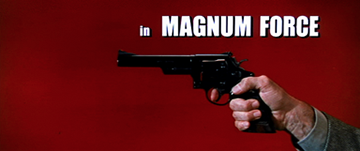
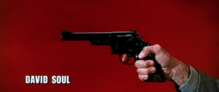
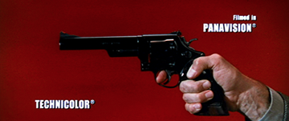
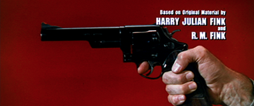
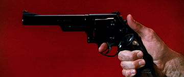
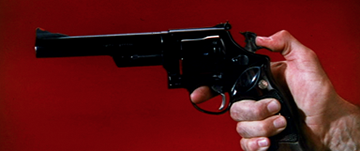
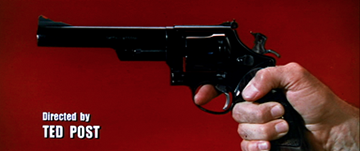
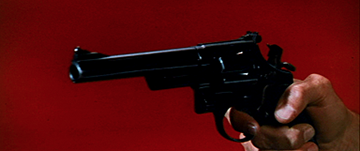
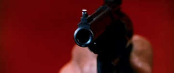
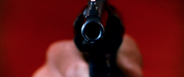

######fig. 12 :  Une ode au Magnum .44 en ouverture de *Magnum Force* (1973).

Alors que l'Ouest semble subsister au travers du mythe du shérif intouchable, il a disparu spatialement : reste l'impureté de la ville. Dans ces films de vigilante, la ville est tracée comme une structure carcérale, dans laquelle se déplace et se répand une criminalité qui prend une forme épidémique, gazeuse : le mal est partout, surgissant de nulle part. La rue est le motif topologique et graphique dominant, scène ouverte où toute personne seule est automatiquement agressée[^141]. Toutefois, cette violence se répand et gagne les espaces privés, comme dans le cas de l'agression à domicile de la femme de Paul Kersey (*Death Wish*), ou les épisodes finaux des aventures de l'inspecteur Harry. Dans ce dernier cas, les enquêtes mènent fortuitement le personnage dans des appartements où règne la luxure : violence sans limites et perversion sexuelle sont étroitement liées dans le discours propre à ce sous-genre. Cet espace, à la fois visuellement éloigné de l'Ouest, mais proche de lui au travers du motif de la corruption, va voir émerger le modèle des héros de la Frontière comme dernière chance de purification. Un contexte qu'on pourrait presque qualifier d'anti-Ouest (le contraire de la géographie étendue et sublimée du *Wild West*) verra donc surgir paradoxalement le héros vengeur comme seul modèle possible pour les deux personnages. Nous avons vu à travers l'exemple de *Liberty Valance* que l'emploi de l'arme à feu distinguait le vrai héros du pied-tendre (*tenderfoot*) : le vigilante reprend également cette distinction à son compte, en entretenant un rapport d'identification avec ses armes qui ne sont pas, comme pour le policier, les moyens de la légitime défense mais les instruments d'une purge à grande échelle. En somme, si l'on s'en tenait là, le vigilante pourrait apparaître comme une réactualisation du *westerner*, réinséré dans un contexte urbain tandis que sa morale d'action reste intacte ; néanmoins, son anachronisme est en quelque sorte inversé par rapport à celui des personnages de westerns "crépusculaires". Pensons une fois encore à la matrice que constitue *Liberty Valance* : dans ce cas, l'inadéquation d'une figure à son époque était vue comme mortifère et le *westerner* s'en allait avec l'Ouest mythique, malgré la validité de ses méthodes. Dans les films de vigilante, l'inverse se produit : une figure trop vite enterrée est ramenée à la vie, en tant que seule source d'héroïsme possible - même si cela doit conduire à une impasse.

##4.2 Une double origine du vigilante

Le vigilante semble ainsi une figure incontournable, non pas à cause d'un héroïsme évident, mais au contraire d'un héritage multiple soumis à de lourdes turbulences. Le lien entre le westerner et le vigilante est fréquemment opéré, et semble presque relever de l'évidence ; ainsi David Morin-Ulmann voit le personnage de l'inspecteur Harry (*Dirty Harry*) comme l'exemple d'une "satire de l'homme sans passé", relevant pourtant d'un héroïsme tout historique, ceinturé par les figures tutélaires que constituent le westerner et le gangster (selon le texte fondateur de Warshow)[^142]. Le visage d'Eastwood joue le rôle de trait d'union d'une tradition à l'autre, mais semble perdre une partie de l'héroïsme qu'il possédait encore avec nonchalance chez Leone ; Pierre Berthomieu parle ainsi de l'inspecteur Harry comme étant affecté d'une "*impuissance héroïque*"[^143]. Nous aurions tendance à parler davantage de déplacement : car Harry Callahan, même s'il emprunte le corps d'Eastwood n'hérite pas de son passé de westerner, mais plutôt d'une autre tradition, celle de High Noon. Le film de vigilante fait l'économie du récit classique ("*classical plot*") tel qu'il est présenté par Will Wright. Dans ce schéma classique, caractérisé pour Wright par *Shane* (entre autres), le personnage s'intègre à une société faible[^144] à laquelle il est étranger, et qu'il finit par défendre malgré ses réticences ; dans le mouvement final, il vainc le "méchant", mais doit quitter la société, ou perdre le statut acquis grâce à ses bonnes actions. Dans le schéma inversé que représente le récit de transition, le méchant n'est plus le personnage face auquel le héros s'inscrit dans une polarité. Il est toujours présent, certes, mais l'opposition de fond est celle qui existe entre le héros et la société à laquelle il appartenait. Les vigilantes, eux, reprennent bien toutes les actions canoniques du western, de l'aide apportée aux citoyens au duel final ; mais le lien, aussi ténu soit-il, qui existait entre eux et la société est définitivement rompu. 

La "société" est d'ailleurs en pleine mutation dans *Death Wish* et *Dirty Harry* : l'héroïsme imparfait de Kersey ou Callahan répond aussi de l'angoisse de l'homme blanc face à l'émergence des minorités[^145]. Alors que des voyous blancs tuent sa femme et violent sa fille, Kersey ne s'en prendra qu'à des bandits noirs. Callahan, quant à lui, est toujours affublé d'un partenaire, noir ou latino, dont le destin est de recevoir les balles auxquelles le vigilante est miraculeusement imperméable. De cette manière, le héros blanc est isolé, séparé des femmes, des minorités raciales, de tout ce qui n'est pas lui. La société est pour le vigilante l'endroit d'une diffraction : elle est toujours secourue par le héros, et préserve au moins (nous verrons que cela n'est pas une évidence) une source d'action, une possibilité pour le personnage d'être dans *l'agir*. De l'autre côté, elle ne rend rien au personnage, tient même à s'en distancer : même si le vigilante peut connaître un certain succès médiatique, devenir un modèle (*Death Wish*, *The Dead Pool*), le personnage est séparé de ses contemporains. Nous pensons ici à cette analyse de Gilles Deleuze, qui fournit une définition du héros de l'Ouest du côté de l'action : "*C'est en tant que représentant de la collectivité que le héros devient capable d'une action qui l'égale au milieu et en rétablit l'ordre accidentellement ou périodiquement compromis*"[^146]. Pour le vigilante, c'est du côté de la représentativité que le bât blesse. Les éléments persistent, mais le lien entre eux semble liquidé : le héros ne peut représenter la société puisque il lui est étranger en tous points. En ce sens, la filiation du vigilante avec le *westerner* correspond à une radicalisation de ce que Will Wright appelle le schéma de transition.

Le western n'est pas le seul genre évoqué par les films issus de ce cycle de vigilantes. Les diverses analyses de cette figure ambiguë de justicier rendent compte d'un vaste nombre de références, et donc de généalogies multiples. David Morin-Ulmann repère trois héritages littéraires se rapportant à *Dirty Harry*, celui du "*hard-boiled*", un courant "*social et journalistique*" et enfin une tendance "*gothique*", que Michel Cieutat semble confirmer lorsqu'il parle des héros reaganiens, héritiers des vigilantes des années 70 comme d' "*anges exterminateurs*"[^147]. *Dirty Harry*, *Death Wish* et *Taxi Driver* anticipent sur la fascination pour les armes à feu que développera le genre action dans les années 80, et plus particulièrement sur l'usage d'armes disproportionnées par rapport à leur contexte d'usage. Enfin, le héros de guerre et le vétéran, figures héroïques problématiques s'il en est, ne sont pas en reste, du côté de Travis Bickle évidemment, mais chez Harry Callahan également, dont il est rapidement dit qu'il est un ancien Marine. Ce tissage d'éléments disparates tend à donner un effet opposé à la référence au *westerner* : plutôt que de rapprocher le vigilante d'une action unique originellement fixée dans l'Ouest, elle emprunte à tous les univers, sature le personnage de codes synonymes de force et de domination, empruntés cette fois à une variété de genres. 

Gansgter et westerner, comme les a isolés Warshow, constituent deux héritages qui sont fondus pour former un être hybride, mais toujours identifiable par l'usage iconique du pistolet. Le vigilante serait dans ce cas une version de ce "*m[a]n with guns*", dans le sens où il hérite de la morale du *westerner*, et de son flegme, mais aussi en tant qu'il entretient un rapport avec la ville qui rappelle l'urbanité des films de gangsters. Elle est ainsi décrite par Warshow : "*pour le gangster, seule la ville existe ; il doit l'habiter pour la personnifier : pas la ville réelle, mais cette ville dangereuse et triste que l'on s'imagine, qui est bien plus prégnante, celle qui résume le monde moderne*"[^148]. Ainsi le vigilante semble hériter des deux figures tutélaires du cinéma américain, en associant leurs aspects les plus contradictoires : hystérie et flegme, Ouest et urbanité. Malgré cette forte référentialité au niveau générique, le personnage du vigilante émerge dans la diégèse comme personnage anhistorique. Il existe en effet une forme d'atemporalité chez ces figures. Celle-ci est double : nous assistons à la fois à une négation de l'Histoire lorsque le *westerner* est convoqué sans que cela soit vu comme un anachronisme (au contraire, ce sont presque les policiers des seventies qui sont vus comme détachés de leur époque), et une multiplication de références qui vise à faire de ces personnages une sorte de héros tout-en-un, justicier, policier, shérif, un peu gangster même, tout cela réuni en une seule figure totémique.

Dans les deux films, la dette du vigilante au *westerner* est clairement affirmée (nous verrons en détail comment) : cela indique-t-il qu'en l'absence d'un nouveau héros adéquat aux espaces urbains, la seule solution est de copier les héros de l'Ouest ? Notons que si "copie" il y a, elle se fait à l'endroit d'un schéma narratif minoritaire, dit "de transition". Toutefois, la référence pourra jouer sur deux points : au niveau des récits, la reprise d'une narration typique caractérise l'action du héros ; mais à l'intérieur même des récits, il est développé toute une relation formelle et symbolique entre le personnage et l'homme de l'Ouest. Entre une morale issue de la Frontière, mais qui a perdu son contexte géographique, et une situation de crise (l'extension mortifère du crime dans la cité) à qui un héros véritable fait défaut, le vigilante ferait alors surgir dans l'interstice une figure originale, du mauvais cow-boy combiné au gentil criminel. 

##4.3 *Dirty Harry* : le legs comme dette

Dans *Dirty Harry* (Don Siegel, 1971), l'inspecteur de police Harry Callahan est connu pour ses excès et ses problèmes avec l'autorité. Lorsqu'un tireur embusqué commence à terroriser la ville, par ses meurtres et ses lettres de menace signées Scorpio, Harry va transformer son enquête en quête personnelle. Il tient personnellement à retrouver le tueur et à l'éliminer sans plus de procès. Ses supérieurs essaient de l'en empêcher, bien que Harry, dès le début de l'histoire, leur ait clairement exposé sa morale : "*Quand un homme adulte poursuit une femme avec l'intention de commettre un viol, je tire sur le salopard. C'est ma politique*"[^149]. C'est précisément cette légèreté avec les principes de l'exercice de la Loi qui va empêcher Harry d'arrêter Scorpio, puisque l'illégalité de ses procédures empêche continuellement l'arrestation du meurtrier, même une fois qu'il a été identifié. Jusqu'au bout, Harry continue cependant d'opérer selon sa morale d'action personnelle. Sans pouvoir prétendre à être un film d'action, *Dirty Harry* rassemble une somme de situations qui vont nourrir le genre : *Lethal Weapon* (Richard Donner, 1987) reprendra ainsi la négociation du policier avec un homme prêt à se suicider, tandis que *Die Hard* citera la course qui mène le héros d'une cabine téléphonique à l'autre, ainsi que le rendez-vous des personnages au stade (pour un *showdown* qui se déroulera finalement ailleurs, dans ce dernier cas). Si *Dirty Harry* nourrit en situations des films ultérieurs, sa scène finale relève bien de la citation, puisqu'il s'agit d'un *showdown*[^150] prolongeant un peu plus le dialogue avec le genre western.
Le *showdown* en question a lieu sur le site d'une carrière, dans ses tunnels, conduits et autres aménagements industriels (*fig. 13*). Au terme d'une poursuite qui mène les deux personnages près d'un cours d'eau, Harry tire sur Scorpio avant que ce dernier puisse faire de même. Le corps sans vie du criminel tombe à l'eau. Harry avance alors sur un ponton, contemple le corps de son ennemi. Enfin, il sort son étoile d'inspecteur de son étui, la regarde elle aussi, avant de la jeter à l'eau, et de rebrousser chemin (*fig. 14*). À ce moment, le corps de Harry n'est plus qu'une minuscule silhouette visible dans un plan d'ensemble, révélant d'ailleurs un paysage curieux, espace résiduel entre la zone industrielle et la ville. Un travelling arrière (probablement couplé à un zoom arrière) isole et absorbe la figure de Harry, qui s'éloigne, solitaire, reprenant une déambulation cette fois sans but apparent. 

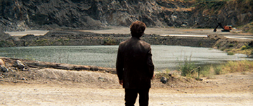
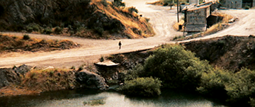

######fig. 13 : Harry Callahan absorbé par un paysage à l'identité trouble dans *Dirty Harry* (1971).

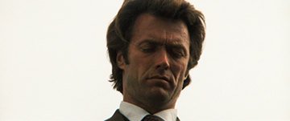
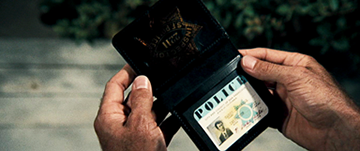
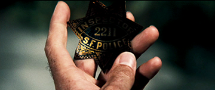
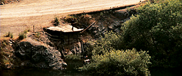

######fig. 14 : Harry jette son étoile dans les mêmes eaux qui ont avalé le méchant Scorpio.

Ce dernier geste signale l'acceptation de sa condition de vigilante, puisque Harry choisit de tuer Scorpio au lieu de l'arrêter, et renonce enfin, dans un geste éminemment symbolique, à la loi officielle. La loi personnelle a donc pris le pas sur la loi commune, et plus largement la loi de l'Ouest est rappelée, à travers le signe de l'étoile, isolé et longuement exposé par un gros plan. Le jet de l'étoile par Harry renvoie directement à la scène finale de *High Noon* (Fred Zinnemann, 1952), dans laquelle ce geste a une valeur comparable : il ne s'agit donc pas d'un simple clin d'œil, mais de la remise en circulation d'un symbole. 

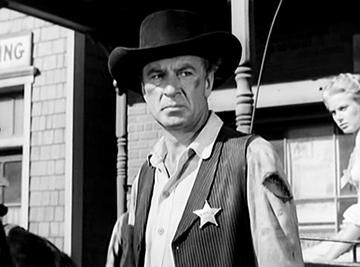
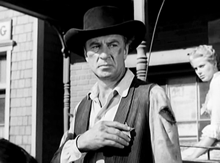
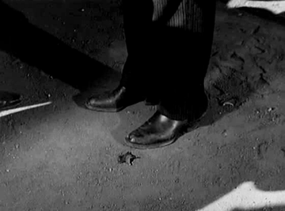
######fig. 15 : Le Marshall Will Kane (Gary Cooper) renonce à son statut  dans *High Noon* (1952). 

Dans ce dernier film, le *marshall* Will Kane, au terme d'un combat seul contre tous, a purgé la ville de sa pourriture. Cependant, dégoûté de l'absence de soutien de ses pairs, et sans doute des meurtres qu'il a dû accomplir malgré la promesse faite à son épouse, il jette son étoile au sol, avant de partir avec sa femme, comme il aurait dû le faire dès le début du film. Dans l'économie de *High Noon*, ce dernier geste entérine la solitude du héros : il a dû agir seul, il part sans reconnaissance, et dégoûté des autres et de lui-même (*fig. 15*). Will Kane constitue ainsi une occurrence de héros solitaire, qui ne veut pas être héroïque, mais, qui, en vertu d'une morale stricte est le dernier rempart de la cité contre le mal. Ainsi, lorsque Harry jette lui aussi son insigne, il ne convoque pas le *westerner* pour trouver sa morale d'action : il l'a déjà mise en application pendant toute la durée du film. Du point de vue de Harry, ce n'est pas lui qui agit d'une façon inhabituelle, c'est la société, qui en ignorant sa part de dégradation, le force à la prendre en charge[^151]. La figure du westerner que convoque Harry ne représente pas un palliatif, puisqu'elle dessine déjà, en creux, l'action que Will Kane est contraint de mener : Harry rappelle à lui l'Ouest, mais pour mieux échouer. Will Kane dans *High Noon* n'est déjà plus, en effet, l'homme de loi conquérant dont Harry Callahan pourrait se faire l'héritier : il est un vieux *marshall*, dont l'action, pourtant nécessaire, est menée solitairement, et n'est pas sanctionnée par la célébration, ou l'agrément de la foule. Dans les deux cas, de *High Noon* à *Dirty Harry*, le refus de l'insigne amorce la sortie du héros du film. Dans *High Noon*, les villageois se pressent autour de Will Kane et de sa femme après qu'il a tué son ennemi Frank Miller, mais ne disent mot. Après son dernier geste symbolique, Will Kane prend la route et s'éloigne, selon une logique que Dirty Harry semble filer - mais Harry a même perdu la possibilité d'un public (interne à la diégèse, à tout le moins). L'héritage, ou la filiation de Will Kane à Harry Callahan constitue donc le legs d'un manque, ou de qualités lues en négatif : quel que soit l'honnêteté ou le dévouement des deux personnages, ceux-ci sont voués à sauver des "villageois" (*townspeople*) dont il ne connaîtront pas la gratitude. Il est vrai, cependant, que ce départ est remis en perspective par le retour de Harry Callahan dans quatre films, qui le voient encore officier au sein de la police californienne. De plus, le jet de l'étoile constituait à l'origine une véritable rupture : elle signifiait l'abandon du rôle de shérif pour retrouver une vie domestique. Dans *Dirty Harry*, l'étoile apparaît dès le début du film, à la faveur d'un fondu enchaîné qui la lie avec l'arme du futur ennemi de Harry. 

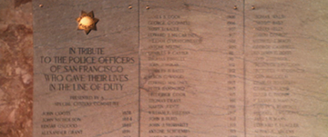
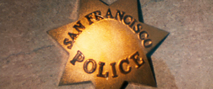
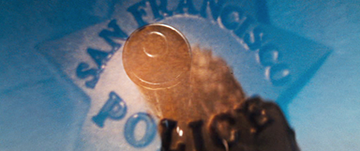
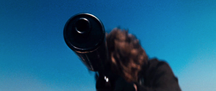
######fig. 16 : L'ouverture de *Dirty Harry* : du symbole de la loi à l'objet qui en permet l'exercice.

Lorsque le policier jette son étoile dans la scène finale, ce n'est pas tant pour abandonner la loi, que pour affirmer, inversement au générique, la séparation de l'arme des lois qui régulent son usage. L'étoile disparue, reste le Magnum : ce n'est pas un hasard si le second film de la série *Dirty Harry* se nomme *Magnum Force* et s'ouvre avec le générique que nous avons décrit.

Aussi opposées soient la petite ville de l'Ouest et la métropole carcérale dessinée par Siegel, les deux espaces sont au fond écrasés l'un sur l'autre : espaces ouverts à la pourriture, au crime et au désordre, peuplés d'une foule aveugle qui ne sait pas reconnaître ses intérêts, dont la seule chance réside dans l'émergence d'une figure unique, qui va prendre en charge l'ensemble d'une situation. D'une époque à l'autre, le mal n'est certes plus localisable, et la Loi de l'Ouest a muté en une loi policière apparemment inadéquate. Mais dans les deux cas, la solution d'action reste réduite : refuser toute forme d'intégration à la société pour pouvoir mieux la sauver d'elle-même, et accepter en guise de conclusion la poursuite d'une déambulation sans fin. Car si Will Kane part avec sa femme, Harry Callahan l'a, lui, perdue pour toujours. Si le vigilante de San Francisco forme une continuité avec l'action du cow-boy de l'Ouest, c'est pour mieux en entériner les échecs. D'un film à l'autre, d'une époque à l'autre, il y a eu conservation des gestes, des fins, et de ce parcours qu'amorce dans le dernier plan une déambulation en forme de parenthèse ouverte ; la visée du parcours, elle, s'est entre temps évidée. Le vigilante se manifeste comme une figure éminemment paradoxale, qui confirme l'impasse que constitue une action issue d'un Ouest fantasmé, tout en confirmant la vivacité de la figure du *westerner*, incontournable pour celui qui prétend à l'héroïsme. 

##4.4 *Death Wish* : une fiction faite action

*Death Wish* (Michael Winner, 1974) reprend des thèmes proches de ceux de *Dirty Harry*, et semble même épouser cette structure de "l'inadéquation adéquate" précédemment exposée. En effet, Harry a perdu sa femme par la faute d'un chauffard, ce qui peut expliquer son appétence pour la vengeance ; de son côté, Paul Kersey, dans *Death Wish*, doit faire face à la mort de sa femme et la folie de sa fille, après qu'elle ont été agressées chez elles par trois jeunes malfrats. Toutefois, cet épisode traumatique fait ici partie de la diégèse et constitue dès lors une justification, ou à tout le moins une excuse pour le comportement du personnage. Les deux personnages ne croient aucunement à l'efficacité des instances censées faire respecter l'ordre et la justice. Comme Harry, Paul Kersey est appelé à devenir un vigilante, bien que, contrairement à lui, son métier ne l'y prédestine pas. Lors de promenades nocturnes qui deviendront sa raison d'être, il va tuer de sang-froid les truands qu'il surprend en flagrant délit (de vol, viol et autres). Son action fait la une des journaux, et rapidement inquiète la police qui peine à l'identifier. Le public en revanche goûte cette justice d'un nouveau genre, et très vite les voleurs et autres bandits font face à une forme d'insurrection populaire. Kersey est cependant rattrapé dans la dernière partie du film, et l'inspecteur qui le traque à contrecœur lui propose de faire disparaître l'arme de ses crimes s'il accepte de quitter la ville de façon permanente. Kersey part pour Chicago, et un dernier plan nous montre son visage souriant, devant le spectacle d'une agression : sa mission pourra continuer.

Le début de notre analyse fera ici écho à celle de Jean-Baptiste Thoret, puisque nous voyons également dans le voyage professionnel de Paul à Tucson le point nodal du film, où le personnage, qui déjà éprouve un désir de vengeance, trouve la forme adéquate à son action dans celle de l'homme de l'Ouest. En effet, le client qui le reçoit en Arizona, Aint Jainchill, l'emmène dans une reproduction d'une ville de l'Ouest, qui selon lui sert de décor de cinéma. Au moment de la visite de Kersey, un show a lieu : une scène primitive, où un *marshall* empêche le vol d'une banque (*fig. 17*). Dans un premier temps, le cadre saisit à la fois les acteurs du spectacle et les touristes qui les regardent, tandis qu'un contrechamp dévoile, en gros plan, le visage de Paul, qui regarde attentivement l'action en train de se dérouler. Puis, au fur et à mesure que le spectacle se déroule, le contrechamp au regard de Paul n'est plus la scène saisie comme telle, mais son contenu filmé comme action d'un western (*fig. 17.12*). C'est-à-dire que par l'entremise du regard de Kersey, nous sommes passés à une action filmée comme simulacre (se produisant avec une scène et un public identifiable), à une action, toujours simulacre, mais ayant acquis un pouvoir de réalité[^152], puisqu'elle est lisible, pour nous, comme le cliché de scènes similaires répétées dans l'histoire du western au cinéma. Le plan qui ouvre la séquence, montre d'ailleurs la ville de pacotille ("*a phoney western town*" comme la qualifie Jainchill) en plan d'ensemble, et au premier plan, une corde de potence, symbole de la vengeance à venir : dans l'économie du film, mythologie de l'Ouest et action légitime du vigilante coïncident parfaitement. 

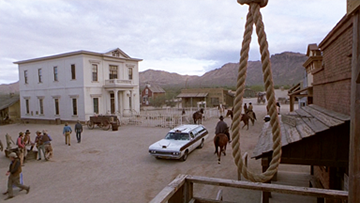
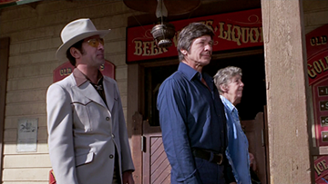
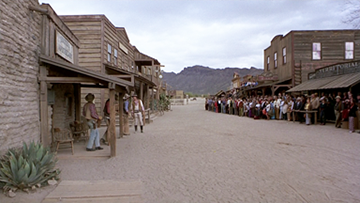
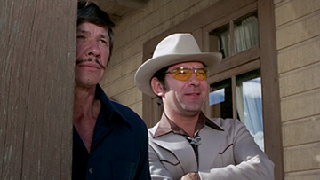
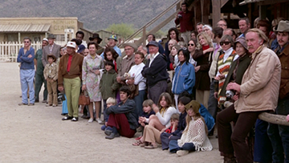
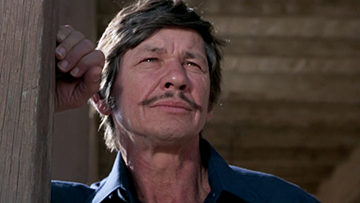
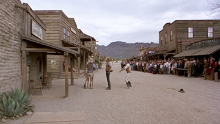
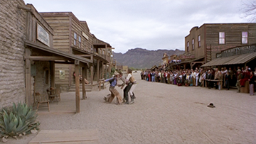
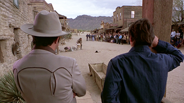
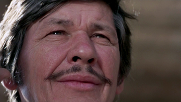
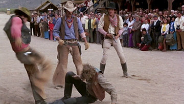
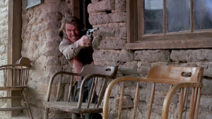
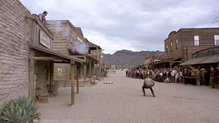
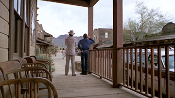

######fig. 17 : Une ville de pacotille contient un programme d'action dans *Death Wish* (1974).

En rentrant de son voyage, Kersey ouvre le cadeau que Jainchill lui a offert avant son départ : un pistolet, qu'il lui avait présenté comme ayant appartenu à un certain Candy Dan en 1880. Ce dernier don achève donc une transmission qui pour nous peut déjà constituer une forme de filiation. Seulement, il ne s'agit plus d'un pont d'une fiction à une autre (de *High Noon* à *Dirty Harry*, comme dans le cas précédent), mais à l'intérieur de la fiction, une autre fiction qui du coup apparaît comme fantoche, mais dans laquelle Kersey va puiser le programme de son action en tant que vigilante. Inversement, l'ancienne vie de Paul, figée dans l'introduction du film présentant les vacances idylliques du couple à Hawaï, va subir une déréalisation, alors que le western va se cristalliser comme formule d'action. Lorsque Paul rentre d'Arizona, il reçoit, cruellement, les photos de ses vacances : tandis qu'il les manipule, les photos nous apparaissent naturellement déformées dans l'espace, par un effet de perspective. Nous passons ainsi de la vision directe (l'ouverture édénique du film), à sa copie, pâle fiction : l'image de la femme de Kersey n'est justement plus qu'image, mais une image-objet vue comme épaisseur de papier, et plus pour le contenu qu'elle représente. Inversement, l'Ouest fantoche de la potence et de Candy Dan a pris une tenue, un volume qui va se matérialiser encore davantage : car Paul abandonne bien vite les photographies, pour ouvrir le paquet de Jainchill. La vision de l'arme, comme objet en volume, ouvre elle sur une suite possible : c'est cette fiction faite objet qui va fonder l'action du vigilante. L'héroïsme à venir (bien que discutable) semble calcifié dans l'arme, qui possède une qualité de fétiche, comme le Magnum .44 dans *Dirty Harry*[^153]. Si le western est l'endroit où se joue le réalisme au prix de la mythologie[^154], il faut constater que *Death Wish* revient de façon réactionnaire sur l'absence de complémentarité entre les deux. Le film affirme au contraire, par l'intermédiaire de l'épisode du spectacle[^155] la possibilité d'un retour *réel* à l'Ouest qui passe par sa validation en tant que mythe : nous voyons ici une tendance qui va se confirmer dans les décennies suivantes, lorsque le *westerner* n'est plus une référence historique attachée à l'époque de l'Ouest, mais le contenu d'un spectacle filmique.

Dès lors, la qualité de *westerner* du vigilante sera totalement intégrée à la diégèse. Paul Kersey va lui-même entériner cet état de fait, cette fois-ci par le discours, au second degré. À la fin du film, l'inspecteur Ochoa rend visite à Paul à l'hôpital, alors qu'il vient d'être arrêté. Il lui dit alors : "*Faites-vous muter dans une autre ville et je jetterai ce pistolet dans le fleuve [...] Nous voulons que vous quittiez New York. Pour toujours*"[^156]. Le vigilante prend ici une valeur politique : non seulement son action compense celle, inefficace, des autorités, mais elle inspire lesdites autorités à penser une Loi indépendante des lois. Alors que Kersey devrait être arrêté pour homicide, son action est reconnue légitime par un inspecteur qui est davantage gêné par les retombées médiatiques éventuelles de l'affaire que par le choix moral de Kersey. La réponse de ce dernier à l'inspecteur est révélatrice : "*Inspecteur ? Avant le coucher du soleil ?*"[^157]. Tandis que le *show* de Tucson menait Kersey du spectacle vu à la reconstitution d'une scène (celle de sa vengeance propre), ses derniers mots ramènent sa série de meurtres dans le rang du spectacle, grâce à la citation stéréotypée tirée des westerns. Elle est également importante dans la mesure où elle replace la figure du vigilante dans la polarité entre le gentil shérif (ici, l'inspecteur Ochoa) et le "méchant" dont il faut débarrasser la ville. Ceci nous mène au fond à la question essentielle, car il faut bien reconnaître que ni Harry Callahan, ni Paul Kersey ne peuvent coïncider totalement avec le statut de héros. Leur morale trop approximative, leur action principalement égocentrée, et parfois violente sans raison, une forme de cruauté leur valent le plus souvent le qualificatif d'anti-héros[^158]. Pourtant, l'héroïsme revient les chatouiller, les rattraper, comme si toute action de protection, ou de punition (cette Loi sublimée par Callahan et Kersey) *devait* emprunter un parcours héroïque - ici, en forme de détour, résultant dans l'aporie.

Qu'est-ce qu'un vigilante ? C'est une figure interstitielle plutôt qu'un héros. Comme chez nombre de figures émergeant dans les années 70, et par la suite, l'action et la morale y subissent un divorce, une diffraction radicale. Les moyens ne sont plus seulement disproportionnés par rapport aux fins, mais ils en sont indépendants. Dans ce contexte de partage entre l'âme et le corps (le reflet, dans le personnage, de ce divorce), l'homme de l'Ouest apporte en réponse un catalogue de gestes, un reste de spectacle converti en morale de l'action, des emblèmes (étoile, fusil ou pistolet, etc.) ; manque le milieu originel, l'Ouest. En réalité, le vigilante est construit comme un héros qui n'a *aucun* milieu, puisque la ville, sorte de monstre dévorant, équivaut à l'absence de lieu, à la perte de tous les repères essentiels. Les vigilantes tâchent donc de compenser la perte d'un espace par la reproduction, symbolique et visuelle, de l'action du western. Mais cet apport (ce legs, dans la perspective d'un passage en forme d'héritage), dessine un manque substantiel, à l'intérieur de ce "plus" héroïque que la convocation du *westerner* laissait pourtant augurer. Dans le cas de *Dirty Harry*, Harry Callahan se fait l'héritier d'une dette déjà contractée, dont il renforce la gravité en affirmant un reste de lignée. Parallèlement, Paul Kersey, dans *Death Wish*, arrive à convertir le spectacle désuet du *marshall* sauvant la banque en programme de lutte contre le crime. Mais dans un dernier mouvement, il se replace du côté de la pourriture dont il cherchait à purger les villes. 

Les années 70 semblent ainsi condamner les héros potentiels ; la lignée héroïque n'est pas brisée, mais seulement viciée : celui qui essaie encore, dans un dernier sursaut, de jouer au *marshall*, deviendra au mieux un *drifter*. La période concernée, légèrement en amont de notre chronologie est fréquemment identifiée comme l'époque des anti-héros, de la psychologisation des figures classiques et du pathos gagnant les corps par le biais d'un nouveau jeu (la Méthode) et de scénarios libérés du *happy end*. Dans ce contexte, brossé à grands traits, le vigilante s'impose comme une figure pivot, qui articule le réalisme crépusculaire des westerns après-guerre avec la violence décomplexée à venir dans les années 80. Bronson et Eastwood sont bien, dans ces deux incarnations, associés aux années 70 (malgré la prolongation de leurs deux cycles respectifs) : leurs deux corps, leurs deux visages restent les emblèmes de la période. Néanmoins, à un niveau structurel, ils lèguent aux héros à venir le poids paradoxal d'un fort héritage, du côté de la référence générique, et, paradoxalement, une certaine anhistoricité.
Plus largement, nous pouvons anticiper sur la conséquence de telles mises en forme du côté d'une définition de l'héroïsme : cette décennie, souvent lue comme le moment du triomphe des anti-héros, pourra nous permettra de nuancer de telles catégories. Ce n'est pas tant que l'anti-héros remplace le héros dans les années 70, mais l'héroïsme qui cherche à s'exprimer, quand bien même tout s'y oppose. Les anti-héros ne seraient pas, dans ce cas, contre l'héroïsme, mais c'est l'héroïsme lui-même qui fait retour, qui se dessine comme contre-modèle puisque le contexte n'est plus adapté à son émergence. La particule "contre" peut sembler erronée : né de la rencontre entre le gangster et l'homme de l'Ouest, malgré la contradiction inhérente à cette combinaison, le vigilante constitue moins un retournement de l'héroïsme que son fléchissement, lors de concessions à d'autres figures corollaires.

___

[^127]: Ce motif de la domestication qui rattrape le héros, ou tout au moins le policier en fin de carrière est souvent présent dans le film d'action et le film criminel : dans *Lethal Weapon* et *Falling Down*, les deux policiers doivent partir à la retraite, fortement incités par leurs épouses. Nous pourrions également parler d'un motif de "la dernière affaire" qui vient conclure une carrière souvent tranquille, et remet en cause le départ (*Falling Down*, mais aussi *Seven*).

[^128]: Il se trompe même doublement, puisqu'il parle d'un départ conjoint de John Wayne et Grace Kelly ; il est aussitôt corrigé par McClane, qui, en bon héritier, est conscient de sa lignée. La référence à *High Noon* n'est cependant pas fortuite car McClane est aussi peu aidé par ses concitoyens dans *Die Hard* que Gary Cooper l'était en son temps.

[^129]: "*I'm* *the bad guy [...] How did that happen? I did everything they told me to*".

[^130]: Cf. VIVIANI Christian. *Le Western*. op. cit., p. 44.

[^131]: SCHATZ Thomas. *Hollywood Genres: Formulas, Filmmaking, and the Studio System*. 1981, p. 34.

[^132]: Ce film emprunte d'ailleurs à une autre tradition, celle du "*rape revenge film*" telle qu'elle a été isolée par Yvonne Tasker. Il s'agit, littéralement, de films illustrant une vengeance féminine faisant suite au viol de la protagoniste (*Mortal Thoughts*, 1991 ; *Eye for an Eye*, 1996), cf. TASKER Yvonne. *Working Girls: Gender and Sexuality in Popular Cinema*. 1998, p. 102.

[^133]: Nous pourrions ajouter *The Punisher* (Jonathan Hensleigh, 2004) et *The Crow* (Alex Proyas, 1994) à cette liste, qui se situent au carrefour du film de vigilante et de l'adaptation de comic books, ainsi que *Kill Bill* (Quentin Tarantino, 2003) mettant lui aussi en scène un vigilante de sexe féminin - là encore l'hybridité générique (entre western, film de gangsters et film d'art martiaux) est manifeste. 

[^134]: "*Nobody* *fights my battles*".

[^135]: "*I* *figure this place owes me something and I intend to make it pay*".

[^136]: "*There's* *right and there's wrong. You got to do one or the other*".

[^137]: WARSHOW Robert. op. cit., p. 105.

[^138]: "*Une* *des sources de l'attrait du cow-boy en tant que héros vient peut-être de la façon dont il résout cette ambiguïté en donnant un sens moral à la violence*" ("*Perhaps one source of the cowboy hero's appeal is the way in which he resolves this ambiguity by giving a sense of moral significance and order to violence*"), in CAWELTI John G. op. cit., p. 88.

[^139]: *The* *Long shadow of Dirty Harry*, Gary Leva, 2008.

[^140]: "*This* *being a .44 Magnum, the most powerful handgun in the world, it would blow your head clean off, so you might want to ask yourself: "Do I feel lucky?". Well, do you, punk?*" (traduction originale, version française du film).

[^141]:  Nous retrouverons ce motif dans notre analyse des films de super-héros (dans *Spider-Man*, principalement), cf. infra., p. 563-567.

[^142]: "*Le* *personnage de l'Inspecteur Harry se nourrit de ces artifices et des valeurs trois fois exposées par Sergio Leone, puis par D. Siegel : satire de l'homme sans passé, solitude entre nihilisme cultivé et héroïsme de la raison hollywoodienne. Mais quel est-il, cet héroïsme ? C'est celui, traditionnel, du self made man à l'assurance constante traversant l'histoire américaine et ses spectacles, du cow-boy au gangster. Ces deux êtres incarnent deux vertus d'Outre-Atlantique : détermination et énergie*", in MORIN-ULMANN David. "Figures de la justice et de la morale". 2007, p. 116.

[^143]: BERTHOMIEU Pierre. *Le cinéma Hollywoodien. Le temps du renouveau*. 2005, p. 18.

[^144]: "*les* *citoyens ordinaires des petites villes  [...] se sont emparés des rôles habituellement réservés aux méchants*" ("*the ordinary citizens of the towns  [...] have taken over the usual roles of the villains*"), in WRIGHT Will. op. cit., p. 80.

[^145]: Nous pensons également à Richard Dyer qui explique : "*L'accent placé sur les charmes et les dangers de la ville dans de nombreux films noirs classiques - ces charmes étant incarnés par les clubs de jazz, ces dangers par l'obscurité - renvoie à la perception, par les blancs, d'une ville devenant l'espace des noirs, menaçant même pour les hommes blancs, sans parler des femmes*" ("*it may also be that the emphasis in so much classic noir on the allures and dangers of the city - allure represented through nightclub jazz, dangers through darkness - speaks of a white perception that the city was increasingly becoming a black space threatening even to white men, leave alone women*"), in DYER Richard. *Pastiche*. op. cit., p. 129. 

[^146]: Cf. DELEUZE Gilles. *Cinéma : I. L'image mouvement*. 1983, p. 202. Gilles Deleuze y définit l'action héroïque comme étant nécessairement dépendante d'une "*médiation*", en s'appuyant sur *The Big Sky* d'Howards Hawks, entre autres.

[^147]: CIEUTAT Michel. Préface. 2007, p. 12.

[^148]: "*for* *the gangster there is only the city; he must inhabit it in order to personify it: not the real city, but that dangerous and sad city of the imagination which is so much more important, which is the modern world*", in WARSHOW Robert. op. cit., p. 101.

[^149]: "*When* *an adult male is chasing a female with intent to commit rape, I shoot the bastard. That's my policy*".

[^150]: Autrement dit, la confrontation entre le gentil *marshall* et le hors-la-loi, face-à-face. 

[^151]: Ainsi Harry dit lui-même à son nouveau coéquipier : "*Maintenant tu sais pourquoi on m'appelle Dirty Harry. Je récolte tous les sales boulots*" ("*Now you know why they call me Dirty Harry. Every dirty job that comes along*").

[^152]: Un tel chemin rappelle le récit de *Westworld* (Michael Crichton, 1973), situé dans un futur indéterminé. Là, les touristes ont accès à des vacances inédites, qui reprennent le décor de trois genres cinématographiques (western, cape et épée, péplum). Si ces vacances permettent aux clients de vivre leur propre *showdown*, elles sont garanties sans risques, tout au moins jusqu'à ce que les robots du parc d'attraction décident de se rebeller. Yul Brynner, figure emblématique du western, incarne l'un de ces robots, finalement exécuté par un touriste devenu le héros du jour - mais sans que l'Ouest, resté simple décor de carton-pâte, ne nourrisse le sens de cette action.

[^153]: C'est là une des différences du film de vigilante avec l'Action des années 80 : dans cette période ultérieure, c'est le corps qui devient porteur des valeurs que l'arme incarnait. Le corps devient même une arme, comme nous le verrons avec le cas d'Arnold Schwarzenegger, ou plus simplement dans *Lethal Weapon*, dont le titre renvoie directement au personnage de Martin Riggs (Mel Gibson).

[^154]: BOURGET Jean-Loup. *Hollywood, la norme et la marge*. op. cit., p. 49.

[^155]: La référence au western ne nourrit d'ailleurs pas que les héros en devenir. Lorsque Clint Eastwood joue dans *Pink Cadillac* (1989), ce sont ses ennemis, des néo-nazis, qui s'entraînent dans un décor de western, comme si l'impasse éprouvée par les vigilantes pouvait surgir dans d'autres films, avec d'autres situations, du côté des méchants - l'acteur Eastwood sert ici néanmoins de lien.

[^156]: "*Get* *a transfer to another city and I'll drop this gun in the river [...] We want you out of New York. Permanently*".

[^157]: "*Inspector?* *By sundown?*".

[^158]: Remarquons que le qualificatif de "vigilante" permet de contourner le problème, en évacuant le concept d'anti-héros. 