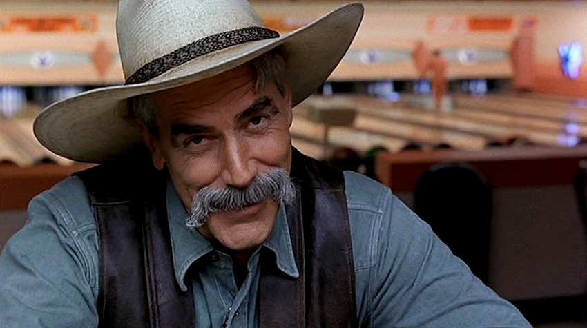
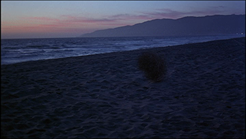
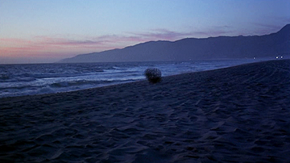
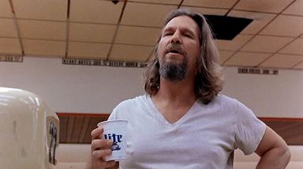
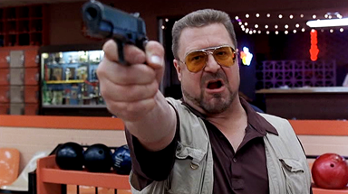
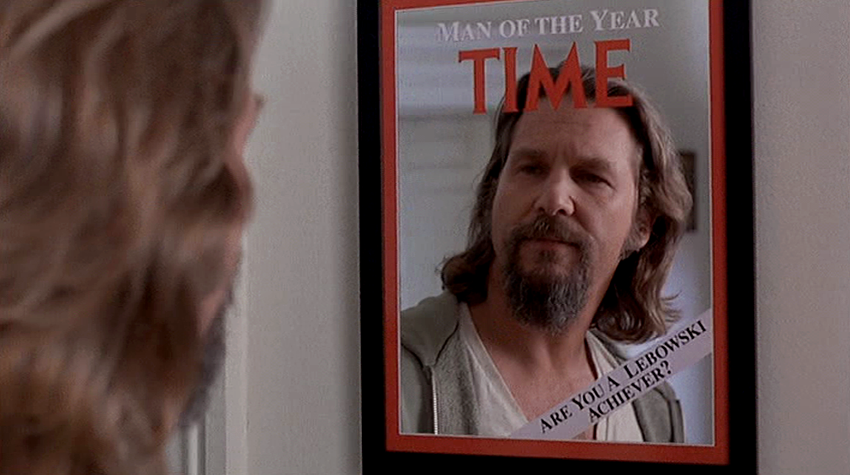

#5. Hommes de l'ouest : le dilemme du héros et du spectacle

##5.1 Les années 80-90 : une difficulté théorique

L'héritage du héros de western est toujours à double tranchant. Il peut permettre à un personnage de retrouver la gloire d'une action passée, de reprendre la main sur son destin (*Death Wish*), mais en retour, il signale l'inadéquation du personnage à son milieu. Parfois, le legs est tout bonnement négatif (*High Noon* inspirant *Dirty Harry*), mais ce qui a été perdu socialement est compensé par le corps, qui se fait actif, violent, en relation avec une arme iconique - le visage de Clint Eastwood dans ce cycle est aussi emblématique que son Magnum[^159]. Si ce corps violent - et violenté - va perdurer dans la décennie suivante, l'idéal masculin et sa forme physique vont largement évoluer. En marge, le *westerner*, sa visibilité comme ses impératifs narratifs, vont garder une obsédante présence. La figure du vigilante incarne ce paradoxe : obsolète, le *westerner* l'est sûrement, mais il reste la seule source d'héroïsme dans un monde urbain, violent et désorganisé. 
Nous n'affirmerons donc pas que les héros des *actioners* des années 80 sont des versions post-modernes des hommes de l'Ouest[^160], en dépit d'un parcours autour du western et de la référentialité. Ceci correspondrait à une lecture cyclique du genre, selon laquelle les années 80 représentent une "*période creuse*"[^161] pour le western : apparemment disparus, les *westerners* survivraient à travers la morale des personnages de films d'action. En somme, le *westerner* aurait seulement changé de costume. Le héros d'action hérite bien de son homologue de l'Ouest, mais de façon détournée. Les citations visuelles fonctionnent de façon immédiate, mais en termes de nature, l'action hero se connecte au *westerner* par le biais d'un autre personnage. Le vigilante permet de combiner le double héritage du policier *hard-boiled* et du *westerner*. Alors que le milieu de l'Ouest est liquidé, il reste le milieu urbain du privé ou du policier, ainsi que leur fêlure essentielle. Nous éviterons ainsi les raccourcis journalistiques, qui font, entre autres, d'Arnold Schwarzenegger un "*Cary Grant avec des pectoraux*"[^162]. Si Schwarzenegger est lié au cinéma classique, il emprunte davantage aux errances martiales de Charles Bronson, lui même héritier d'un western reformulé. L'héritage, parfois direct par le biais de la vignette, se joue par rebonds dès lors qu'il affecte la fabrique du héros. 
Le héros de film d'action reprend souvent des allures de shérif prenant seul en charge le destin d'une cité, soit. Pour nous cependant, il est important de ne pas en conclure que le héros d'action solde la mémoire du westerner : celui-ci continue d'exister, même marginalement, dans la production cinématographique hollywoodienne. Le héros d'action est le résultat d'un aller-retour entre *hard-boiled* et *westerner*, et forme avec ses deux parents une trilogie qui va générer d'intéressants dialogues réflexifs. *The Big Lebowski* (Joel et Ethan Coen, 1998), sorte d'état des lieux satyrique, nous intéressera particulièrement, puisqu'il présente la particularité de discuter des trois figures en même temps. Certes, le film n'appartient pas au genre Action : mais ce nouveau détour, avant d'affronter le genre Action en tant que tel, nous permettra de mieux cerner pourquoi le westerner, le *hard-boiled* et l'*action hero* se télescopent sans cesse, et appellent même, de par leur nature, cette friction entre héroïsmes.

##5.2 *The Big Lebowski* : croisements génériques

Dès sa séquence d'ouverture, *The Big Lebowski* (Joel Coen, 1998) est l'occasion d'un retour en arrière, vers une époque qui ne pourra être racontée que par le truchement de ressorts nostalgiques, ceux-ci participant souvent d'une relecture au second degré[^163]. La référence, pour le héros potentiel, sera celle du héros comme personnage de film, et non comme figure vivante. Autrement dit, le *westerner* n'est pas convoqué en tant que figure de l'Ouest, reliée à sa période historique, mais tel qu'il a été évoqué à travers l'histoire du western, genre filmique. La référence reste l'Histoire, mais c'est bien d'Histoire du cinéma qu'il est ici question. D'emblée, le westerner sera montré, lu, comme personnage fictif, non pour sa réalité historique correspondant à une époque. *The Big Lebowski* retient donc notre attention comme possibilité d'une généalogie au second degré, où par exemple, la référence sera moins "Wyatt Earp" que "Wyatt Earp interprété par Henry Fonda dans *My Darling Clementine*". Il s'agit dans ce cas d'un ressort typiquement post-moderne, de "*jeu réflexif*" ("*self-conscious play*"[^164]), qui invite à reconnaître un ensemble filmé non pour son référent fictionnel ou profilmique, mais pour les associations de type "clin d'œil" suscitées d'un film à l'autre. 

######fig. 18 :Réminiscences du western dans *The Big Lebowski* (1998).

*The Big Lebowski* constitue par ailleurs dans son entier une gigantesque fausse piste qui aboutit à toute une série de non-lieux. Jeff Lebowski (Jeff Bridges), qui se fait appeler "*The Dude*", vit à Los Angeles dans les années 90, alors que débute la Guerre du Golfe. Il est un hippie d'âge mûr, sans emploi, qui passe ses journées à jouer au bowling avec ses amis Walter (John Goodman) et Donny (Steve Buscemi), écouter des cassettes de Creedance Clearwater Revival, et fumer du haschich. Un soir, il est attaqué par trois Allemands qui pénètrent chez lui, et le somment de révéler "*où est l'argent*". Constatant leur erreur, ils fuient, non sans avoir uriné sur le tapis du *Dude*. Ce dernier décide de retrouver l'autre Lebowski, celui qui devait de l'argent aux Allemands, pour lui demander une compensation pour le tapis. Il échoue, mais il est bientôt contacté par son riche homonyme (le *Big Lebowski* du titre) : sa très jeune épouse a été kidnappée, sans doute par le même groupe d'Allemands, et il tient à ce que le *Dude* se charge de remettre la rançon. Walter, ancien vétéran du Vietnam, décide de mener les opérations à sa manière, et remet un leurre au lieu de l'argent de Lebowski. Plus tard, la mallette contenant l'argent est dérobée en même temps que la voiture du Dude. 
Au terme d'invraisemblables péripéties, le *Dude* réalise qu'il n'y jamais eu d'argent, que le riche Lebowski ne voulait pas vraiment retrouver sa femme, et que cette dernière n'avait pas été kidnappée, mais était simplement partie quelques jours. Les Allemands tentent une dernière fois d'agresser le *Dude* sur un parking, mais celui-ci leur révèle qu'il sait tout de leur plan. Ceux-ci décident de se contenter de leurs portefeuilles, ce que refuse Walter. Au terme d'un combat entre les deux partis, les Allemands sont vaincus, et Donnie meurt d'une crise cardiaque. Après avoir éparpillé les cendres de Donnie, Walter et le *Dude* continuent de jouer au bowling, et la vie reprend son cours. Sam Elliott conclut le film face à la caméra par un ironique "*Catch you down the trail*" ("*On se retrouve sur la piste*", dans une traduction approximative).

Les formes traditionnelles du western sont donc convoquées de façons diverses, des tumbleweeds sur lesquelles s'ouvre le film (*fig. 18.2* et *18.3*), à la présence d'un acteur identifié au genre[^165], Sam Elliott (*fig. 18.1*), et la musique de la série télévisée *Branded*, une occurrence elle aussi du western. L'introduction narrée par Sam Elliott nous plonge dans une atmosphère clairement identifiable (même pour qui n'est pas féru de westerns) et constitue dès lors une des nombreuses fausses pistes lancées par le film. Par ailleurs, le film tisse des liens avec un autre héritage, celui du film noir. L'usage d'une voix off, le contexte de Los Angeles, la corruption qui touche toutes les classes de la société, ainsi que la nonchalance du personnage évoquent les romans de Chandler, et plus particulièrement les péripéties du détective Philip Marlowe. Jeff Lebowski n'hérite donc pas d'une tradition héroïque, mais de deux, simultanément. Los Angeles est à la fois dépeinte comme un métropole viciée, à la façon du film noir, et comme l'extrémité de la Frontière : le buisson (*tumbleweed*) qui glisse horizontalement vers l'ouest finit d'ailleurs sur un forme d'aporie, quand il rencontre un front océanique. Ces deux références sont encore brouillées par d'autres, certes un peu plus marginales. Les frères Coen revendiquent[^166] également des emprunts faits au *buddy movie*[^167], tandis que Jakub Kazecki repère d'autres éléments relevant du pastiche. Il mentionne la scène de l'enterrement de Donnie, tournant en dérision une scène canonique du thriller[^168] ou encore le pastiche de film pornographique que le *Dude* voit chez Maude. Le film de sport est un genre auquel le film fait également référence, mais sur un mode là aussi distancié, dans la mesure où le bowling n'est pas une discipline olympique, et offre peu de visuels héroïques (contrairement au base-ball ou au football américain).

Cependant, la présence identifiable d'un *westerner* est marginale (trois apparitions en tout), et la référence au film noir est diffuse. Pourquoi alors focaliser notre attention sur ce film en particulier ? Pour analyser la figure du héros, il est essentiel de s'intéresser aux contre-modèles qui accompagnent celles-ci, dans un même récit ou dans des productions contemporaines. L'héroïsme n'est jamais aussi clairement défini que lorsque son inverse est dépeint : nous aurons l'occasion de mieux saisir ce paradoxe apparent dans le chapitre consacré aux nerds. L'histoire de *The Big Lebowski* est donc dominée par des losers faussement éloignés de nos questions d'héroïsme. Ce vernis de perdant cache en effet dans plusieurs cas des questions majeures : à défaut d'introduire un héros crédible, le film joue au démontage de cette figure. Mais cette fois, non seulement la figure va être écartelée d'une contradiction à l'autre, mais la place possible du héros va être évacuée : les héros n'émergent plus de façon lisible, et de plus, la place de choix qui leur était réservée semble avoir disparu. Si le western crépusculaire, dès Ford, jouait avec la possibilité pour un personnage d'émerger (avec toutes les concurrences, hésitations, et retours occasionnés), le piédestal sur lequel devait se tenir le héros n'était pas supprimé. Même les parcours des vigilantes, en forme d'impasse, tenaient encore sur une situation de crise, où une action apparaissait comme nécessaire à la survie d'une communauté. 

Dans *The Big Lebowski*, ce n'est pas tant qu'il n'y a pas d'histoire, mais qu'il n'y pas de situation. Jeff Lebowski, loser notoire, n'est pas empêché de devenir un héros : la situation de crise dans laquelle une telle transformation est possible n'existe pas, et le film travaille constamment à son démontage. L'agression de Jeff Lebowski à son domicile, la prise en charge de la remise d'une rançon, la découverte d'une preuve à l'arrière de sa voiture volée, l'interrogatoire d'un pornographe véreux sont autant de ressorts que nous reconnaissons, venus principalement du film criminel, du film noir puis du thriller. Cependant, comme nous le révèle le retournement final, toutes ces péripéties n'avaient finalement aucun sens, puisqu'il n'y a jamais eu ni kidnapping, ni argent pour la rançon, ni même, du côté de la famille de la disparue, de véritable intention de retrouver cette dernière[^169]. Quant à la connexion fondamentale du *Dude* avec l'histoire, elle repose sur un quiproquo. Walter répète ainsi "Elle s'est kidnappée toute seule"[^170] à l'envi, comme pour mieux exprimer la vérité de l'histoire, c'est-à-dire que celle-ci ne repose sur rien. Kazecki y voir un dispositif de déconstruction : 
>>Les deux modèles de masculinité présentés dans les premières scènes du film, c'est-à-dire le cowboy qui a abandonné les contrats sanglants et le privé venu de la jungle urbaine, typique du western américain et du film noir, ne constituent pas un repère pour l'action du Dude.
[...]
Les frères Coen mettent en place un processus cognitif : ils présentent le Dude comme le héros d'une saga western, ou comme le détective dans la grande ville, seulement pour détruire plus tard le schéma narratif et les choix esthétiques attendus[^171].

Ainsi l'héritage se retourne ici contre le personnage du film, chargé de reproduire des gestes qu'il ne comprend pas et qui l'aident pas dans sa quête - ou plutôt son absence de quête.

#5.3 *The Dude*, figure en déconstruction

Les interrogations de Sam Elliott au début du film, qui semblent signaler une relativité de la figure du héros ("*Je ne parlerai pas de héros, parce qu'au fond, qu'est-ce qu'un héros ?*"[^172]) constituent une forme de fausse piste : la question n'est pas tant de savoir ce qu'est un héros, que de constater qu'il n'y en a pas besoin. Contrairement à d'autres films hollywoodiens, qui feront le même constat sur la base d'une nouvelle envergure de l'homme normal (tout aussi capable que les prétendus héros), il ne s'agit pas de requalifier l'héroïsme. Pour qu'il y ait héroïsme, il faut en effet qu'il y ait une sollicitation extérieure, qui appelle à une prise d'action. Si l'on admet ce présupposé, il faut examiner plus attentivement la figure de Jeff Lebowksi - *The Dude* (*fig. 19.1*). Ce dernier est un loser, sans-emploi, qui va où ses pas le mènent, dit oui à tout, mais qui n'est jamais écouté quand il proteste. Son leitmotiv, "*Reste cool*" ("*Take it easy*"), parle de lui-même : il n'aime pas les complications, et se contente parfaitement du *status quo*. Autant son corps est encombrant, d'une lourdeur rendue manifeste par le moindre mouvement, autant celui-ci est une coquille vide : Jeff Lebowski n'a pas d'identité, comme l'affirme son surnom. 
Dans le cinéma d'action, l'emploi de qualificatifs tels que "*dude*", "*bro*" ou "*son*" à l'encontre du héros sont souvent l'occasion pour celui-ci de protester et de marquer sa différence, en répétant son nom et en affirmant par là même son identité. Le procédé est comiquement renversé par les frères Coen : Jeff Lebowski se fâche en effet, mais seulement lorsqu'on l'appelle par son nom. Il insiste qu'on l'appelle "*The Dude*", c'est-à-dire "*le mec*"[^173], personne et tout le monde à la fois[^174]. Cependant, si aujourd'hui "*dude*" possède ce caractère de généralité, au point de ponctuer les conversations, à l'origine, il rappelle les oppositions qui nous intéressent dans ce chapitre. En effet, le terme désigne à l'origine "*un citadin déplacé à la campagne, étranger à la vie dans les champs*"[^175], qui a donné son nom aux "*dude ranches*" dans les années 20[^176].  Dans le dictionnaire Oxford, il est indiqué que le terme apparaît pour la première fois en 1883, et renvoie à un "*homme démontrant une attention exagérée à son habillement, son phrasé et sa tenue, qui est très spécifique quant à l'esthétique de la "bonne forme" ; en conséquence, le terme s'étend à un précieux, un dandy, un "coquet"*"[^177]. Incidemment, "*Dude*" est le surnom donné au loser regagnant ses galons interprété par Dean Martin dans *Rio Bravo* (Howard Hawks, 1952). Le signifiant est toutefois assez mobile, puisque dans les années 70, il cesse de renvoyer à l'Est pour intégrer l'argot des surfeurs - et donc la culture de l'Ouest, principalement de la Californie. Le choix de ce nom nous semble relever d'une double inscription culturelle, cependant, alors même que le film utilise Los Angeles comme la dernière Frontière (matérielle, celle du front océanique), l'ancienne origine du terme, du côté de la côte Est refait surface. Par son nom même, Jeff - *The Dude* incarne son absence de détermination.

Poursuivons un moment sur ces questions d'identification dans leur relation au langage. L'identité, dans le cas de *The Dude* semble constamment être évidée, notamment par l'usage qu'il fait de la parole. En effet, le discours de Jeff, toujours laborieux, construit au terme de longues hésitations et bafouillages, ne trouve une éloquence que lorsqu'il se tisse d'emprunts. Tantôt, il répète la morale de George Bush, prônée par Walter et entendue à la télévision ("*Ça ne passera pas*"[^178]) ou, entendant le langage châtié de Maude Lebowski, il en reprend les codes[^179] sans à-propos ("*dans le jargon de notre époque*"[^180]). Enfin, lorsqu'il ne se trouve pas de discours à répéter, sa parole opère une boucle, manifestant une redondance qui participe également de l'effet comique ("*Ils vont tuer cette pauvre femme*"[^181]), annone-t-il de nombreuses fois). Toutefois, poids mort ou coquille vide, là ne semble pas être la question, puisque nous avons été avertis par l'étranger que le Dude est tout à fait à sa place ("*Il est pile à sa place*"[^182]) dans la cité de Los Angeles, dans sa situation, qui est, rappelons-nous, une absence de situation, un non-lieu narratif - alors même que la signification originelle de "*dude*" renvoie à un personnage inadéquat à son milieu. Autrement dit, Jeff Lebowski est le non-personnage idéal pour une non-histoire. Même le principe d'action, auxquels obéissent encore les héros les plus torturés, se trouve nié. Eddie Robson parle du Dude comme d'un "*homme d'inaction*" (a "*man of inaction*"[^183]), tandis que Kazecki commentant ce propos, affirme que Lebowski n'agit pas, mais qu'il "*est agi*" ("*acted upon*"[^184]), un retournement que nous appliquerons plus loin au film d'action[^185].

Toutefois, son trajet va le faire successivement changer de peau, lors d'occurrences qui ne sont pas sans rappeler des scénarios héroïques. Enquêtant sur la disparition de l'argent, le *Dude* se rend chez Jackie Treehorn, un riche pornographe mêlé à l'affaire. Celui-ci interrompt sa conversation avec le Dude pour répondre à un coup de téléphone, griffonne une note puis s'éloigne momentanément. Le *Dude* semble pour la première fois prendre une décision, et faire preuve d'astuce : il se dirige vers le téléphone, et frotte le bloc de papier avec un crayon pour révéler le message écrit par Treehorn. Cet acte "héroïque", rappelant lointainement les méthodes des espions ou des privés, ouvre sur une déception, car Jackie Treehorn n'a fait qu'esquisser un croquis obscène. Cependant, le *Dude* avait raison de se méfier, mais il s'est trompé de cliché : comme dans tout bon film d'espion, son verre était en effet drogué. À la suite de cette scène d'héroïsme raté, un nouveau topos surgit ; le *Dude* est embarqué par la police, et discutant avec le shérif, reproduit le schéma de la confrontation entre ce dernier et le *drifter*, telle qu'elle est construite par le western. N'ayant pas réussi à adopter les méthodes de l'espion, Jeff semble se déplacer vers le mode du héros solitaire, qui chassé de la ville pourra revenir accomplir sa mission : il n'en est rien. Le shérif exécute une variation du geste primitif d'expulsion du mal de la cité, sanctionné une phrase comique insistant sur l'effet de référence ("*Garde ta sale gueule de tire-au-flanc hors de ma communauté balnéaire*"[^186]). 

Ce principe d'échange d'identités, au sein d'un même personnage n'est pas réservé au *Dude* : nous allons ici voir que Walter constitue le stéréotype gonflé, exagéré du héros reaganien, tandis que sa femme Cynthia, absente physiquement mais omniprésente par ses prescriptions rappelle l'épouse fantôme de Columbo ; Donnie est un vrai "loser", un *nerd* qui ne comprend rien et à qui on demande toujours de se taire, mais il est également un surfeur ; Maude Lebowski reprend les codes de la femme fatale, mais correspond également à une caricature d'artiste contemporaine féministe entre Orlan et Cindy Sherman ; enfin, le détective Da Fino, habillé comme le privé typique du film noir, est interprété par Jon Polito, qui s'est illustré dans des rôles de mafiosi - mais le personnage à une importance quasi nulle dans la narration, et, détail absurde, roule dans une vieille Volkswagen. Ainsi, il ne s'agit pas de stéréotypes repris, et simplement tournés en dérision : les éléments notoires se rattachant à cette stéréotypie sont démontés, et recomposés entre eux. 
Des éléments héroïques (le bloc griffonné, l'agression à mains nues, l'usage d'un leurre lors d'une remise de rançon) sont donc présents, mais ils sont mêlés à un bric-à-brac de références cinématographiques plus ou moins précises, et complétés par les éléments les plus improbables : par exemple, Walter est un vétéran républicain agressif, à la morale douteuse, mais aussi un juif très pieux, qui refuse de prendre le volant le jour de Shabbat. Ces éléments ont également incité des rapprochements du film avec le carnaval et le grotesque. Paul Martin et Valerie Renegar voient dans l'usage de mots vulgaires, les références scatologiques et sexuelles, les physiques exagérés (comme le ventre proéminant de Walter) et démembrés (l'orteil coupé de l'épouse Lebowski) les caractéristiques d'un registre carnavalesque[^187] qui ramène, selon la définition de Bakhtin, les fonctions les plus hautes, les plus spirituelles, au niveau du corps[^188]. Le carnavalesque se fonde sur l'exagération et la mise en spectacle de ses composantes. Ces aspects recoupent l'héroïsme performatif qu'on retrouvera dans le film d'action, mais les effets en sont bien différents, puisque cette exagération verse dans le ridicule, et contribue à démonter les stéréotypes du programme héroïque issu de genres classiques du cinéma.

## 5.4 L'héroïsme par l'extrême, entre Walter et *The Dude*

######fig. 19 : Jeff Lebowski et son ami Walter : deux modèles opposés.

À l'opposé du *Dude*, qui en bon *drifter* se laisse pousser par le vent (tels les légendaires *tumbleweeds* symboliques de l'errance des westerns[^189]), Walter réagit de façon excessive à tout stimulus, selon la morale condensée dans la phrase "*This aggression will not stand*"[^190] de George Bush (*fig. 19.2*). Toute opposition, qu'il s'agisse d'un adversaire de bowling qui "triche" sans le vouloir, où d'une tenancière de restaurant qui lui demande de parler moins fort, sont vécues comme des agressions, et appellent une sanction. En un sens, tandis que le *Dude* ne peut jamais prétendre au statut de héros, de par son inactivité et le caractère inachevé de ses actions (les bonnes intentions ne font jamais progresser l'action, comme chez Jackie Treehorn), Walter représente le pan hystérique de l'héroïsme : à vouloir sans cesse répliquer, se venger, retourner l'agression à l'envoyeur, son action est tout aussi absurde et inefficace que celle de son ami pacifiste[^191]. Nous pouvons noter, par exemple, les deux moments où Walter fait usage d'une arme, la première fois dans un cadre qui ne justifie pas le recours à la violence (lorsqu'il surprend un joueur enfreindre une règle de bowling, à son insu), la deuxième de façon incontrôlée et dangereuse (il lâche son arme qui se déclenche seule et tire à la ronde). Physiquement, Walter constitue la caricature du héros reaganien, notamment au travers de son accoutrement guerrier jusqu'à la saturation (bandeau, lunettes, treillis), et ses références constantes au Vietnam, là encore proférées sans que le contexte de la conversation le justifie. La scène finale en est l'exemple le plus criant : Walter, en faisant l'élégie de Donny, perd le fil et se met à parler des victimes de Khe Sanh. Toutes les prises de parole du personnage reviennent à ces logorrhées sur la guerre du Vietnam, qui rappellent les discours pathétiques des héros de films dits MIA ou POW[^192]. Walter fonctionne donc comme une sorte de relecture comique du personnage de Rambo, pour qui tout entretient un rapport avec la guerre : de quelle guerre s'agit-il, le spectateur ne sait plus trop, dès lors que la mémoire mythifiée du Vietnam est mixée avec les énoncés propagandistes de la guerre du Golfe (contemporaine du récit). Restent des attitudes, des comportements extrêmes, et entre l'agressivité de Walter et le flegme du *Dude*, l'absence d'un juste milieu.
Ces attitudes apparaissent comme les *habitus* d'êtres reclus, qui ne trouvent pas de situation dans laquelle progresser parce qu'ils ne le peuvent pas. Rappelons que l'étranger nous avertit de la grande qualité du *Dude*, en introduction : il est juste à sa place. C'est ce que les personnages de *The Big Lebowski* se contentent de faire : remplir leur place, de toute leur redondance, sans qu'aucune situation ne leur offre l'opportunité de sortir des clichés. Comme pour confirmer cette absence de contexte propice à une prise de responsabilité héroïque, le Dude dit à Maude Lebowski : "*C'est une affaire très compliquée, Maude. Beaucoup de tenants et aboutissants, et que sais-je encore...*"[^193]. Du héros, il ne subsiste que deux facettes exagérées, du récit héroïque, que des stases, des moments figés qui sont la reprise de topoï déjà parodiés[^194]. C'est ici qu'il faut signaler que l'effet de nostalgie caractéristique du post-modernisme lisible dans *The Big Lebowski* dépasse dans ce cas le charme rétro et la fascination pour des contenus désuets. La référence à l'Ouest, et à tous les autres clichés du cinéma, participe d'une intention globale de conjuguer le récit au passé. Ce passé n'est pas tant celui de l'Histoire et de ses événements, mais plutôt celui du conte, du récit immémorial répété à l'envi. 

*The Big Lebowski*, récit hybride, présente par ailleurs des principes d'énonciation relevant du conte. De tels mécanismes sont notables au niveau du récit : les interventions en voix over de l'étranger, les rêves se déroulant dans des espaces non diégétiques, hors du temps, et le fil rouge que constitue le tapis (devenant logiquement tapis volant dans les hallucinations du *Dude*) sont autant d'éléments qui mythifient cette histoire urbaine. Mais plus qu'un mythe tourné en dérision, le film raconte l'impossibilité, pour les personnages, de vivre une histoire au présent. Ceci est à nouveau sensible dans les discours, étant donné que la narration se replie sur elle-même, dans un mouvement où le méta-discursif repasse par tous les points du récit. Ainsi, au *Dude* qui lui reproche de vivre dans le passé parce qu'il a conservé la confession juive après son divorce, Walter réplique : "*3000 ans d'une magnifique tradition, de Moïse à Sandy Koufax, tu parles que je vis dans le passé !*"[^195]. Le retour à des stéréotypes connotant plus particulièrement des époques forme presque le lieu d'un manifeste : dès lors, les frères Coen mêlent absence de narration logique (ou plutôt la construction d'un récit qui pose l'impossibilité de raconter encore) et repli du récit sur un univers charmant et désuet à la fois. 

Contrairement aux *westerners* qui sont obsolètes dans une époque car ils sont les héros d'un temps révolu (*Ride the High Country*, entre autres), les personnages de *The Big Lebowski* n'ont jamais été héroïques. Ils répètent des attitudes qui peuvent *apparaître* héroïques par association, mais n'embrassent jamais réellement le statut de héros, n'occupent jamais cette place. Ceci est notamment dû au manque de situation permettant l'héroïsme, un aspect qui est relié par les frères Coen (toujours sur un mode satyrique) à la fin de la possibilité du récit. Lorsque Walter et le *Dude* cherchent l'argent dérobé dans la voiture de ce dernier, ils en viennent à soupçonner un jeune lycéen, dont le père est le scénariste du western télévisé *Branded*. Il faut là noter deux éléments : Walter se répand en compliments auprès de l'écrivain, et ce dernier ne peut répondre, puisqu'il est placé dans un respirateur artificiel. Le souffle régulier du respirateur est audible tout le long de la scène, à défaut d'une parole articulée. D'un côté se trouve donc tout le paratexte associé à la série *Branded* : il s'agit d'une série datant des années 60, mettant en scène un soldat injustement dégradé, vers 1880[^196]. Le fait que Walter a vu tous les épisodes, et se considère comme un fan de la série instaure le western comme lieu de projection pour le héros d'action (dont Walter est la parodie). À défaut d'être un héros, Walter contemple le récit héroïque de l'Ouest comme modèle. Or, la personne en charge de la transmission de l'histoire de l'Ouest, telle que Walter la conçoit, est symptomatiquement privé de parole. Nous reprenons ici les observations de Todd A. Comer quand au rôle de la scène : 
>> Dans la mesure où le film s'ouvre en montrant un célèbre acteur de Western (l'Étranger), on peut considérer que le chemin qui tend vers un récit traditionnel de type Western échoue puisque l'origine - Sellers l'écrivain - repose dans un respirateur artificiel, à bout de souffle, incapable d'écrire de parler et de donner du sens son récit.[^197]

Nous aurions toutefois tendance à dissocier ces deux aspects : le pan de Larry Sellers concerne en effet un certain essoufflement (la métaphore appelle une lecture littérale) du récit, autrement dit, après les 156 épisodes héroïques de *Branded*, la possibilité d'héroïsme s'achève de ne plus pouvoir être racontée. D'une certaine façon, l'étranger confirme cette tendance lorsqu'il soliloque, parle de son discours ou redit ce qui vient de se passer. La nécessité de "*rendre son récit son cohérent*" ("*making his narrative cohere*") nous semble constituer un pan différent : il s'agit moins de signaler l'absence de l'auteur (comme Larry Sellers, prêt à décéder), que de signer ici une sur-présence. On retrouve ici, au niveau de la narration, l'opposition entre Walter et le *Dude*, l'opposition entre trop-plein et creusement de la figure héroïque. Le *Dude* ne se situe d'ailleurs pas du côté d'une cohérence de l'histoire, puisqu'il est incapable d'être un destinataire efficace ; dans la maxime digne d'un western que lui propose l'étranger en guise de morale ("*Comme dirait quelqu'un de beaucoup plus avisé que moi, quelquefois c'est toi qui te cognes le bar mais d'autres fois, et ben, c'est le bar qui te cogne*"[^198]), le Dude voit une morale asiatique, voire zen ("*C'est un truc oriental ?*"[^199], demande-t-il). 

Si le héros est donc écartelé entre les deux figures extrêmes incarnées par Walter et le *Dude*, ce dernier est lui le lieu d'une division - ce qui vient encore complexifier la figure pourtant absente du personnage héroïque. Le *Dude* confond en effet la morale des saloons avec une morale zen, ce que son nom lui-même semblait annoncer, entre argot dépréciatif désignant un *easterner* déplacé et signifiant creux approprié par les surfeurs californiens. Et si le *Dude* écoute justement Creedance Clearwater Revival, un groupe californien, il pratique chez lui le tai-chi, emblématique de l'est, mais d'un est si lointain qu'il en est proche. Est, Ouest, les deux directions se replient sur elles-mêmes, dans une révolution complète. C'est d'ailleurs ce qui arrive enfin au personnage : toutes les péripéties, pour autant qu'elles sortent le *Dude* de son ordinaire, le laissent exactement là où nous l'avions trouvé. Est et Ouest ne sont donc pas transcrits ici comme les pôles autour desquels la mythologie peut se répéter ou se renouveler (comme dans *Liberty Valance*, lieu d'un retournement) : les oppositions et les repères ont été soldés au nom d'une relativité généralisée. Ainsi, l'histoire du *Dude* semble d'un côté en retrait, incapable de fournir un cadre solide propre à voir apparaître un héros, de l'autre, la multiplication des références et des figures charriant avec elles des fantômes d'autres genres et époques du cinéma vient saturer le récit : l'excès de liens avec le passé semble en quelque sorte empêcher la formation d'une généalogie.

À voir la place de l'étranger dans *The Big Lebowski*, nous pourrions conclure à une dilution de l'importance de la référence à l'Ouest dans les films après les années 90 (ou plus largement après la période de domination du film d'action). En effet, il est bien identifié par une somme de repères et de codes, même s'il semble perdu au milieu d'un ensemble vaste et complexe de références. Le *westerner* n'est plus le héros, le personnage actif de l'histoire : il est devenu la voix qui va mythifier un récit sans structure. Justement, la structure du mythe est le squelette qui maintient du lien entre les épisodes, grâce à la voix identifiable du *westerner*. Si figure héroïque il y a, ce n'est pas grâce à des effets de citation, par exemple au travers du topos du film d'espionnage (dans le cas du *Dude*), ou des éléments iconiques propres au héros de film d'action (Walter, habillé comme Rambo mais sans commune mesure au niveau physique). La succession et l'assemblage de situations relevant de clichés font de Jeff Lebowski un non-personnage, dont l'identité est précisément une absence d'identité. Symptomatiquement, chez le vieux Lebowski, il se regarde dans une glace permettant la reconstitution, avec son visage, de la une du *Times* portant un bandeau "*Homme de l'année*" ("*Man of the Year*", *fig. 19.3*). 

######fig. 19.3 : "Lebowski" - signifiant vide que le Dude vient ponctuellement habiter, ici de manière littérale avec cette Une dépouillée de son référent iconographique.

Nous avons ici vu que le surnom de "*dude*" était le signe de cette identité absente : mais celui qui n'est rien peut potentiellement tout être, sur le plan de la référence tout au moins. Le *Dude* n'est pas un nouveau héros, mais une enveloppe capable de transformer tout habitus du héros en numéro de cirque. Même par emprunt, il n'y a pas de possibilité pour le *Dude* de coïncider avec une identité héroïque[^200].  
En somme, Jeff Lebowski n'est pas un héros héroïque, mais il n'est même plus un héros "personnage principal" : autour de lui, entre des personnages encombrants, bruyants, et toute une somme d'homonymes, l'évidement pratiqué par les frères Coen liquide la question du héros dans toutes les acceptions du terme. Du côté de son identité civile, Jeff Lebowski est condamné à ne pas exister davantage, puisque son homonyme est plus riche et plus puissant que lui. Les aléas du scénario l'amènent sur le chemin de la fille du riche Lebowski, qui parviendra à tomber enceinte de lui : ainsi l'étranger peut-il parler de cette progéniture en guise de conclusion ouverte, ou faussement ouverte. Car l'enfant de Jeff Lebowski et de Maude Lebowski, c'est encore un Lebowski, c'est-à-dire la répétition du même d'une génération à l'autre : *Dude* et Lebowski sont finalement des patronymes aussi vides l'un que l'autre. Tout comme les directions Est et Ouest se replient sur elles-mêmes, dans une révolution complète, le *Dude* ne sort de son quotidien que pour mieux y retourner[^201]. 
Autrement dit, si les frères Coen instaurent visuellement, par la présence iconique de l'étranger une très forte filiation avec les westerns, c'est paradoxalement pour retourner et boucler la question de cette filiation : les comportements de héros n'ont pas les résultats escomptés, l'Est et l'Ouest s'opposent pour mieux se rencontrer. La situation elle-même n'est qu'un simulacre de situation, dans laquelle les personnages se déplacent mais n'évoluent pas. Enfin, une dernière dichotomie achève de faire de *The Big Lebowski* une déconstruction, par la voie de la généalogie, du héros. Comme l'avance Anthony Hoefer, la division fondamentale du *Dude* n'est pas uniquement géographique (Est / Ouest) mais aussi temporelle. Il commente le récit en voix-off de l'étranger qui clôt le film comme suit : "*Parfois il y a un homme - Je ne parlerai pas de héros, parce qu'au fond, qu'est-ce qu'un héros ? Mais parfois il y a un homme [...] Il y a un homme qui  est à sa place, et de son temps*"[^202]. Hoefer avance donc : 
>> L'affirmation peut sembler curieuse, particulièrement parce que le Dude est à la fois anachronique et le produit de son époque, dans la mesure où l'époque absorbe tout. Contrairement à Marlowe, le Dude ne cherche pas de solution, mais à compenser la souillure de son tapis ; il n'a ni l'intérêt, ni la capacité pour chercher de solution à la manière de Marlowe - parce que son temps et sa ville intégrent facilement la contradiction[^203].

Ainsi, si l'histoire hésite, s'essouffle, le discours final de l'étranger situe une fois pour toutes le *Dude* dans un tissu de contradictions géographiques et temporelles. Celles-ci ont à voir avec des héroïsmes anciens qui visitent le récit mais ne s'y attardent pas, comme si aucun ne parvenait à "prendre". Tandis que la place possible du héros devient celle du quidam, d'un Lebowski à l'autre, le *westerner*, à défaut d'occuper le centre, se promène. Cette promenade n'est plus l'errance horizontale du héros des westerns crépusculaires : car dès l'ouverture, le *tumbleweed* qui roule et trace sa route se heurte à l'océan : ce n'est pas seulement la Frontière qui a atteint son point limite, mais une lignée tout entière. Lorsque le *Dude* trouve une échappatoire à son errance, c'est en général sous l'effet d'un coup porté à la tête, d'un rêve suscité par le haschich, ou lorsqu'enfin son verre a été drogué : dans les divagations dont il est alors victime, il imagine des ascensions, que ce soit en volant sur son tapis, dans un meuble à chaussures s'élevant à l'infini, ou dans la fascination pour une jeune fille effectuant des sauts en trampoline. Ces trajets, verticaux ceux-là, ne constituent pas davantage une issue.

___

[^159]: Nous avions pourtant précisé plus haut que le film de vigilante se distinguait du film d'action par son absence de fétichisation du corps ; il ne s'agit en aucun cas d'une contradiction, puisque l'iconicité du visage d'Eastwood n'équivaut pas à la fétichisation du corps de Schwarzenegger (par exemple). Là, c'est le corps dans son entier, comme masse musclée, qui fait image.

[^160]: "*À* *l'image de Ronald Reagan et de John Wayne, ce sont des cow-boys modernes et solitaires, et peu importe si le cheval s'est mué en puissante moto, en voiture de course ou en avion*", in FAUVET Pascale. "Le héros reaganien ou l'expression d'un mythe du "rêve américain" ". 2007, p. 159.

[^161]: LEUTRAT Jean-Louis, LIANDRAT-GUIGUES Suzanne. op. cit, p. 21.

[^162]: Nous avons déjà évoqué cette expression repérée par Jason Hoberman dans notre introduction, cf. infra., p. 18.

[^163]: Tenant en cela, pour Laurent Jullier, d'un style post-moderne, dans le sens où il "*recycl[e]*" des "*figures classiques et populaires*" in JULLIER Laurent. *L'écran post-moderne*. op. cit., p. 26.

[^164]: Ibid., p. 19. Laurent Jullier suit ici Gilbert Adair, et son ouvrage au titre évocateur (*The post-modernist always rings twice. Reflections on culture in the 90s*, 1992).

[^165]: Nous voyons ici l'infinité des rebonds possibles, d'une référence à l'autre : au second degré, Sam Elliott est un acteur de films et séries télévisées appartenant au genre western dans les années 60-70 ; mais il rappelle aussi toutes les utilisations d'acteurs "âgés" dans des rôles représentant une variation de leurs interprétations de jeunesse (Clint Eastwood, à de nombreuses reprises), mais aussi certaines de ses interprétations alors récentes récentes (*Tombstone*, 1993) ; enfin, sur un dernier plan, le personnage appartient à la série de narrateurs dont les frères Coen ont pu faire usage dans leurs films (l'aveugle dans *O Brother Where Art Thou?*, ou encore les personnages de Nicolas Cage et Billy Bob Thornton racontant leur propre histoire dans *Raising Arizona* et *The Man Who Wasn't There*, respectivement).

[^166]: Cf. LOWE Andy. "The Brothers Crim". In : WOODS Paul A. (dir.), *Joel & Ethan Coen: Blood Siblings*, Londres : Plexus, 2000, p.162-166, cité par KAZECKI Jakub. "What Makes a Man, Mr. Lebowski?": Masculinity Under (Friendly) Fire in Ethan and Joel Coen's The Big Lebowski. Atenea, 2008, p. 154.

[^167]: Ce sous-genre s'inscrit plus largement dans la catégorie de l'action, et présente deux héros partenaires que tout oppose (âge, race, ethnicité, classe) mais qui vont apprendre à collaborer face à une menace extérieure. *Lethal Weapon*, *Tango & Cash* ou plus récemment *Men In Black* en sont des exemples.

[^168]: KAZECKI Jakub. op. cit., p. 155. Néanmoins, Kazecki cite le film d'action et le thriller comme références ; c'est plutôt ce dernier genre qui nous semble directement ciblé dans le film, ainsi que le film de guerre.

[^169]: Cet apparent retour au status quo à l'issue du récit n'est pas complètement étrangère au film noir : dans *The Maltese Falcon*, la statuette n'est pas retrouvée, et Spade retourne finalement à sa situation d'origine, cf. SCHATZ Thomas. Hollywood Genres. op. cit., p. 297.
 
[^170]: "*She* *kidnapped herself*".
 
[^171]: "*The* *two masculinity models presented in the opening scenes of the movie, the cowboy who gave up his bloody work and the private investigator in the urban jungle, typical for the American western and film noir, despite audience's expectations, are just not the measure of the Dude's action [...] The Coens initiate a cognitive process: they present the Dude as the hero of a cowboy saga or a detective in a big city only to later destroy the anticipated narration scheme and aesthetic choices*", in KAZECKI Jakub. op. cit., p. 151-153.

[^172]: "*I* *won't say a hero, because what's a hero?*".

[^173]: François Brunet et Declan McCavana proposent "mec" ou "gars" comme traduction in BRUNET François, McCAVANA Declan. D*ictionnaire bilingue de l'argot d'aujourd'hui*. 1996, p. 95. 

[^174]: Dans la version française du film, *the Dude* devient "le Duc". Ceci peut sembler un contresens, mais il faut se rappeler que "the Duke" était le surnom de John Wayne. Associé au personnage avachi de Jeff Bridges, la grandiloquence du titre devient ridicule, en même temps qu'il prolonge donc les liens du film avec le western.

[^175]: "*a* *city dweller unfamiliar with life on the range; especially: an Easterner in the West*", in *Merriam-Webster Dictionnary* [ en ligne ] 2012.

[^176]: HARPER Douglas. *The Online Etymology Dictionary* [ en ligne ] 2001-2012.

[^177]: "*a* *man affecting an exaggerated fastidiousness in dress, speech, and deportment, and very particular about what is aesthetically 'good form'; hence, extended to an exquisite, a dandy, a 'swell' *" in SIMPSON J. A., WEINER E. S. C. *The English Oxford Dictionnary*. 1991, p. 1104.

[^178]: "*This* *will not stand*".

[^179]: Todd A. Comer  propose une analyse dans ce sens : "*le* Dude *ne tire pas son existence du langage, mais existe comme le déversoir pour la conversation des autres*" ("*the Dude does not originate language, but exists as a receptacle for other's conversation*"), in COMER Todd A. "This Agression Will  Not Stand": Myth, War and Ethics in The Big Lebowski. *Substance*, 2005, p. 101.

[^180]: "*in* *the parlance of our times*".
 
[^181]: "*They're* *gonna kill that poor woman*".

[^182]: "*He* *fits right in there*".

[^182]: "*He fits right in there*".

[^183]: ROBSON Eddie. *Coen Brothers.* 2003, p.189 cité par KAZECKI Jakub. op. cit., p. 151.

[^184]: KAZECKI Jakub. ibid., p. 151.

[^185]: Cf. infra., p. 169-180.

[^186]: "*Keep your ugly goldbricking ass out of my beach community*".

[^187]: MARTIN Paul. RENEGAR Valerie R., "The Man for His Time" The Big Lebowski as Carnivalesque Social Critique. *Communication Studies*, 2007, p. 304-306.

[^188]: "*le* *registre inférieur du corps*" ("*the lower stratum of the body*") in BAKHTIN Mikhail. *Rabelais and his world*. 1984, p. 19-20, in MARTIN Paul. RENEGAR Valerie R., The Man for His Time" The Big Lebowski as Carnivalesque Social Critique. *Communication Studies*, 2007, p. 305.

[^189]: Nous renvoyons ici aux analyses de Jean-Louis Leutrat et Suzanne Liandrat-Guigues sur cette métaphore de l'errance, qui forme également un contrepoint léger à la *stone face* des westerns, in LEUTRAT Jean-Louis, LIANDRAT-GUIGUES Suzanne. op. cit., p. 143.

[^190]: L'agression dont il est question à l'origine concerne le Koweït ; "This Aggression Will Not Stand" \[ en ligne \]. New York Times. 1991.

[^191]: On peut ici noter que, en plus de représenter deux pans d'un héroïsme dysfonctionnel, Walter et le *Dude* représentent comme deux faces d'un même personnage : sinon, comment expliquer leur improbable amitié ?

[^192]: Respectivement "Missing in Action" et "Prisoners of War" ; ces abréviations désignent un cycle de films réalisés dans les années 80 dont l'ambition est quelque peu de réécrire la guerre du Vietnam. Les récits racontent en général le retour d'un vétéran en Asie pour libérer des prisonniers qu'un gouvernement inactif ignore. Ce dernier exploit est une façon de gagner la guerre, malgré tout.

[^193]: "*This* *is a complicated case, Maude. Lots of ins, lots of outs, lots of have-yous...*".

[^194]: De nombreux films sont basés sur ce procédé unique et sa déclinaison, tels la série des *Naked Gun* (*Y a-t-il un flic*...) au début des années 90 ; *The Big Lebowski* instaure selon un degré supplémentaire, puisqu'il propose un jeu plus complexe que la simple dérision sur une succession de situations parfaitement identifiables par le public.

[^195]: "*3000* *years of beautiful tradition, from Moses to Sandy Koufax, damn right I'm living in the fucking past!*".

[^196]: *Branded* (*Le proscrit*), création : Larry Cohen, États-Unis, 1965-1966 (NBC).

[^197]: "*Since* *the film opens with a famous western actor (The Stranger) it can be seen as striving toward a traditional cowboy narrative only to fail because the origin - writer Sellers - lies gasping in an iron lung, incapable of speaking and making his narrative cohere*", in COMER Todd A. op. cit., p. 110.

[^198]: "*Sometimes* *you eat the bar, and sometimes, well, he eats you*" (traduction originale, version française du film).

[^199]: "*Is* *that some kind of eastern thing?*" ; notre traduction ampute la remarque de sa double connotation. "*East*", dans ce cas, peut renvoyer à l'Est dans un sens global (l'Asie) mais aussi local (l'Est civilisé que tout *westerner* cherche à mettre à distance).

[^200]: Nous pourrions justifier cet état de fait en ramenant le *Dude* à la catégorie de loser, ce qui n'est pas totalement faux. Le personnage nous semble toutefois un peu plus complexe, surtout si nous considérons la propension des frères Coen à faire du "faux faux" : en un sens, le *Dude* est déjà une parodie de loser, donc un jeu autour de ces questions qui frotte la figure à ses contraires (ce qui sert bien entendu de nombreux effets comiques).

[^201]: KAZECKI Jakub. op. cit., p. 150.

[^202]: "*Sometimes* *there's a man -- I won't say a hero, because what's a hero? But sometimes there's a man \[...\] ah well, he's the man for his time and place*". Nous trouvons une conclusion du même type dans *The Bonfire of Vanities*, de Brian De Palma (1990). Le personnage de Bruce Willis concluait déjà, sur le ton *tongue-in-cheek* qui le caractérise : "*Ainsi nous touchons à la fin de notre histoire. C'est la dernière fois que j'ai vu Sherman McCoy. La dernière fois que quiconque l'a vu. Il est parti... avec une gloire flamboyante. Un héros de notre époque. Ou aussi proche d'un héros qu'on peut l'être de nos jours*" ("*So we come to the end of our story. That was the last I saw of Sherman McCoy. The last anyone saw of him. He was gone... in a blaze of glory. A hero for our times. Or as close to a hero as we're likely to get these days*"). Le discours a ici une fonction similaire : il réduit l'héroïsme à un particularisme, tout juste survivant dans une époque inadéquate.

[^203]: "*The* *statement seems curious, especially if the Dude is at once both an anachronism and a product of his moment, for the moment is all encompassing. Unlike Marlowe, the Dude is not seeking resolution, but compensation for a befouled rug; he has neither the interest nor the ability to pursue resolution in the way that Marlowe does - because his time and his city easily incorporate contradiction*", in HOEFER Anthony. "Like tumbleweed drifting across a vacant lot": The Mythic Landscape of Los Angeles in Chandler's The Big Sleep and The Coen Brothers' The Big Lebowski. *Clues*, 2008, p. 52.

