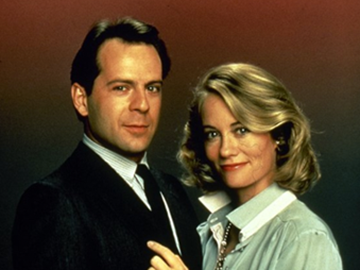
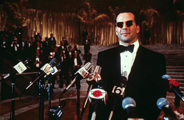
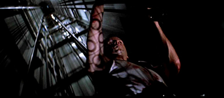
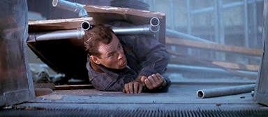
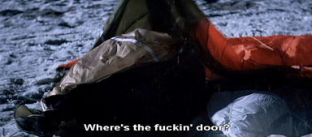
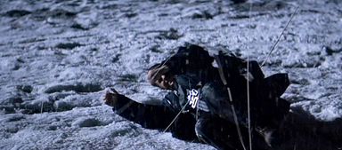
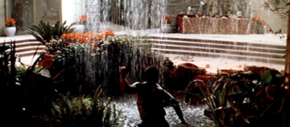
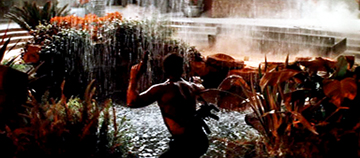

#2. Des héros en mouvement

L'Action est donc le genre des corps, de l'enregistrement de leur mouvement, le plus souvent sur un mode spectaculaire. Avant de comprendre comment ces corps au travail fabriquent de l'héroïsme, il nous faut dire un mot de cette physicalité liée au genre. Encore une
fois, c'est un aspect qui joue en la défaveur du film d'action en ce qui concerne sa réception critique. Les auteurs qui pourtant choisissent l'actioner comme champ d'étude ont eux-mêmes tendance à dévaluer leur objet d'étude, en raison précisément de cette attention portée au corps. Yvonne Tasker qualifie le plaisir du spectateur de film d'action
d'adolescent ("*the adolescent pleasures of action*[^308]") ; Barry Keith Grant voit dans le choix des acteurs un primat accordé à l'anatomie plutôt qu'au jeu[^309] ; enfin, Fabien Gaffez insiste sur la pauvreté des intrigues[^310]. Tous ces reproches adressés au film
d'action reposent sur une grille d'analyse bien précise, qui oppose un cinéma de sensations (qui montre le corps, et parle directement au corps du spectateur) à un cinéma du sens et de la profondeur (qui implique une réflexion). L'accent mis sur le spectacle équivaut aussi, dans cette perspective, à un appauvrissement du récit. Ce système semble tout de
même assez binaire, et répète la partition traditionnelle entre le corps et l'esprit, qui se traduit en dichotomie entre récit et image (du corps, particulièrement). Nous avons donc tendance à suivre le diagnostic de Vivian Sobchack, qui plaide en faveur d'une théorie qui ne fasse pas l'économie d'une pensée *par le corps.* Elle explique :

>>[L]e langage utilisé par la presse pour décrire les dimensions sensibles et affectives de l'expérience cinématographique a été disqualifié en tant qu'il représente une version populaire de cette critique humaniste, imprécise, produite par les études filmiques au
début des années 70, avec l'avénement de modes de description plus "rigoureux" et "objectifs". Ainsi, les références au sensible dans les descriptions liées au cinéma ont généralement été jugées rhétoriques ou comme relevant d'un excès de poésie - la sensualité étant du coup toujours située du côté du corps plutôt que du côté du langage. Il s'agit là d'une vision tautologique[^311].

Nous aurons donc tendance à ne pas dévaluer l'impact du corps en le ramenant à la seule fonction de divertissement "à sensations". Nous souhaitons également dépasser cette opposition canonique entre corps et récit : passer pour le film d'action du côté du corps et du mouvement, ce n'est pas nécessairement suspendre le récit. Au contraire, il y a bien récit, mais ce dernier est raconté *par* le corps, au travers de lui[^312]. Le film d'action a parfois été rapproché de la comédie musicale, dans le sens où, comme elle, il semble interrompre le récit conventionnel pour proposer des scènes de pur spectacle en marge de la
ligne narrative principale. Si le rapprochement n'est pas fortuit, nous souhaitons le réajuster : ce n'est pas le continuum narratif qui est interrompu, mais la narration qui passe à un mode autre, dès lors que le corps s'en empare. Nous allons donc voir selon quelles modalités le corps peut générer un récit qui lui appartient.

S'il y a du corps, celui-ci n'est pas seul dans ses déplacements. L'espace forme une scène pour le héros, et peut également jouer le rôle de contrainte essentielle. Qu'importe si le héros sort indemne de la confrontation, alors que la ville a été nettoyée sur le mode de la
*tabula rasa* : le site géographique concerné (New York, Los Angeles, San Francisco constituent des décors fréquents) l'emporte, en un sens, par la pression exercée sur le parcours du héros. Il faut ainsi comprendre le terme "géographie" : l'espace n'est pas seulement le décor sur lequel un corps - celui du héros - vient glorieusement se
surimposer. Il fonctionne aussi comme forme d'un parcours, comme l'explique Vincent Amiel :

>> l'action de Piège de cristal se situe dans un espace clos, délimité et vertical, alors que le lieu géographique (Los Angeles) est ouvert, sans limites définies et horizontal, alors que, à l'inverse, *Une journée en enfer* se déroule dans un espace ouvert, indéfini et horizontal, tandis que le lieu (New York) est clos, délimité et vertical. [...] dans
*Piège de cristal*, la contrainte qui s'exerce sur le héros est spatiale, car celui-ci, pour vaincre les méchants, doit se plier à l'architecture tortueuse du gratte-ciel. Au contraire dans Une journée en enfer la contrainte est temporelle, car le méchant a disséminé des bombes dans New York et Bruce Willis doit constamment, pour empêcher les explosions,
trouver la réponse à des devinettes posées par celui-là [...] Cependant, la tension, à l'intérieur de chaque film et entre les deux films, tend à se résorber sous la forme d'une contrainte spatiale généralisée[^313].

L'analyse du film d'Action comme reformulation de l'espace, et donc du rôle du corps du héros, par l'entremise du parcours, constituera la base de notre analyse. Ce postulat donnera le primat à l'image comme réseau de formes et d'évocations, en tempérant un temps les aspects idéologiques. Au moment où le héros apparaît, s'auto-désigne comme le responsable d'une situation, il se doit d'entrer en relation avec l'espace, dominer cet espace - quelque soit sa moralité ou le type d'ennemi. Le héros devrait ainsi subordonner son environnement pour le transformer en décor de son action[^314].

Dans le cas précis de la série *Die Hard* tel qu'il est saisi par Vincent Amiel, il est établi que l'action du héros entre en résonance avec la définition d'un cadre urbain sous la forme d'une grille. Ceci permet de saisir plus clairement les différences qui séparent film
d'action et film catastrophe : l'un saisit l'espace comme structure, l'autre dramatise davantage la notion de paysage. Pour notre part, nous insisterons sur la notion de trajectoire comme fondement du film d'action, au-delà des catégorisations qui séparent parcours horizontaux et parcours verticaux. En effet, le cheminement apparaît avant tout
rectiligne, indépendamment des orientations axiales. Dans les espaces confinés qui caractérisent *Die Hard*[^315] (qui reste la matrice de ce fonctionnement par trajectoires spatialement imposées), le fait que le cheminement puisse être vertical ou horizontal est d'une importance relative : le personnage rampe indifféremment dans des bouches
d'aérations (horizontales) ou des cages d'ascenseurs (verticales). Cette discrimination entre verticalité et horizontalité semble donc absorbée par une forme générale, celle du tube, de la droite, ou d'une trajectoire projectile. Dans ce dernier cas, la forme n'est plus
seulement le motif qui caractérise la rencontre d'un corps et de son environnement, mais le schéma global qui affecte le déroulement du récit. Nous isolerons ainsi la permanence d'un "effet tube" à partir de la série *Die Hard* mais également dans *Speed* ou *The Fugitive*,
exemples où le corps censé déployer son énergie est davantage travaillé par son milieu que l'inverse.

Il a été question de héros, de territoires, et entre les deux, de la formation de l'héroïsme dépendant de cette relation. Le personnage se révèle héroïque par un emploi spécifique de son corps, certes, mais ce corps doit en retour produire un impact sur l'espace. Même si le héros n'a pas a priori pour mission de *changer* cet espace (il ne s'agit pas de redistribuer les frontières, symboliques, sociales ou matérielles), il accomplit sa mission en soumettant l'espace à sa loi. Par "espace", il faut alors entendre beaucoup plus que le simple environnement qui s'ouvre à l'action du héros. Le principe de l'exploit tient dans la
recherche et le frôlement, voire le dépassement, d'une limite. Celle-ci s'incarne souvent dans les principes physiques qui fondent le monde et son organisation. Le corps va ainsi refuser de se soumettre à la gravité, à la manière d'Arnold Schwarzenegger capable de s'accrocher à la porte d'un avion et de résister, par sa seule force, à la puissance d'un réacteur qui menace pourtant de le happer. Ce type de face-à-face est fréquent : il oppose le corps à la puissance technique d'artefacts et autres objets technologiques, ou le corps aux lois de la physique. Ces corps seront tour à tour sans gravité, sans poids, ou au contraire d'une lourdeur et d'un volume capables d'absorber toutes les forces.

Nous commencerons par analyser comment, en dépit de cette résistance globale du corps, celui-ci est sans cesse exposé à une pression qui le menace - malgré l'invincibilité souvent associée au héros "reaganien". La dialectique s'opérera entre corps et décor d'un corps qui soumet l'espace à ses lois, à un espace qui écrase et presse le corps de toutes parts. Dans cette perspective, la trajectoire domine, caractérise tous les déplacements : nous verrons que le mouvement ne connaît pas d'interruptions et se définit par cette absence de remords, de détours. Alors que le corps semble faire retour dans toute sa matérialité, sinon son poids, dans les occurrences "d'effets tubes", la poursuite, autre radicalisation de la forme rectiligne de l'espace, travaille à abstraire le corps, voire à l'évider, pour le soumettre à une forme géométrique qui n'est plus que le souvenir schématique des espaces tubulaires. Cette structure en ligne droite définit le film lui-même : *Speed* montre ainsi la course d'un bus qui ne peut pas ralentir sous peine d'exploser, et incarne parfaitement l'éthique même du film d'action. La forme rectiligne est un motif visuel qui s'applique au corps, mais aussi, par contamination, le principe qui structure le film dans son entier.

Ayant défini un corps qui se résume à son déplacement sur une ville devenue un ensemble de coordonnées, nous reviendrons à la face plus incarnée des héros pour comprendre comment cette abstraction relative du personnage côtoie des problématiques du côté de l'identité (sur un pan plus psychologique, donc). Le motif du masque participe d'une mise en tension avec le visage, identité supposée "réelle" du héros : dans nos exemples, le masque se fera parfois le véritable lieu de l'identité héroïque, ou au contraire, son retrait indiquera l'incarnation du héros, en marge des exploits qui sont censés le sacrer comme tel. L'exemple de Jason Bourne, dans un second temps, sera l'occasion de resituer cette identité, vue cette fois comme terme du parcours. Dès lors, la trajectoire prendra une acception différente de la simple forme géométrique, le parcours héroïque qu'elle trace reprenant alors du sens en tant que quête d'identité.

##2.1 Variations sur une trajectoire : le mouvement du héros

###2.1.1 L'effet tube, et autres défaites du corps

Entre le milieu urbain et le corps du héros, il se produit un échange qui détermine la façon dont l'héroïsme va s'exprimer, selon des modalités que nous avions qualifiées, dans notre travail préliminaire, de "*régime de l'étroitesse*". De prime abord, le héros d'action ne
semble pas victime d'une crise personnelle ; il est plutôt exposé aux menaces extérieures que sont les "méchants", les élites qui le trahissent, ou même sa famille qui ne remplit pas, ou plus, son rôle attendu de soutien. C'est le cas de John McClane (Bruce Willis) dans
*Die Hard*, qui se bat seul contre des terroristes allemands, doit négocier avec un FBI corrompu, et enfin renouer avec sa femme Holly qui l'a quitté pour poursuivre sa carrière. Nous avons déjà évoqué le rôle central de ce film dans l'histoire de l'Action : sorti en 1988, il impose un modèle qui va être sans cesse reformulé dans les années 90. Le film fait sortir le film d'action de ses négociations avec le passé au Vietnam, et le fait entrer dans la post-modernité. *Die Hard* revendique son appartenance au genre, et joue de façon ouverte avec ses conventions. Bruce Willis ne possède pas la muscularité d'un Schwarzenegger, mais *Die Hard* va cependant travailler à ériger son corps en rempart. Steve Cohan et Ina Rae Hark, dans une analyse orientée vers les questions de masculinité, proposent une lecture qui constitue ici une piste quant à la nature de l'héroïsme d'Action, et la possibilité d'une crise interne relative à ce dernier :

>> Le corps du héros, s'il peut être abîmé, représente presque le dernier territoire du récit d'action [...] En dernier recours, le corps du héros, et non sa voix, ou sa capacité à élaborer un raisonnement rationnel, est le lieu de la dernière chance. Le fait que le corps du héros constitue le seul espace narratif sûr, et que cet espace soit constamment attaqué, correspond à un thème sans cesse exploré par le cinéma d'action[^316].

Nous retenons ici l'idée que l'héroïsme est poussé dans ses derniers retranchements, ne s'exprime qu'en "*dernier recours*" ("*last resort*") ; néanmoins, le corps n'est pas un lieu sûr, l'outil que le héros peut librement utiliser pour affirmer sa différence. Au contraire, cette différence est manifestée malgré lui. Le héros ne s'exprime pas comme tel, il est *exprimé* par son environnement qui fait pression sur lui de multiples façons.

"L'effet tube" renvoie à l'action de John McClane telle qu'elle est illustrée dans les deux premiers films de la série *Die Hard*. Rappelons ici rapidement l'intrigue du premier film : John McClane, policier new-yorkais, se rend à Los Angeles où sa femme s'est récemment installée pour poursuivre sa carrière. Les époux sont séparés, mais vont passer les vacances de Noël ensemble, avec leurs enfants. John retrouve ainsi sa femme dans l'immeuble Nakatomi, du nom du président de la multinationale. Alors que les employés fêtent Noël, des terroristes
allemands, menés par leur chef Hans Gruber (Alan Rickman), s'introduisent dans la tour. Tous les employés sont pris en otage, et seul John McClane parvient à s'éclipser. Celui-ci tente par tous les moyens de prévenir les autorités, mais ses appels au secours restent trop longtemps ignorés. Lorsqu'il obtient enfin de l'aide à la fin du film, il se retrouve face à un FBI cynique et contre-productif. Seul contre tous, John va donc mener une action de type commando, éliminant les terroristes un par un, pour enfin sauver la situation (selon l'expression canonique américaine, *to save the day*) et se réconcilier avec sa femme.

Les exploits de McClane relèvent de la démonstration de force (sauts dans le vide, combats avec des ennemis en surnombre...) mais aussi d'une action plus discrète. John, en se cachant dans la tour, parvient en effet à espionner ses ennemis, et ainsi à déjouer leur plans : pour ce faire, il pénètre des lieux qui ne sont pas destinés à la déambulation humaine, mais plutôt au transport de fluides (air, eau) ou d'objets mécaniques (cage d'ascenseur). *Die Hard* se situe d'une certaine façon dans la continuité des actioners des années 80 : comme dans *Predator* (John McTiernan, 1987), *Rambo: First Blood Part II* (1985), et les films MIA qui les ont précédés, le héros McClane est seul face à un trop grand nombre d'opposants dans un lieu unique qui doit être purgé de toute trace d'ennemi. Comme ses prédécesseurs, *Die Hard* favorise la pyrotechnie et les cascades les plus improbables, qui contribuent à définir de façon univoque le héros comme homme fort, être d'exception.

Néanmoins, *Die Hard* marque également une rupture. L'emploi de Bruce Willis pour le rôle constitue déjà un indice : par rapport aux Chuck Norris, Arnold Schwarzenegger et Sylvester Stallone qui incarnaient jusque-là le genre, son physique signale un changement. Il est certes musclé, mais pas bodybuildé (comme Stallone ou Schwarzenegger) ou encore sculpté par la pratique d'un sport de combat (comme Chuck Norris). Norris, Stallone et Schwarzenegger ont également fondé leur identité sur un usage du "*stone face*[^317]", ce visage fermé associé à un usage sporadique de la parole. John McClane renverse tous ces usages. Son
visage est constamment contracté, par le rire, la colère ou la déception : en fait de masque, le visage est perméable à toutes les émotions. Martin Flanagan remarque ainsi justement qu'avec Bruce Willis, "*l'attention bascule du corps à la voix*" ("*shifting the emphasis slightly from body to voice*[^318]"). La parole fait l'objet d'une libération, dès lors que les classiques "*punch lines*" (phrases choc) se voient remplacées par une véritable logorrhée qui ponctue l'action. D'un point de vue sonore, la voix même connaît un traitement différent : John McClane possède le timbre plutôt grave de Bruce Willis, mais son
énervement emporte la voix dans les aigus, à l'opposé du cri sourd et tonitruant d'un Schwarzenegger, auquel l'accent Autrichien (certes effacé au fil de la carrière de l'acteur) apporte une rugosité supplémentaire. De plus, Bruce Willis incarne dans ce film un héros
d'action pour la première fois. *Die Hard* a en effet lancé sa carrière, alors qu'il apparaissait déjà depuis trois années à la télévision, dans la série *Moonlighting* (1985-1989), où il incarnait un détective privé (*fig. 20*). Le ton de la série était réflexif, ironique et décalé, et Bruce Willis semble emporter quelque chose de cet esprit
*tongue-in-cheek* dans *Die Hard*. Même s'il est amené à pratiquer la *stone face* dans sa carrière, nombre de ses films conserveront ce lien avec la parodie, bien plutôt qu'avec la comédie (*The Bonfire of Vanities* en *fig. 21*, *Hudson Hawk*, *The Last Boy Scout* et récemment *What Just Happened*).

######fig. 20 : Bruce Willis et Cybill Shepherd (photographie promotionnelle pour *Moonlighting*). © Lions Gate Home Entertainment.

######fig. 21 : Bruce Willis exerce son humour *tongue-in-cheek* dans *The Bonfire of Vanities* (1990).

McClane se parle à lui-même, se plaint de sa situation, commente même les embûches qu'il traverse sur un mode métanarratif[^319], comme s'il s'adressait aux scénaristes[^320]. Alors qu'il passe son temps à ramper dans des conduits et autres voies d'aération dans le premier film, il se retrouve dans *Die Hard II* dans une situation par trop similaire, et commente ainsi : "*Juste une fois, j'aimerais avoir un Noël normal. Du lait de poule, un putain de sapin, une petite dinde. Mais non. Il faut que je rampe dans cette putain de boîte de conserve*[^321]". C'est cette idée de boîte de conserve (*tin can*) qui forme un motif, plus qu'une simple variation sur le thème des embûches. Là se joue, tôt dans l'histoire de l'actioner, un renouvellement de la conception de l'espace, du corps, et enfin de l'héroïsme tout entier. Dans ce contexte, la marche est non avenue, le corps devient héroïque en régressant. Ramper sur ses quatre pattes, forme primitive du mouvement à l'opposé de la geste héroïque, constitue pourtant la seule modalité de déplacement.

###2.1.2 *Die Hard*, ou le tube substitué au paysage

En observant les deux premiers films de la série *Die Hard*, qui sont les exemples les plus parlants de l'usage de ce motif en "tube", il est manifeste que les lieux dans lesquels se déroule l'intrigue sont particulièrement vastes. La tour Nakatomi (*Die Hard*) et l'aéroport de Washington (*Die Hard II*) constituent en effet les lieux uniques dans lesquels va se dérouler toute l'action[^322]. Il est difficile de parler de huis clos, tant les sites sont étendus ; John McClane semble cependant sans cesse lutter contre la clôture de ces lieux : il se lance ainsi hors de la tour Nakatomi accroché à une lance à incendie, ou arpente les pistes d'atterrissage de l'aéroport en tous sens. Cette action qui consiste à sillonner un espace, à l'épuiser par les déplacements de son corps correspond bien aux premiers actioners que nous avons cités ci-dessus. Qu'il s'agisse du désert (*The Delta Force*, plus tard *Rambo III*) ou de la jungle (*Rambo: First Blood Part II*, *Predator*), l'espace apparaît comme une aire de jeu, sans limites précises, ouverte à l'action du héros (*fig. 22*). Ce sont également des milieux naturels, qui mettent en relief l'instinct du héros, ses qualités primitives (par opposition à la corruption des bureaucrates, sur laquelle nous reviendrons). Les tours et aéroports remplacent donc la jungle (*Rambo: First Blood Part II*, *Predator...*) qui constituait jusque-là le décor du film d'action. Ce passage à la modernité urbaine constitue également une contextualisation de l'action sur le territoire
américain. Même si ces lieux sont vastes, le corps de John McClane n'aura quant à lui de cesse de retourner vers les espaces les plus confinés[^323], les interstices entre les lieux plutôt que les lieux eux-mêmes. Les formes du tube sont multiples : verticalement, ce sont la
cage d'ascenseur, les colonnes d'eau ; horizontalement, la bouche d'aération, le conduit métallique menant d'une pièce à l'autre. Le motif du tube se déploie en effet selon toutes les échelles, pressant plus ou moins le corps. La cage d'ascenseur fonctionne par ailleurs comme la réplique schématique de l'immeuble qui le contient, la forme tubulaire devenant ainsi la forme globale qui prédétermine l'espace.

######fig. 22 : Deux héros dominant leur environnement.
######fig. 22.1 : Sylvester Stallone dans *Rambo III *(1988).
######fig. 22.2 : Arnold Schwarzenegger dans *Commando *(1985).

Dans *Die Hard*, les cages d'ascenseurs et autres conduits d'aération se substituent aux *open spaces* de la tour Nakatomi ; dans *Die Hard 2*, ce sont les locaux techniques et autres salles de traitement de bagages qui sont préférés aux immenses espaces d'accueil de l'aéroport. Quel rôle jouent ces espaces confinés ? Le corps de McClane, incomparable avec les débordements musculaires d'un Schwarzenegger, semble retrouver par compensation un poids et un encombrement exagérés dans l'exiguïté des conduits. Tous ces conduits explorés par McClane sont de façon notoire destinés au transport d'eau, d'air : ils ne sont pas faits pour le corps humain. Les cages d'ascenseur que McClane utilise sont certes moins étroites : mais séparées de leur usage traditionnel, elles deviennent des gouffres, ramènent paradoxalement une monumentalité naturelle dans une construction artificielle. Tout se passe en effet comme si ce corps qui se refuse à l'héroïsme était pressé par son milieu de se révéler comme tel.

 
######fig. 23 : Formes de l'effet-tube.
######fig. 23.1 : Bruce Willis prisonnier d'une cage d'ascenseur dans* Die Hard*.
######fig. 23.2 : Le corps de l'acteur est de nouveau comprimé dans* Die Hard 2*.
######fig. 23.3 et 23.4 : La scène du parachute dans* Die Hard 2*, une nouvelle occurence d'espace sans issue.

Tandis que les corps bodybuildés des films d'Action semblent excédés par leur propre énergie au point d'être obligés à la dépense, le corps de McClane paraît subir un phénomène inverse, où l'énergie se replie en dedans. Alors même que la dénomination du genre semblait garantir la
fonctionnalité du corps, l'héroïsme de McClane se fonde sur un dysfonctionnement physique. Là où Rambo courait, sautait, McClane rampe, se débat dans un milieu, qui, en dépit de sa taille réelle, semble toujours être trop petit (*fig. 23*).

Ce confinement du corps dans un espace restreint menace également sa visibilité. Alors que les films de Schwarzenegger, par exemple, reprennent la mise en scène du muscle dans les concours de culturisme, le corps de Bruce Willis, une fois soumis à la forme du tube, met la caméra (et donc le point de vue sur son corps) à l'épreuve. Elle le saisit par exemple frontalement, en train de ramper dans un conduit d'aération : ce faisant, elle occasionne par un effet de perspective une vue en raccourci de son corps, dès lors réduit à un visage, tandis que
le reste de sa personne est visuellement comprimé. Ces aspects visuels réunis esquissent un corps dont le mouvement n'est possible que dans la secousse. Le corps hoquetant qui se soumet à ce régime n'a de cesse, non pas de poursuivre son action héroïque, mais de chercher une issue. C'est le sens de la scène comique de *Die Hard 2*, où John McClane, qui vient pourtant d'échapper à une mort certaine grâce à un siège éjectable, se retrouve piégé dans un parachute qu'il ne parvient pas à démêler, éructant "*Où est la putain de sortie ?*[^324]" (*fig. 23.3* et *23.4*). Trouver une sortie, une issue constitue le seul horizon de ce corps à la fois prisonnier des situations et du mouvement qui vise pourtant à le libérer. Cet enfermement peut également se comprendre comme une intimité : car tout au long du film, McClane semble à force ne faire qu'un avec la tour, se battant simultanément avec et contre elle - à défaut d'affronter le corps de ces ennemis. Le corps est donc mis à l'épreuve, mais se colle au plus près du décor, ne fait plus qu'un avec lui[^325].

Nous posons ainsi que l'Action peut être amenée à empêcher l'action. L'espace force le corps à se révéler au lieu de rester la toile de fond devant laquelle se déroulent les exploits du héros. Ainsi, si "action" il y a, celle-ci ne réside plus dans un geste à proprement parler mais précisément là où le geste est empêché. Concernant le héros, cette action qui doit être précipitée hors du corps au lieu d'être exprimée manifeste un épuisement psychologique, comme en témoigne la parole de McClane, quasiment un lamento. Lorsqu'il constate la répétition des
situations dans *Die Hard 2*, il fait plus qu'instaurer un processus métanarratif : il montre par là qu'il n'est pas auteur de son action, qu'il est plus agi qu'actant. C'est un aspect qui rappelle une fois encore le burlesque, telle que Fabrice Revault d'Allones le définit :

>> l'homme du cinéma burlesque est foncièrement un être urbanisé du XXe siècle, un homme pressé ou que l'on presse, débitant à haut régime des objets, des lieux, des corps, des situations, des actes, des gestes[^326].

Notons également ce commentaire de Jean-Louis Schefer, qui complète ce
point de vue :

>> Il est constant que les aventures burlesques ne touchent pas le développement d'une histoire et n'atteignent que la "figure" des personnages. Ce ne sont pas des dieux, rien ne laisse soupçonner sur leurs faces ou leurs vêtements mal ajustés la souveraineté des grands
acteurs du film noir : ils sont soumis à un destin (réductible à une séquence d'action) qui les transforme, les dévêt, les salit, ne les idéalise jamais, sans les faire avancer d'un pouce dans leur histoire[^327].

Comme pour le personnage burlesque, le héros d'action, bien que héroïque, ne semble avoir d'autre destin que celui auquel son corps, heurté à l'espace, le destine. Les deux genres se fondent sur un espace qui réclame la catastrophe, et des corps contraints à la passivité en
même temps qu'à l'action - mais être en action ne signifie dans aucun des cas présents être actif. En rappelant également sans cesse qu'il n'a pas envie d'être là, qu'il agit contre son plein gré, McClane instaure un nouveau rapport du héros à son environnement, où la contrainte
spatiale remplace le désir - le désir d'agir, mais aussi le désir d'être héros.

Cependant, nous ne dirions pas que McClane est un héros malgré lui : car jamais son exploit ne revêt la forme de l'accident. Il n'est pas non plus exactement un anti-héros : il maintient le programme, malgré cette absence de désir. Aussi ironique son positionnement soit-il, il opère
tout de même la prise en charge qui est attendue de lui, élimine les méchants, et s'éloigne à l'horizon vers le soleil couchant, réconcilié avec sa femme. La forme globale du parcours, du désordre d'une situation à sa résolution par l'entremise du héros, subsiste.

###2.1.3 Le confinement, et l'inversion du sens de l'action

John McClane expose donc un corps sous pression, pressé d'exprimer son héroïsme. Dans le temps même où il impose ce statut de héros, il maugrée, proteste, ponctue son action de remarques acides et ironiques. Malgré son isolement dans l'action, il va avoir l'occasion d'échanger
par l'intermédiaire d'une radio avec deux protagonistes : Al, un policier afro-américain corpulent dont le métier se limite à faire des rondes nocturnes ; et Hans Gruber, son ennemi. C'est surtout la seconde série d'échanges qui mérite ici notre attention. Dans ce dialogue entre héros et *villain*, ce sont bien sûr des provocations qui sont échangées, chacun promettant à l'autre sa défaite prochaine. Cette interaction est marquée par une forte référentialité, amenée dans un premier temps par Gruber, puis filée par McClane tout au long du film. Le terroriste allemand, qui ignore l'identité de son adversaire, lance
ainsi : "*Qui es-tu ? Encore un de ces Américains qui a vu trop de films dans son enfance ?*[^328]", puis : "*Encore un de ces orphelins d'une culture défaite, qui se prend pour John Wayne, Rambo, Marshal Dillon ?*[^329]". La série est éclectique : elle rassemble John Wayne, acteur emblématique du genre western, Rambo, icône récente du genre Action, et Marshal Dillon, le héros de la série télévisée *Gunsmoke*, diffusée à la télévision américaine de 1955 à 1975*.* Gruber ironise donc sur le statut même de héros, renvoie l'existence de ce type de personnage à un fantasme d'enfant. Ce type de référence, où le film semble prendre conscience de sa propre fictionnalité (car, si McClane réussit, il reste néanmoins un personnage fictionnel, au même titre que Rambo) va devenir une caractéristique récurrente dans les années qui suivent la sortie de *Die Hard*. Ce qui nous intéresse ici cependant, est que la référence
dépasse son aspect anecdotique lorsque McClane la reprend à son compte. Plutôt que de se réclamer de la virilité des modèles sus-cités, il la déconstruit en ironisant : "*En fait, j'ai toujours eu un faible pour Roy Rogers. J'aime bien ses chemises pailletées*[^330]". À l'opposé du vigilante qui réactive le souvenir de l'Ouest pour l'utiliser comme moteur de son action, McClane détourne le cliché et se réclame d'un modèle inadéquat - en insistant sur la fragilité de la masculinité de Roy Rogers, dont le costume clinquant représente un décalage par rapport à l'image mythologique du *westerner*. Mais cette auto-dérision est vite compensée par une référence stratégique.

L'échange se poursuit, marqué par la même thématique, lorsque Gruber lance : "*On joue toujours au cow-boy, McClane? Les Américains, tous les mêmes. Cette fois-ci, John Wayne ne partira pas sur fond de coucher de soleil avec Grace Kelly*[^331]". McClane répond alors : "*C'était Gary Cooper, connard*[^332]". Ce deuxième échange marque un fléchissement : McClane a beau se moquer de lui-même, il connaît ses classiques - et pour cela, semble suggérer le film, il constitue un digne héritier de John Wayne et Gary Cooper. Tout ceci serait très anecdotique si le film ne répondait pas par l'image à ces injonctions. Car c'est bien sur fond de soleil couchant que John McClane quitte le film, qui plus est accompagnée de sa femme en lieu et place de Grace Kelly - à ceci près que le couple n'est pas fraîchement marié, mais réconcilié. *Die Hard* annonce ici un nouveau type de filiation avec des formes antérieures
d'héroïsme dans le film d'action : le personnage, conscient de l'existence de la figure du héros l'évoque et parfois s'en réclame. En même temps que le récit évoque très ouvertement le western, c'est un autre type de personnage, plus récent, qui est plus tard évoqué. Alors que le récit, approche de sa conclusion, McClane se retrouve dans un bureau dévasté par les divers affrontements qui s'y sont déroulés et de récentes explosions.

######fig. 24 : La tour Nakatomi mue en jungle vietnamienne dans* Die Hard*.

Pieds et torse nus, le héros évolue dans ce qui reste d'un jardin d'intérieur, décoré de plantes exotiques et d'une fontaine, par laquelle il doit passer pour sortir de la pièce. Suite aux explosions, les douches écossaises se sont déclenchées, reconstituant une pluie tropicale : car en effet, le décor urbain de la tour Nakatomi s'est mué, visuellement, en une jungle rappelant les décors des films de MIA ou encore le deuxième volet de la franchise *Rambo* (*fig. 24*). L'image affirme sans détour ce que le langage n'impose qu'au détour de l'ironie : McClane est bien un héros, qui tient aussi bien de John Wayne que de Rambo. Et tant pis si les ennemis sont conscients du drame qui se rejoue, qu'il s'agisse d'un Gruber cultivé, ou d'un cruel agent du FBI, qui, ravi d'embarquer dans un hélicoptère, éructe : "*Comme au bon vieux temps de Saigon*[^333]" en donnant l'assaut. Là où les méchants pratiquent allègrement la référence, McClane, lui, semble emporté par elle, au point de revivre ce qui apparaît comme la scène d'un autre film, alors même que le contexte du récit semblait l'interdire. À la différence des vigilantes qui portent le legs du *westerner* comme un poids, le héros d'action défini par Bruce Willis dans *Die Hard* compose avec aisance avec la référentialité, de manière distanciée. La référence est donc double : directe, quand elle se produit dans les dialogues, discrète, sur le mode de la contamination, lorsqu'elle envahit l'image. Elle permet le succès du héros, et ne le hante plus comme un modèle inatteignable, et permet même de compenser les défaites du corps, sans cesse soumis à de nouvelles pressions. Nous reviendrons sur les questions d'héritage ultérieurement, mais nous avons vu ici qu'elles pouvaient tempérer une définition critique du corps. Nous allons à présent, pour sortir du cadre seul de la série *Die Hard*, envisager la forme à présent le schéma de la ligne droite, un autre motif directionnel cette fois manifeste sur le pan de la narration.

##2.2 Poursuites : en l'absence de corps

###2.2.1 La poursuite, mode général du film d'action

Si la forme rectiligne domine l'Action matériellement, comme fragment formel omniprésent et sans cesse reformulé, elle est également présente structurellement, comme schéma global présidant à la réalisation du programme héroïque. Même lorsqu'il n'existe pas de tube pour que le corps vienne s'y couler, la forme de la droite comme formule du récit domine, à l'instar des figures du cinéma burlesque où "*l'homme contemporain est emporté sur la flèche de l'espace-temps comme sur un cheval emballé*[^334]". Dans ce schéma, le héros devient en quelque
sorte un homme-canon : le film d'Action s'ouvre en effet fréquemment sur une séquence paroxystique (les exemples sont nombreux, c'est notamment la signature de *Lethal Weapon*), qui lance une suite d'actions palpitantes. La tension n'est pas censée retomber tant que la fin du film n'est pas atteinte, sauf éventuellement pour des pauses humoristiques : là encore, *Lethal Weapon*, film d'action mais aussi *buddy movie*, remplace régulièrement les explosions et fusillades par des joutes verbales entre Riggs (Mel Gibson) et Roger (Danny Glover). Nous n'irons pas jusqu'à dire que chaque film du corpus correspond à ce schéma en ligne droite. Chaque film s'accommode d'hybridations momentanées avec d'autres genres et reformule à sa façon ce système en "boulet de canon". Nous nous intéresserons donc plus particulièrement
aux films où cette structure rectiligne est radicalisée, au point de devenir l'essence de l'action du héros et plus seulement la colonne vertébrale du récit.

*Speed* (Jan de Bont, 1994) constitue un exemple incontournable, dans la mesure où il cristallise la forme essentielle du film d'Action, ou atteint en tout cas une nouvelle pureté du genre Action[^335], en même temps que du film de traque, puisqu'ici le héros court après *rien*, sinon sa propre survie. L'arc narratif est en effet minimal : un bus, sur lequel un terroriste a installé une bombe, doit rouler au-dessus des cinquante miles par heure pour éviter d'exploser. De la même façon, la condition de fonctionnement du film d'Action est de maintenir une vitesse dans la succession d'événements, sous peine d'échouer à garder l'attention du spectateur. Ainsi, tout comme le bus de *Speed* ne peut ralentir, s'arrêter ou faire de demi-tour, le film d'Action dans son ensemble ne peut s'autoriser de trop nombreux contrepoints à l'action, ou de remords : son récit doit *avancer*, coûte que coûte. Ce bus lancé à grande vitesse n'est qu'un exemple parmi d'autres, qui montre comment le récit du film d'action se replie sur son fonctionnement. Ce n'est pas un hasard si on parle de "machines" pour désigner les blockbusters : en somme, les films d'action sont des machines qui se fascinent pour des machines, dont ils copient le mouvement perpétuel, jusqu'à l'épuisement.

IMAGES SPEED

######fig. 25 : Éclectisme des moyens de transport dans* Speed *- la multiplication des appareils roulants permet de générer un mouvement continu.

Le bus ne compte donc pas *en tant que* bus, tant la trajectoire subsume les véhicules qui temporairement l'incarnent. Ainsi Keanu Reeves pour s'extraire du véhicule s'accroche à lui, sur une plateforme à roulettes. Ainsi appareillé, il est en mesure d'échapper à la mort - car le bus finit par exploser - mais aussi de conserver la trajectoire alors que le véhicule qui l'incarnait a disparu. Il a ainsi le temps de glisser, de poursuivre sa course, de se relever et de prolonger le mouvement en courant. Le récit passe ainsi du mouvement d'une machine, à celui d'un corps appareillé, puis d'un corps seul, avant de faire retour, dans la scène finale du métro, à la machine. La trajectoire s'incarne dans tous les corps possibles (*fig. 25*), mais ces corps ne sont que le moyen d'assurer au récit un mouvement perpétuel, que Nicole Brenez commente ainsi, ramenant pour nous la figure du tube : "*Keanu Reeves dans* Speed*[...] n'a besoin ni de réfléchir ni d'éprouver, [...] il est pure action et même opérativité dans l'acte et, pour cela, ne ressemble à rien de plus qu'un câble électrique*[^336]". Dans ce grand système machinique que forme le film d'action, le corps n'est pas en reste et devient lui-même le rouage d'un ensemble qui le dépasse.

La poursuite est un topos fréquent du film d'action : le héros, qui a retrouvé le méchant, doit pour l'attraper le poursuivre, où inversement le héros doit semer le méchant pour rester en vie. Comme le film d'action qu'elle emblématise (aux côtés de l'explosion), la poursuite se
déroule principalement en milieu urbain, le plus souvent en voiture, mais tous les véhicules peuvent être sollicités : bateaux, motos (*First Blood*, *Paycheck*, *Matrix*), motoneiges (*Die Hard II*), camions (*Red Heat*, *Terminator*). Tous ces types de véhicules et bien d'autres s'affrontent, non sans un certain esprit d'éclectisme : *Live Free or Die Hard* (2007) voit ainsi McClane piloter un camion tandis qu'il est poursuivi par un *jet* de l'armée ; *Mission: Impossible* met en scène Tom Cruise sur le toit d'un TGV, traqué par un hélicoptère. Cette diversité est parfois détournée, au bord de la parodie : Carpenter a imaginé pour *Escape from Los Angeles* une poursuite entre une voiture et Snake Plissken perché sur une planche de surf, porté par une vague parallèle à la route. Dans cette apparente variété, la poursuite tend en fait à répéter le même, une formule qui met en jeu la réduction d'une distance entre un point A et un point B. La poursuite porte encore davantage l'accent sur la vitesse, déjà prédominante dans les films d'action du côté du montage. La rapidité d'enchaînement entre les actions permet d'installer une attente, d'autant plus lorsque le
mouvement est empêché, comme dans le cas de John McClane. La vue d'un corps privé de mouvement fait désirer une efficacité du corps, réalisée dans une accélération.

La longue course du bus dans *Speed* est ainsi encadrée par deux scènes caractéristiques. Dans la scène d'introduction, Keanu Reeves et son acolyte désamorcent une bombe dans une cage d'ascenseur (citant ainsi *Die Hard*) ; dans la scène finale, le héros combat le méchant Howard
Payne (Dennis Hopper) sur le toit d'un métro lancé à grande vitesse dans un tunnel - qui combine la forme matérielle du tube et la trajectoire en ligne droite. Il nous faut signaler que si le combat sur des véhicules variés constitue un topos remarquable dans le film d'Action, cette scène plus particulière du combat dans un métro est devenue un lieu commun du
film d'action (*Batman Begins*, *Mission: Impossible*, *Die Hard: With a Vengeance*, *Wanted*, etc.)[^337]. Comme nous l'avons précédemment vu dans l'analyse de Vincent Amiel[^338], la forme individuelle des trajectoires (verticales, horizontales...) se surimpose aux géographies
particulières des villes, sans souci particulier de correspondance : là où la figure matérielle du tube correspondait à un environnement qui prenait toute son importance face au corps du héros, sa version symbolique domine corps et milieux tous ensemble, préside aux déplacements des corps d'Action comme auparavant dans le cinéma burlesque. Dans ce cadre, la trajectoire tend à abstraire le corps, mais également le personnage héroïque dans son entier. Luc Vancheri écrit ainsi, à propos de l'homme burlesque : "*la poursuite, en mobilisant le
corps, en est venue à perdre l'homme, laissé pour compte dans un sursaut, tombé à terre et oublié après sa chute*[^339]". Nous laisserons ici l'idée de chute, pour insister sur ce qui, entre le burlesque et le film d'Action, constitue une forme partagée. La poursuite "oublie" en
effet l'homme qui pourtant l'opère par son déplacement. Une fois encore, tout comme un milieu pouvait associer le héros à son action sur un mode passif, la poursuite travaille à défaire l'autonomie du héros, en devenant origine et fin d'un mouvement pourtant effectué *par* le corps du héros.

Ce dernier genre n'est pas le seul élément auquel renvoient les corps du film d'Action. La poursuite existe depuis les *serials* muets, mais trouve une incarnation particulière dans le cinéma des années 70. Des films tels que *Bullitt* (1968), ou encore *The French Connection* (1971), ont imposé la poursuite automobile comme étant la scène d'action quintessencielle[^340]. Ce développement générique s'explique conjointement par l'association croissante de la voiture à la course dans la culture américaine (*hot rods*, *muscle cars*) et par le développement technique qui a permis aux caméras d'être embarquées dans des voitures en mouvement. Tico Romao voit ainsi dans *Bullitt* la contextualisation du héros *dans* l'action, grâce à cette innovation technologique. Cependant, il y a un écart important entre la poursuite
des années 70 et sa reformulation dans le film d'action. Par exemple, dans *The French Connection*, le mode de la poursuite ne contamine pas toutes les représentations spatiales. Quand Gene Hackman prend en filature un bandit, la station de métro est encore un lieu dans lequel les personnages peuvent se mouvoir, s'arrêter, s'observer. Le mouvement de défilement commence et finit avec la voiture ; hors de celle-ci, les héros retrouvent leur rapport immédiat au monde. Dans l'Action, la poursuite n'est tout simplement plus circonscrite à une scène, aussi longue soit-elle.

Dans *The Matrix Reloaded* (2003), comme dans *Speed*, la poursuite est donc constante et empêche la définition de tout *locus*. Ou alors, c'est le déplacement qui devient, paradoxalement, un lieu. Nous pensons ainsi à la scène de combat sur l'autoroute dans *The Matrix Reloaded* : les personnages sont mobiles, sautent de camion en moto lors de leur lutte.
Derrière eux, le paysage constitue une sorte de décor mouvant, moins un espace qu'une toile de fond[^341].

######fig. 26 : Le décor devient une toile de fond immobile, tandis que les appareils de locomotion sont soumis au déplacement continu (*Matrix Reloaded*). Le découpage de la scène est visible en détail dans les [annexes](../annexes.md).

Le véhicule et son mouvement perpétuel se sont substitués au sol sous les pieds des héros. Nous retrouvons dans ce type de scènes la figure de la trajectoire : la seule issue à cette longue scène d'action est toujours évoquée par les personnages comme se trouvant *en avant*.
L'autoroute oblige ce parcours rectiligne tout en évidant curieusement la question de l'issue : la survie par le combat anime la poursuite, privée dans un premier temps de destination géographique. Défilement fonctionnel[^342], la poursuite n'est plus une scène d'action, mais
l'essence de toute action, puisqu'elle se combine avec toutes les formes de combat et même avec la romance finale. En résumé, la poursuite, comme puissance de défilement, se combine avec la forme matérielle du tube.

###2.2.2 La traque : abstraction du corps et disparition du héros

Dans le film de traque en particulier, la poursuite est comme étirée pour devenir un principe narratif global, en introduisant une originalité : le héros est cette fois l'objet de la traque (*Minority Report*, *Paycheck*, *Mission: Impossible*, *The Sixth Day*, la franchise *Jason Bourne*). Dans ce sous-genre, le héros, un homme accusé d'un crime qu'il n'a pas commis (les accusateurs étant souvent les coupables) est poursuivi par la police, le FBI et autres représentants contemporains de l'autorité. En ce sens, le film de traque renouvelle la
formule "seul contre tous" qui est celle du film commando ; il permet également de renverser la structure habituelle des récits dans lesquels le méchant est recherché et traqué[^343]. *The Fugitive* met donc en scène un cardiologue, Richard Kimble (Harrison Ford) injustement
condamné et emprisonné pour le meurtre de sa femme. Lors de son transfert, le bus qui le conduit à la prison a un accident. Le personnage profite de cette opportunité pour s'enfuir, devenant dès lors l'homme le plus recherché de l'État. En même temps qu'il cherche à échapper aux autorités, il tente de déjouer la conspiration qui a conduit à la mort de sa femme et à son emprisonnement.

En observant ce synopsis, il peut sembler curieux que le héros soit en fuite, car fuir, c'est refuser le combat : quoi de moins héroïque ? Tad Gallagher remarque à juste titre que le film de traque est le seul contexte où la fuite puisse revêtir des connotations positives pour le
héros, à l'opposé de la morale du "*stand and fight*[^344]" (faire face et se battre). Nous suivons son analyse lorsqu'il note que, face au personnage d'Harrison Ford, le spectateur n'est pas tant "*dans l'identification que dans l'empathie*" ("*an object of empathy rather
than idolization*[^345]"*).* Le film est donc le lieu d'un retournement : alors que Kimble est au début du film la cible de la traque, il devient l'origine d'une poursuite nouvelle lorsqu'il se met en quête du véritable assassin de sa femme. Le *marshall* Samuel Gerard (Tommy Lee Jones) qui le recherche va, en suivant ses traces, faire les mêmes découvertes que Kimble et découvrir l'innocence de ce dernier. Sans que la traque s'interrompe physiquement, son sens (et non son orientation) change complétement. Au lieu que Gerard cherche Kimble, Kimble et Gerard cherchent ensemble l'auteur du complot. Cependant, cela n'occasionne aucun changement dans la forme, comme si la poursuite et le sens de cette dernière avaient été séparés.

Il importe donc peu de savoir vers quoi Kimble court, ou de quoi il cherche à s'éloigner : c'est la course qui se tient entre les deux qui importe, et le film apparaît dès lors comme l'enregistrement d'un mouvement perpétuel - jusqu'à ce que ce dernier s'arrête, avec
l'arrestation du véritable coupable. Comme souvent dans le film d'action, l'épilogue est minimal, laissant la caméra s'éloigner pudiquement de la scène où l'intrigue s'est résolue. Il n'y a pas d'après à la trajectoire, particulièrement dans la poursuite, à moins de
donner au film une suite, qui ne peut constituer qu'une nouvelle trajectoire, une nouvelle flèche lancée vers sa résolution. Kimble court, donc, mais ce qu'il advient du personnage est indépendant de ce mouvement perpétuel : la poursuite semble annuler l'importance du poursuivant et du poursuivi. Cependant, il faut nuancer cette dernière idée d'effacement de l'identité du personnage. Le docteur Kimble, en tant qu'individu, est certes dominé par la nécessité de sa course. Cependant il s'arrête parfois pour se cacher, et va même plus loin en se déguisant. Nous avons déjà vu de nombreux points de convergence entre le genre Action et le burlesque, en raison de leur traitement commun des corps, à la fois passifs et pressés d'agir : il nous faut ici noter cette nouvelle rencontre à l'endroit du déguisement[^346]. Mais là où l'Action semblait reprendre à son compte les types de trajectoires expérimentés par le corps burlesque, il semble que le travestissement prenne un sens un peu différent. En effet, on lit chez Jacqueline Nacache que le déguisement dans la comédie américaine (telle qu'elle émerge à partir des années 30) condamne l'acteur "*à être* l'inverse[^347]" de ce qu'il est habituellement, tel Cary Grant retournant sa persona dans *I Was a Male War Bride* (Howard Hawks, 1949). Se déguiser, dans *The Fugitive*, agit au contraire comme un geste révélateur.

Au début du film, Kimble apparaît avec une barbe fournie, ce qui rompt avec l'image habituelle d'Harrison Ford. Il faut ici comprendre l'image de l'acteur Ford, mais plus encore son image en tant qu'il a déjà incarné des héros - Indiana Jones et Han Solo étant des héros glabres. Après avoir réussi à survivre à sa première nuit en cavale, Kimble s'introduit dans un hôpital pour panser ses blessures, au moyen d'un travestissement sommaire (un bleu de travail suffit à le faire passer pour un livreur). Il s'isole pour soigner ses blessures et achever une véritable transformation, en taillant sa barbe. En même temps que cette opération rend Kimble méconnaissable, elle rend visible Harrison Ford tel que son public le connaît : le héros Kimble n'existe que dans la mesure où Harrison Ford héros transparaît (*fig. 27*). Les soins sont également un prétexte à un déshabillement partiel : le personnage vu jusqu'alors comme docteur apparaît également musclé, conformément au programme héroïque[^348].

######fig. 27 : Le docteur Kimble multiplie les identités d'emprunt pour cacher son évasion. Lorsqu'il se rase pour parfaire son déguisement, c'est l'acteur Harrison Ford qui tombe le masque (*The Fugitive*).

Alors que le personnage se déguise, le héros, par l'entremise de l'acteur, tombe le masque. La barbe n'est pas seulement un masque, mais aussi un signe : elle témoigne d'une masculinité plus sauvage, d'un endurcissement du héros face à son expérience de la prison[^349].

Pour qu'il y ait poursuite, il ne faut pas beaucoup plus que la seule évidence d'un corps en mouvement : c'est ce que montre la traque canonique de *North by Northwest* (Alfred Hitchcock, 1959) : qu'un homme commence à courir, il sera poursuivi. Siegfried Kracauer évoque d'ailleurs la poursuite comme une des formes fondamentales du mouvement au cinéma, aux côtés de la danse et du "*mouvement naissant*" ("*nascentmotion*[^350]"). Il rappelle dans son commentaire l'affirmation d'Alfred Hitchcock, selon qui "*la poursuite \[...\] semble être l'expression
finale du medium cinématographique*[^351]". Il est impossible de parler de traque sans mentionner *The 39 Steps* (1935) et *North by Northwest.* Dans le premier cas, le spectateur se retrouve face à une intrigue minimale, qui va permettre de lancer la course folle du personnage. Hannay accueille chez lui une espionne qui lui confie l'importance de sa mission avant d'être tuée par ses poursuivants. Accusée du meurtre de la jeune femme, Hannay n'a d'autre choix que de fuir et de poursuivre la quête - qui vise à protéger un secret d'État. Ce film de la carrière anglaise d'Alfred Hitchcock présente déjà les lignes de force qui mailleront *North by Northwest* : un personnage impliqué dans une affaire par hasard, des jeux de dupes (un potentiel allié se révélant être un ennemi) et l'emprunt d'une identité (il suffit à Hannay de se retrouver par hasard derrière une tribune pour être pris pour le candidat d'une élection). Sa particularité réside dans la forme globale de la poursuite, qui se résout ultimement dans une forme de circularité. Le film s'ouvre sur une scène dans un music-hall : le spectacle est interrompu par un coup de feu, tiré par l'espionne qui cherche à créer une diversion pour s'enfuir. La scène finale se déroule dans le même lieu, le Palladium de Londres : Hannay comprend que le Mister Memory qui se produit sur la scène, ne connaît pas seulement des faits d'actualité, mais aussi le secret que ses ennemis cherchent à s'approprier. Un nouveau coup de feu est tiré, cette fois en direction de l'artiste, et
crée une panique similaire à celle qui a ouvert le film. *North by Northwest* expose plus crûment la nature essentiellement formelle de la traque en réduisant son prétexte à sa plus simple expression. Un quiproquo préside en effet à la traque de ce dernier film : Cary Grant n'est pas le Kaplan recherché par ses poursuivants. Mais en courant, il le devient. Cet exemple montre que la poursuite, au-delà de sa possible gratuité, n'est pas seulement une direction : en courant, le héros change d'identité. Le personnage de Cary Grant court lui-même après Kaplan pour résoudre la situation, c'est-à-dire qu'il court après lui-même, après le fantôme qu'il est devenu. Alors que le corps se déplace, la psyché se meut, comme l'expose Mark Gallagher, qui nous fait retourner un moment du côté du western :

>>Dans les genres cinématographiques destinés aux hommes tout au long du
vingtième siècle, les protagonistes masculins affirment leur maîtrise
des événements narratifs au travers d'une stase physique. Pour être
perçu comme invulnérable, le personnage masculin doit adopter une forme
d'inertie sur le plan physique. Les signifiants linguistiques de la
dureté ou de la densité - tels les visages ciselés de Schwarzenegger,
Charlton Heston, ou Kirk Douglas, avec leurs mâchoires carrées et
fossettes accentuées ; les voix graves et les discours laconiques de
John Wayne et Sylvester Stallone ; les noms suggestifs tels que "Brick"
ou "Rocky" - connotent une puissance invicible. Les mouvements lents et
délibérés des protagonistes de western, exception faite,
occasionnellement, de l'arme dégainée et du coup de poing rapides,
suggèrent que le mouvement lui-même est un effort. Les actions
tranquilles de John Wayne dans *Red River* (1948) et *The Searchers* (1956),
le self-control d'Henry Fonda dans Warlock (1959), et les mouvements
détendus de Charles Bronson dans *Once Upon a Time in the West* (1968)
dénotent chez leurs personnages de la confiance en eux et de la
ténacité. Plus les héros de western bougent, plus leur masculinité est
sujette à être redéfinie[^352].

Si les ponts entre le western et l'action sont nombreux, le statisme n'est pas, sauf quelques *showdowns* hiératiques (surtout dans la série B) une caractéristique du film d'action, bien au contraire. Cependant, ces observations nous permettent de saisir une dichotomie, entre
immobilité et mouvement, et, par conséquent, entre stabilité du personnage et mouvance de l'identité. Alors que le corps s'épuise en suivant la trajectoire, l'identité se fractionne. Ceci n'est pas fortuit : c'est en se déplaçant, en faisant de son corps un véhicule, que le
héros semble forcé à parcourir, non seulement l'espace, mais aussi la somme de ses identités possibles. Ainsi Cary Grant court après Kaplan physiquement et symboliquement, en devenant lui-même l'objet de sa course. Le docteur Kimble, quant à lui, fait de la traque un trajet du
personnage à la star. Kimble semble se dépouiller d'encombrants accessoires pour révéler le héros qu'il cache en lui. Nous allons ainsi explorer cette combinaison entre le mouvement de corps et l'identité des héros - cette dernière située, de façon assez traditionnelle du côté du visage.

##2.3 Du corps au visage, du mouvement à l'identité

###2.3.1 Masques et visages : l'identité à l'épreuve de la trajectoire

La séparation entre les corps et leurs mouvements, que nous évoquions donc auparavant, est encore intensifiée dans la série des *Mission: Impossible*, qui prennent très souvent la forme de la traque. En posant l'existence d'un visage artificiel capable de faire assumer aux espions
toutes les identités, la franchise nous fait assister à des poursuites où tous les personnages sont interchangeables. La supercherie va au-delà du simple masque, puisque le film imagine également un masque sonore, c'est-à-dire un micro capable d'imiter la voix de la personne dont
l'identité est usurpée. Aucun indice ne trahit la véritable identité d'un personnage : c'est seulement lorsque le visage s'amollit grâce à des procédés numériques, devenant une pellicule gommeuse, que le spectateur comprend qu'on s'est joué de lui[^353]. Ce masque est donc
moins un accessoire, un élément de costume, qu'un duplicata parfait du visage, une deuxième face. Le spectateur peut ainsi très bien suivre l'espion Ethan Hunt (Tom Cruise) pendant toute une séquence, avant de découvrir qu'il ne s'agissait pas de lui (*fig. 28*).

######fig. 28 : Un acteur peut en cacher un autre. Dans *Mission: Impossible*, un visage gommeux est déchiré, pour révéler le visage de Tom Cruise.

Le procédé est d'autant plus troublant qu'il brouille l'identification entre l'acteur et le personnage. Celui-ci prédate même les effets spéciaux : dans *Dark Passage* (Delmer Daves, 1947), une dissociation similaire peut être observée. Humphrey Bogart interprète Vincent Parry,
un prisonnier en cavale dont le spectateur ne voit pas le visage puisque les premières scènes du film sont tournées en caméra subjective. Bogart est cependant bien présent, grâce à sa voix. Un article de journal permet de découvrir de manière détournée le visage du personnage : mais ce visage n'est pas celui de Bogart. C'est seulement à la suite d'une opération de chirurgie esthétique (destinée à faciliter la fuite de l'évadé) que la star retrouve son visage, alors même que le personnage perd le sien. Une phase de transition est nécessaire, et le personnage de Vincent déambule alors pendant plusieurs scènes avec un visage couvert de bandages (*fig. 29.1*). Fait significatif, sa récente opération l'empêche de parler, ce qui accentue encore le divorce entre le visage et la voix déjà pratiqué au début du récit.

######fig. 29 : L'identité d'Humphrey Bogart est déconstruite dans *Dark Passage*, et sa reconstruction permet de renouer avec l'héroïsme associé à la persona de l'acteur.

Lorsque Vincent découvre sa nouvelle apparence, la présence de Bogart, déjà préparée par le son, est complétement rendue au spectateur, selon des modalités qui rappellent la transformation de Harrison Ford dans *The Fugitive*. Pour apparaître dans sa pleine mesure, l'acteur est momentanément absentéisé, évidé. Pour ce faire, il est coupé en deux, entre son image et sa voix (les deux signifiants puissants de sa persona). La voix existe d'abord sans visage, puis le visage apparaît progressivement - le spectateur reconnaît les yeux de Bogart sous le bandage - mais de manière muette. C'est au point significatif de l'heure écoulée (en anglais, the *one hour mark*) que l'acteur semble enfin recomposé, prêt à faire preuve de la sagacité et de l'élégance que le spectateur lui attribue (*fig. 29.2*).

Dans le cas de *Mission: Impossible*, le principe semble encore radicalisé. Tom Cruise ne signifie plus seulement "Ethan Hunt", et il en résulte du coup une certaine confusion qui culmine lorsqu'un autre acteur, parfois l'interprète du méchant, joue en fait Hunt masqué. Le
corps de l'acteur n'est plus le moyen d'incarner un personnage, mais une donnée relative qui peut signifier tour à tour tous les personnages, puisqu'à tout moment le visage, par le truchement de l'effet spécial, peut révéler son inconsistance. *Mission: Impossible II* use et abuse de ce ressort qui permet à fabriquer des identités éphémères, qui peuvent à tout moment subir un retournement. Au fond, ce procédé retourne le principe de la doublure qui consiste, à partir de plusieurs corps distincts, à en construire un seul[^354], puisque les masques de
*Mission: Impossible* permettent d'imaginer un corps qui en contient plusieurs. La trajectoire dans le film de traque implique, nous l'avons vu, une perte de l'importance des corps et de leur identité au profit de la seule forme géométrique du mouvement. La traque étant associée au
masque dans *Mission: Impossible*, il convient d'examiner si cette abstraction se poursuit dans les occurrences de travestissement, si le corps en devenant multiple reprend la main sur la trajectoire.

Nous retrouvons ici le principe de travestissement associé au visage déjà relevé dans *Mission: Impossible*, à la différence que le sens pris par l'opération est quasiment inversé. Là où les visages caoutchouteux sous lesquels se cache Tom Cruise occasionnent un trouble en empêchant le spectateur de jamais localiser le héros avec certitude, c'est dans *The Fugitive* au moment où le héros se déguise que son identité héroïque nous apparaît avec le plus de netteté. Il faut alors relier cette qualité de l'identité héroïque, obtenue par le détour du masque, à la valeur de la trajectoire du héros. La valeur du travestissement dans *The Fugitive* achève d'isoler la trajectoire comme phénomène abstrait et indépendant du corps du héros. En effet, Kimble est devenu héros, mais pas grâce au chemin parcouru : il était déjà héroïque dès le début, alors qu'il dissimulait Harrison Ford héros sous l'apparence d'un
docteur barbu. C'est en se déguisant, donc en cherchant à échapper à cette trajectoire déjà tracée, que Kimble existe le plus comme héros. L'héroïsme ne signifie plus dès lors acquérir des qualités, mais les retrouver sous le masque.

La mobilité de l'identité héroïque est ainsi fonction du déplacement. Le corps bouge, et l'identité avec lui - seulement là où le corps ne fait que se déplacer, l'identité se trouve reformulée. Comme le suggère Gallagher, bouger, c'est prendre le risque de la redéfinition : Cary Grant expose ce principe de façon radicale, puisque son corps, simplement en se levant, va endosser une identité radicalement différente. Nous retrouvons le "*feuilletage de sens*[^355]" que Jacqueline Nacache emprunte à Barthes et replace à l'endroit du burlesque. Ce qui feuillette ici, ce sont les visages, qui tombent les uns après les autres, révélant leur nature de masque. L'identité véritable, c'est l'héroïsme, peut-être pas dans *North by NorthWest*, mais certainement dans *The Fugitive* et *Mission: Impossible*. Toujours, ce déplacement héroïque que constitue la traque ramène au visage : *Le Fugitif* va chercher le sien dans le paratexte filmique de la franchise *Indiana Jones*, tandis que *Mission: Impossible* détruit la possibilité d'une identité fixe - le spectateur n'est jamais sûr que
la personne qui parle n'en soit pas une autre. Le final révèle ainsi, sous la peau de Jon Voight qui s'affaisse, les traits reconnaissables de Tom Cruise. Enfin, dans *North by Northwest*, la fuite de Cary Grant se termine par l'escalade du Mont Rushmore, qui participe d'une "*inflation délirante du visage*[^356]", pour reprendre l'expression de Pascal Bonitzer : si Cary Grant ne change pas de visage à proprement parler au cours du film, il est lui aussi hanté par la possibilité d'être Autre.

À ce trop plein d'identités, répond l'absence d'une identité identifiable et permanente fréquemment rencontrée dans les films d'action. Ce n'est pas un hasard si le motif de la traque croise fréquemment celui de l'amnésie. Celle-ci peut s'exprimer de plusieurs manières : dans de nombreux films, elle est simplement organique (*Resident Evil*, *The Long Kiss Goodnight, X-Men, Van Helsing*). Dans ces quatre films, deux héros féminins et deux héros masculins ont oublié tout ou partie de leur passé, qui leur revient par flashes, de façon
plus ou moins traumatique. Dans certains cas, l'amnésie bénéficie d'une justification technologique : dans *RoboCop*, le personnage décédé voit son cadavre utilisé pour devenir un policier-robot : tous ses souvenirs d'homme ont été effacés, comme on supprime les données d'un disque dur. *Total Recall* (Paul Verhoeven, 1990) joue également sur le feuilletage
d'identités au moyen de l'amnésie. Dans ce film, Douglas Quaid, le personnage d'Arnold Schwarzenegger, décide de participer à un jeu de simulation pour tromper son ennui. Ce jeu réaliste se présente comme une expérience virtuelle, dans laquelle Quaid choisit les paramètres, et décide de vivre l'aventure d'un espion. Le dispositif ne semble pas
fonctionner en raison d'une opération précédente, et Quaid rentre chez lui, où il est attaqué par des hommes de main. Il semble vivre une aventure bien réelle, où il découvre qu'il n'est pas réellement Quaid, mais un homme nommé Hauser, qui a subi volontairement l'effacement de sa
mémoire, et adopté une identité fantoche - celle de Quaid. Quaid décide d'empêcher Hauser de reprendre le contrôle de son corps, et finit par l'emporter. Le film se termine sur un *happy end* parodié, ou Hauser embrasse sa dulcinée sur fond de coucher de soleil martien. Paul
Verhoeven laisse l'ambiguité subsister, et il est impossible de décider si nous avons assisté à l'action héroïque réelle de Quaid, ou à son expérience virtuelle. Le dispositif ici mis en place peut sembler complexe, mais il est exemplaire : le héros américain émerge souvent
dans le contexte d'un trop-plein d'identités, qui cherchent à cohabiter ou se réapproprier un même corps. La traque se replie alors sur elle-même, à la manière de *North by Northwest* : le héros ne court jamais qu'après lui-même dans la traque, donnant ainsi à la poursuite
une forme de circularité. Tout en se démultipliant par le jeu de masques (un corps composé de multiples identités), le héros finit par écraser tous ces avatars sous une seule et même forme : celle d'un corps en mouvement, condamné à chasser sa propre ombre.

Pour parler de la rencontre entre le héros et son identité, il faudrait dire : la rencontre entre le héros et ses identités, ou ses visibilités. Il y a le héros mobile, celui qui se déplace quoi qu'il arrive, épousant toutes sortes de véhicules les uns après les autres (*Speed*) ou se cognant pour mieux avancer (*Die Hard*). Recouvrant partiellement celui-ci, il existe un héros reconnaissable par le truchement de l'acteur, ce dernier charriant avec lui l'aura héroïque gagnée dans d'autres films. L'identité, alors qu'elle semble évidée par une
trajectoire uniforme de film en film, est frappée elle aussi par cette mobilité fonctionnelle : les visages se font masques, malgré l'unité du personnage que peut laisser présager la présence d'une star.

Nous verrons plus loin que le héros se fait également icône : le muscle luisant, la prestance, le visage de marbre suffisent à sa reconnaissance, avant même la réalisation d'exploits. Toutes ces facettes se mêlent et se superposent imparfaitement. Le héros se définit
donc par l'image, par la citation de topoï bien reconnaissables (le visage d'une star, un muscle, une pose) tandis que le récit désarticule sa visibilité du côté du mouvement. Ces deux aspects opposés d'identification et d'abstraction travaillent ensemble à faire exister
le héros, mais selon des formules toujours réinventées. Les deux séries *Jason Bourne* (trois films de traque) et *Matrix* présentent des fonctionnements qui reprennent cette articulation thématique de la traque et de l'identité, et nous allons ici voir comment.

###2.3.2 Le visage à défaut du corps : Jason Bourne et Neo

Jason Bourne est le héros d'une série de films réalisés entre 2002 et 2007, inspirée d'un téléfilm de 1988 (avec Richard Chamberlain), lui-même basé sur un ouvrage de Robert Ludlum, et qui comporte pour le moment trois volets : *The Bourne Identity* (Doug Liman, 2002), *The
Bourne Supremacy* (Paul Greengrass, 2004) et *The Bourne Ultimatum* (Paul Greengrass, 2007)[^357]. Au début du premier film, le personnage est repêché par un bateau de pêche italien. Il est blessé et frappé d'amnésie : il a oublié jusqu'à son propre nom. Là où sa mémoire le trahit, son corps se souvient : sa force, ses réflexes, le forcent à s'interroger sur son passé - un passé d'espion, et de tueur. Il est traqué par ses anciens employeurs pour avoir échoué dans une importante mission, celle-là même qui lui a valu d'être jeté à la mer. La traque est donc, comme souvent, double. Elle consiste à fuir les agents de la CIA qui souhaitent l'éliminer pour de bon, et à retrouver ceux qui possèdent des réponses sur son passé. Les trois films appartiennent sans conteste au genre Action : ils contiennent leur lot de poursuites, fusillades et explosions. Néanmoins, leur mise en scène de la trajectoire rectiligne diverge par rapport aux exemples précédents.

La série des *Matrix* comprend également trois films réalisés par Andy et Lana Wachowski : *Matrix* (1999), *Matrix Reloaded* (2003) et enfin *The Matrix Revolutions* (2003). Thomas Anderson (Keanu Reeves), informaticien le jour, hacker la nuit est contacté par un mystérieux
personnage nommé Morpheus. Ce dernier va progressivement lui révéler que le monde tel qu'il le connaît a été anéanti par une guerre opposant les humains à leurs machines. Ces dernières, victorieuses, ont asservi l'humanité. Sur une terre dévastée, les humains sont "cultivés" dans de gigantesques champs, mais vivent, en pensée, dans un monde reconstitué informatiquement - la *Matrice* du titre. Morpheus et son équipe de rebelles ont pour mission de trouver l'Élu qui les libérera du joug des machines. Anderson, renommé Neo, son pseudonyme de hacker, va successivement "sortir" de la Matrice (nous verrons comment), découvrir le monde réel qui lui était caché, puis retourner dans ce monde fabriqué pour tenter de le détruire. Le film appartient clairement au genre Action, mais constitue également un hybride qui mêle les références bibliques, l'œuvre littéraire de Philip K. Dick et une vulgarisation de
la pensée du simulacre par Jean Baudrillard. *Matrix* a marqué une importante étape dans l'histoire du film d'Action, puisqu'il repose, comme beaucoup de ses prédécesseurs, sur la référence au western tout en innovant sur le plan des scènes d'Action (nous pensons au *bullet time*, qui a connu une importante fortune critique).

Revenons donc à notre premier exemple, Jason Bourne. La fuite physique, tournée vers l'avant, se redouble d'une autre course, celle-là orientée vers le passé. Pour découvrir ce qu'il est, et ce pour quoi il est recherché, Jason Bourne doit accomplir un retour en arrière. Et ce
retour ne tient pas uniquement de la réminiscence, d'un voyage symbolique dans le souvenir : il implique de revenir physiquement sur des lieux déjà traversés, connus, éprouvés. *Vidé* de son identité, Jason Bourne la retrouve par fragments, sur le mode de la donnée.

######fig. 30 : Le feuilletage de l'identité dans* The Bourne Identity*.

Visuellement, ce thème de l'identité comme compilation de fragments d'information est obsédant dans les trois films. L'habillage du film voit même se déployer les indications de temps et d'heure[^358] de façon ostentatoire, par une animation graphique et typographique où les
lettres composant les mots apparaissent dans le désordre, accompagnés de cadres, cibles, et autres éléments suggérant la complexité et la capillarité de l'information. Les bandeaux sur lesquels passent des lettres, dont seules certaines s'éclaircissent pour former un mot,
mettent en relief un autre aspect qui obsède la série de films : l'information, dans son existence informatique, est principalement définie par sa capacité de défilement. L'élément informatif n'arrive jamais seul, il est extrait d'une masse indéfinie, il surgit pour faire
sens. Nous retiendrons de cette information, effective ou suggérée, principalement celle qui concerne Jason Bourne. Elle est double : souvent immatérielle (séries de chiffres, données cryptées, codes), elle se matérialise également dans un bric-à-brac représentant symboliquement
le champ de ruines de l'identité *Bourne* (*fig. 30*). De nombreux gros plans s'attarderont ainsi sur les multiples passeports accumulés par l'espion, cartes de crédit et autres papiers participant de cette accumulation de la donnée, à défaut d'une identité cohérente.

Il faut alors revenir au défilement : tout comme les chiffres défilent sur les ordinateurs de la CIA, Bourne offre son corps au défilement. Le film épouse une esthétique "*run and gun*[^359]" qui supprime la focalisation de l'image, sa netteté et sa stabilité au profit d'un
mouvement haletant, perpétuel, visant à placer le spectateur au cœur de l'action. Dans les poursuites - qui sont fréquentes, vu le contexte du film de traque - Bourne n'est plus visible. Il nous apparaît alors flou, comme lui-même se perçoit : une figure résumée à ses capacités physiques, mais à qui il manque le nom, des coordonnées, une localisation. Bourne redevient visible quand il devient une donnée : sa photographie, multipliée à l'envi sur ses faux passeports, ou dans les bases de données de la CIA, est tangible.

Bourne prend alors une existence d'emblème, qui se résume à son buste multiplié sur les photos d'identité. La course effrénée de Forrest Gump, déjà mentionnée dans le premier chapitre[^360], peut sembler un exemple fort distant, mais apporte ici quelques éclaircissements. Dans la scène qui nous intéresse, Forrest se met à courir, apparemment sans raison, après le départ de la femme qu'il aime, Jenny. Cette course durera trois ans et demi, sans autre motivation apparente que le fait de courir. David Savran explique ainsi le sens de cette course : alors que Jenny est en fuite ("*running off*"), Forrest court sans fuire, au travers ("*running* through"), "*en ne se dirigeant pas vers une destination, mais en se dédiant à un processus*[^361]". Tout comme dans l'exemple canonique de *North by Northwest*, le déplacement du corps occasionne une mobilité de l'identité. Mais, à cause de l'amnésie qui constitue le présupposé du film, il ne reste à Jason Bourne, en fait d'identité, que son corps. Rempli des automatismes qu'il a appris, mais sans le souvenir qui pourrait expliquer leur présence, Bourne possède en fait d'identité un corps plein, mais une identité vide. Son visage est une page blanche à laquelle tous les noms inscrits sur ses multiples passeports peuvent se rapporter. Neo, dans *Matrix*, est construit d'une façon absolument inverse. Lorsqu'il "sort" de la Matrice, il retrouve son corps véritable, celui qui durant sa vie entière était prisonnier d'un cocon perdu dans les champs cultivés par les machines. Lorsqu'il est, littéralement, débranché par Morpheus, il doit utiliser un corps dont il n'a jamais eu l'usage. Sa libération, visuellement, correspond en tous points à une naissance, puisqu'il sort nu et souffrant d'une masse liquide dans laquelle son corps était conservé (*fig. 31*). Il porte également les stigmates de son asservissement par les machines, sous la forme de "prises" greffées sur le corps. Dans un premier temps, il est réduit à l'inactivité, le temps que ses muscles atrophiés se reconstituent.

######fig. 31 : Dans* The Matrix*, Neo sort d'une réalité suggérée et récupère ainsi un corps neuf.

Là où Bourne, privé de mémoire mentale, ne peut compter que sur la mémoire du corps, Neo commence son trajet héroïque en changeant de corps. L'apprentissage, séquence canonique de bien des films d'action (surtout les films d'arts martiaux) prend ici un sens nouveau : ce corps neuf doit réapprendre à se mouvoir, mais selon des règles différentes. En effet, la Matrice n'étant qu'un simulacre, le corps peut y accomplir tout ce que l'esprit lui permet. Le corps nouveau et atrophié de Neo qui reste dans le monde dévasté lui permet cependant de maîtriser l'avatar tout puissant qui retourne dans la Matrice pour s'y mouvoir, libre de la gravité. Les deux exemples permettent de mesurer le chemin parcouru depuis *Die Hard.* Dans les années 2000, le film d'action évolue toujours autour de la catastrophe, mais celle-ci ne balaie plus seulement l'espace urbain. Le principe de la *tabula rasa* s'applique au héros lui-même, de façon encore plus radicale que dans *Total Recall* : ainsi la mémoire de Bourne et le corps de Neo sont complètement effacés, pour mieux être reconstruits. Cette reconstruction, après le désastre, constitue alors le programme héroïque. Ce principe de table rase n'est d'ailleurs plus matériel, comme cela était clairement marqué par la forme de l'explosion. L'effacement devient numérique : puisque l'identité (Bourne) et le corps (*Matrix*) sont des données, ils peuvent être liquidés sans trace, comme un disque dur que l'on formate. Le défilement du corps, principe de la poursuite, se double d'ailleurs dans les deux films du défilement constant de la donnée : ce sont les informations à la surface de l'écran dans *Jason Bourne*, ou le code informatique de la Matrice dans *Matrix*. La course suppose ici que du corps, ou de l'identité, quelque chose à été perdu : mais cette perte est un effacement, un retour à zéro qui multiplie les possibilités pour le héros, devenu le site de la catastrophe, la géographie frappée d'une purge.

##Conclusions : un corps au bord de la disparition

Le héros, au sein du genre Action, voit son héroïsme principalement éprouvé au travers d'un face-à-face avec un territoire : espace et personnage peuvent dominer l'autre tour à tour, mais existent fondamentalement par opposition, en se malmenant mutuellement. Ce dernier, le plus souvent urbain, impose sa forme à la course du héros, à moins qu'il ne soit lui-même subordonné à des structures récurrentes, comme le motif à la fois matériel et symbolique du tube. Le parcours est dès lors façonné de façon à *faire sortir* l'héroïsme du héros, à
l'*exprimer*. Le héros d'Action, quelque soit sa force apparente, devient la figure passive, agie, d'une Action opérant indépendamment de lui. L'espace confiné tend quant à lui à prendre la forme canonique de la ligne droite, qui subsume tous les déplacements du héros, aussi
variés soient-ils. Le corps de ce dernier semble ainsi répondre d'une nature projectile : le récit le voit, comme un flèche, former sa course en fonction d'un but unique à atteindre. Ce but en soi ne retient jamais le film d'action, qui s'arrête aussitôt la course finie. En cela, le corps du héros d'action entre en connivence avec celui du personnage burlesque, même si leurs visées sont toutes différentes.

Le héros d'action, pour prouver son héroïsme, est donc placé face à une exigence de déplacement constant, et à cet égard, la scène de poursuite prend une valeur métonymique. Celle-ci met effectivement en scène cette obligation de mouvement, sous diverses formes ; courir, ce peut être *s'éloigner de, courir après*... Dans la poursuite, le corps devient
associable à tous les objets, il se machinise, s'équipe, s'appareille. À la fois, ce corps héroïque tend à disparaître derrière la nécessité de son déplacement : la trajectoire devient la forme abstraite, géométrique qui confond tous les héroïsmes. Le mouvement généré par la poursuite ne concerne pas que le corps : c'est toute l'identité qui devient instable, mouvante, à la fois en perpétuel changement et objet de la quête. Le héros garde un corps en mouvement, tandis que son visage s'essaie à un jeu de masques.

Le film de traque généralise la contrainte de la scène de poursuite : le principe du "*courir après*" est l'arc qui structure le récit. Le héros en fuite est obligé de courir et de se dissimuler : or, c'est dans cette dissimulation qu'il révèle le plus directement son héroïsme,
disqualifiant presque le rôle de sa course, dès lors rendue accessoire. L'effort physique n'est plus le lieu par lequel le héros se fait héros, puisqu'en révélant l'héroïsme véhiculé par le visage de l'acteur, le personnage a en somme anticipé et décidé par avance de son statut. Nous nous sommes ainsi éloignée, tout au long de ce chapitre, de l'analyse des parcours comme configurations spatiales, pour mettre ces schémas en relation avec leurs visées, dont celle, cardinale, de(s) identité(s). Celles-ci sont sans cesse reformulées, liées différemment au corps qui les incarnent. Ce corps, dans les actioners des années 90, s'opposait à son environnement, parfois en encaissant tous les chocs générés par la
catastrophe. Dans les exemples de *Jason Bourne* et *Matrix*, le corps devient le site du désastre : en effaçant des pans entiers du personnage (corps ou esprit), les récits réinventent une forme d'innocence. Si les gestes ne sont pas nouveaux, les corps qui les accomplissent s'émerveillent devant leurs propres capacités, devant le spectacle de ce
que peut leur corps. Face à un monde qui existe comme chiffrage perpétuel, le héros, né une deuxième fois, impose son corps comme dernière évidence de chair. C'est le grand paradoxe de l'Action, tendue entre l'abstraction des trajectoires, et le retour, sans cesse du corps - dont la matérialité va à présent nous intéresser.

___

[^308]: TASKER Yvonne. "The Family in Action". 2004, p. 261.

[^309]: GRANT Barry Keith. "Man's Favorite Sport? The Action Films of Kathryn Bigelow". 2004, p. 371.

[^310]: GAFFEZ Fabien. op. cit., p. 88.

[^311]: "*[T]he* *language used in the press to describe the sensuous and affective dimensions of the film experience has been written off as a popular version of that imprecise humanist criticism drummed out of film studies in the early 1970s with the advent of more "rigorous" and "objective" modes of description. Thus, sensual reference in descriptions of cinema has been generally regarded as rhetorical or poetic excess— sensuality located, then, always less on the side of the body than on the side of language. This view is tautological*", in SOBCHACK Vivian. *Carnal Thoughts: Embodiments & Moving Image Culture*. 2004, p. 58.

[^312]: Sabine Lebel développe une idée similaire ("*the narrative of the body*") en conservant tout de même l'idée d'une suspension du récit. De plus, elle applique ce concept plus particulièrement aux films de super-héros récents, cf. LEBEL Sabine. "Tone Down the Boobs, Please!" Reading the Special Effects Body in Superhero Movies. *Cineaction*, 2009, p. 58. Tico Romao parle quant à lui d'une "*dimension narrative intrinsèque au spectacle*" ("*inherent narrative dimension of action spectacles*") in ROMAO Tico. "Gun and Gas: Investigating the 1970s Car Chase Film". 2004. p. 142.

[^313]: AMIEL Vincent, COUTÉ Pascal. op. cit., p. 105.

[^314]: On peut même comprendre "espace" au sens étendu de l'environnement et des autres personnages présents. Serge Daney commentait un effet similaire dans un tout autre contexte, celui du film *Coup de torchon* de Bertrand Tavernier. Le personnage de Lucien Cordier (Philippe Noiret) semble le seul à "*[avoir] une histoire. Les autres ne sont que le décor de sa trajectoire à lui*", in DANEY Serge. *Cinéma Journal, Volume I.* op. cit., p. 81. Pour nous, cela indique que le personnage peut aisément disparaître derrière ladite trajectoire.

[^315]: Principalement dans *Die Hard* (1988) et *Die Hard 2* (1990), le troisième film de la série constitue à cet égard un cas particulier : il est souvent considéré comme éloigné de la "mythologie" *Die Hard* (qui inclue un John McClane solitaire, et la localisation de l'action dans un espace clos). De manière significative, le scénario, écrit par Jonathan Hensleigh a été considéré pour le quatrième volet de la franchise *Lethal Weapon* ; cf. "Jonathan Hensleigh" \[ en ligne \]. Wikipedia. Dernière mise à jour le 23 mai 2012.

[^316]: "*The* *body of the hero, though it may be damaged, represents almost the last territory of the action narrative [...] When all else fails, the body of the hero, and not his voice, his capacity to make a rational argument, is the place of last resort. That the body of the hero is the sole narrative space that is safe, that even this space is constantly under attack, is a theme repeatedly returned to within the action cinema*", in TASKER Yvonne. "Dumb Movies for Dumb People". op. cit., p. 241. Notons que la thèse des auteurs repose sur l'analyse de *Die Hard*, mais également de *Rambo*, *RoboCop* et *Total Recall*.

[^317]: Cf. infra., p. 160.

[^318]: FLANAGAN Martin. "'Get Ready for Rush Hour' The Chronotope in Action". 2004, p. 112.

[^319]: C'est également une façon de se distinguer des actioners jusque là réalisés, dont l'exagération peut être vue comme une naïveté : en produisant des héros qui commentent leurs parcours, on se distance de l'action sur un mode "clin d'œil" (*cf*. ROMNEY Jonathan. "*Arnold Through the Looking Glass*". 2000, p. 35.).

[^320]: Par exemple : "*Mec, j'arrive pas à y croire. Une autre cave. Un autre ascenseur. Comment le même truc peut arriver au même mec deux fois ?*" ("*Man, I can't fucking believe this. Another basement. Another elevator*. *How can the same shit happen to the same guy twice?*") dans *Die Hard 2*.

[^321]: "*Just* *once, I'd like a regular, normal Christmas. Eggnog, a fucking Christmas tree, a little turkey. But, no. I gotta crawl around in this motherfuckin' tin can*".

[^322]: *Die* *Hard 2* voit tout de même le champ d'action s'élargir, lors d'une incursion au quartier général des terroristes et d'une poursuite en motoneige. John McClane retourne néanmoins à l'aéroport après ces courts épisodes.

[^323]: Eric Lichtenfeld voit même dans *Die Hard* le début d'un cycle, celui du "*film d'action confiné*" ("*confined action film*") in LICHTENFELD Eric. *Action Speaks Louder*. op. cit., p. 159.

[^324]: "*Where* *is the fucking door?*".

[^325]: "*une* *compréhension intime de la tour*" ("*intimate understanding of the layout of the building*") ; "*Les surfaces et les objets deviennent des alliés potentiels*" ("*Surfaces and objects become potential allies*"), in FLANAGAN Martin. op. cit., p. 114.

[^326]: REVAULT D'ALLONNES Fabrice. "L'homme burlesque du cinéma". 1995, p. 61.

[^327]: SCHEFER Jean-Louis. *L'homme ordinaire du cinéma*. 1980, p. 60.

[^328]: "*Who* *are you? Just another American who saw too many movies as a child?*".

[^329]: "*Another* *orphan of a bankrupt culture who thinks he's John Wayne, Rambo, Marshal Dillon?*".

[^330]: "*I* *was always partial to Roy Rogers, actually. I like those sequinned shirts*".

[^331]: "*Still* *the cowboy, McClane? Americans, all alike. This time, John Wayne does not walk off into the sunset with Grace Kelly*".

[^332]: "*That* *was Gary Cooper, asshole*".

[^333]: "*Just* *like fuckin' Saigon*".

[^334]: Ceci fait suite à une analyse du mouvement chez Charlot et Buster Keaton, in REVAULT D'ALLONNES Fabrice. op. cit., p. 70.

[^335]: Cf. AMIEL Vincent, COUTÉ Pascal. op. cit., p. 27. et DYER Richard. "Action !". 2000, p. 17.

[^336]: BRENEZ Nicole. *De la figure en général et du corps en particulier. L'invention figurative au cinéma*. 1998, p. 34-35. La citation s'inscrit dans le cadre d'une comparaison plus générale entre corps du personnage et machine.

[^337]: La poursuite sur le toit du métro n'est pas complètement une invention : sa forme rappelle la scène canonique de l'attaque du train dans le western, mise en place dans un des exemples les plus précoces du genre, parfois considéré comme le premier western, *The Great Train Robbery* (Edwyn S. Porter, 1903).

[^338]: Cf. infra., p. 155-156.

[^339]: VANCHERI Luc. *Figuration de l'inhumain. Essai sur le devenir-accessoire de l'homme filmique*. 1993, p. 61.

[^340]: ROMAO Tico. op. cit., p. 131. Nous reviendrons sur *Bullitt* ultérieurement, cf. infra., p. 501.

[^341]: Ceci est sans doute dû aux conditions de tournage de la scène, et aux contraintes qui l'ont entourée. Dans le *making-of* de cette scène (*Crash Course*, Josh Oreck, 2003), il est expliqué qu'aucune autoroute aux États-Unis ne pouvait être fermée pour le tournage de la poursuite. Face à cet échec, l'équipe technique du film a décidé de construire entièrement un fragment d'autoroute, ce qui explique en partie l'aspect redondant, décontextualisé, pris dans ce cas par le décor.

[^342]: Dans la trilogie *Matrix*, même le statisme renvoie au défilement, qui est celui du code informatique sur lequel repose notre monde. Même immobiles, les corps se définissent encore par le mouvement.

[^343]: Le film de traque constitue davantage une variante qu'un renouvellement : *First Blood*, le premier film de la série des *Rambo*, montre le personnage du même nom pris en chasse comme un animal. Les films suivants inversent le principe, puisque c'est alors Rambo qui devient le chasseur.

[^344]: GALLAGHER Mark. op. cit., p. 173.

[^345]: Ibid., p. 174.

[^346]: Ce deuxième croisement pourra d'ailleurs s'appliquer plus largement à la comédie, et pas seulement au burlesque.

[^347]: NACACHE Jacqueline. "Comédie américaine : le moment du double". 1995, p. 83.

[^348]: Il suffit pour s'en convaincre de regarder *Predator*, ou la série des *Rambo* : dans le film d'Action, le corps du héros subit toujours un examen rapide, scandé par un découpage nerveux. Dans la franchise *Rambo* le découpage permet d'isoler les muscles, mais saisit aussi l'équipement progressif, entre la dissimulation d'armes et le port d'accessoires emblématiques (le bandeau, entre autres). Cf. infra*.*, p. 712-714.

[^349]: La barbe est d'ailleurs fréquemment utilisée dans ce sens. Elle apparaît souvent dans un contexte de robinsonade : par exemple, la pilosité faciale de Tom Hanks permet dans *Cast Away* (Robert Zemeckis, 2000) de détacher l'acteur de ses rôles urbains pour lui donner une aura primitive. Il s'agit également d'un procédé qui permet de suggérer l'écoulement d'une durée, et donc l'acquisition d'une expérience (dans *Ben-Hur* par exemple).

[^350]: KRACAUER Siegfried. "The Establishment of Physical Existence". 1999, p. 294.

[^351]: Ibid. Notons également que si Hitchcock a repéré l'essentialité de la poursuite au cinéma, d'autres après lui ont loué sa capacité à porter la forme à son paroxysme - Pascal Bonitzer affirme ainsi : "*Hitchcock aurait donc [...] "creusé" la poursuite griffithienne comme Mallarmé dit avoir "creusé" le vers baudelairien*" in BONITZER Pascal. *Le champ aveugle. Essai sur le réalisme au cinéma*. 1999, p. 36.

[^352]: "*In* *male-oriented U.S. film genres throughout the twentieth century, male protagonists paradoxically assert their agency and control over narrative events through physical stasis. The suggestion of male invulnerability demands physical inertness. Physical and linguistic signifiers of hardness or density— the chiseled faces of Schwarzenegger, Charlton Heston, or Kirk Douglas, with their square jaws and accentuated cheekbones; the deep voices and measured delivery of John Wayne and Sylvester Stallone; even suggestive names such as "Brick" or "Rocky"—connote indomitable power. The slow, deliberate movements of protagonists of westerns, notwithstanding the occasional quick draw or punch, suggest that motion itself is a travail. Wayne’s unhurried actions in* Red River *(1948) and* The Searchers *(1956), Henry Fonda’s self-control in* Warlock *(1959), and Charles Bronson’s relaxed movements throughout *Once Upon a Time in the West *(1968) all denote their characters’ tenacity and self-assurance. The more Western heroes move, the more their masculinity is subject to redefinition*", in GALLAGHER Mark. op. cit., p. 172.

[^353]: Ce processus est porté à son paroxysme dans le dernier film de série sorti en 2011 (*Mission: Impossible - Ghost Protocol*), dès lors que les espaces sont également contaminés par ce jeu de faux-semblants. Pour exemple, pensons seulement à la scène ou Ethan Hunt et son acolyte projettent l'image d'un couloir désert pour leurrer un agent de sécurité. L'artifice n'est jamais aussi jouissif que lors de son démontage : à la faveur d'une erreur humaine, l'image tremble, reprend sa bidimensionnalité, et le subterfuge est révélé.

[^354]: Nous choisissons deux exemples parlants, mais ils ne sont pas isolés : dans *Face/Off* (John Woo, 1997), Nicolas Cage et John Travolta subissent aussi une opération de chirurgie esthétique qui permet l'échange de leurs deux visages. Outre ces prétextes narratifs, le morphing sert également à ces changements d'identités dans *Terminator 2: Judgement Day* et plus tard dans *X-Men* (avec le personnage de Mystique).

[^355]: NACACHE Jacqueline. op. cit., p. 86.

[^356]: BONITZER Pascal. op. cit., p. 59.

[^357]: La franchise doit connaître une forme de *reboot*, puisque le nouveau film, dont la sortie est prévue en France à la fin de l'année 2012, ne verra pas Matt Damon reprendre le rôle titre. La continuité narrative avec les films précédents est cependant conservée.

[^358]: Ceci est fréquent dans les films d'espionnage, qui substituent aux linéales très souvent utilisées au cinéma (Futura, Gill Sans) des mécanes (Courier, Prestige) qui évoquent le rapport tapé à la machine à écrire, l'accumulation de données et leur archivage.

[^359]: JULLIER Laurent. *Le style* run-and-gun *: esthétique et filiations*. Présentation dans le cadre du colloque "Le cinéma américain contemporain", organisé par l'ARIAS, INHA, juin 2008.

[^360]: Cf. infra., p.46-47.

[^361]: "*Unlike* *Jenny, who according to the taxi driver who picks her up, is "running off", Forrest is not running away but, to borrow a page from Moore and Gillette, running through, dedicating himself not to a destination but to a process*", in SAVRAN David. *Taking it Like a Man, White Masculinity, Masochism, and Contemporary American Culture*. 1998, p. 306.
